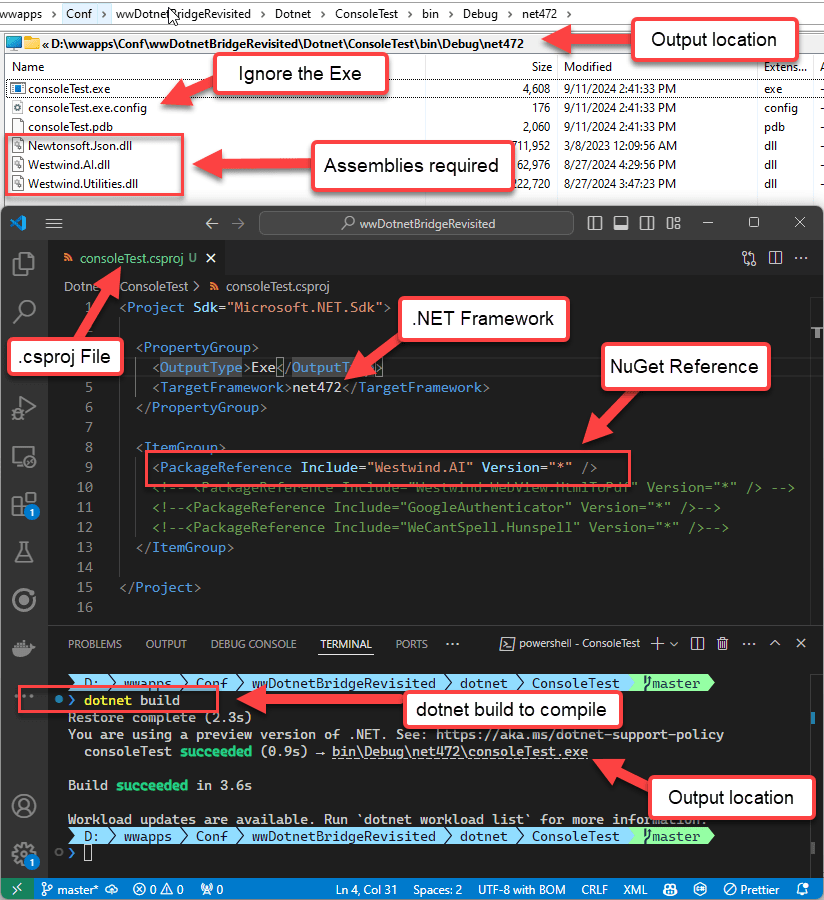
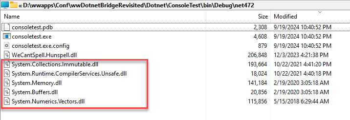
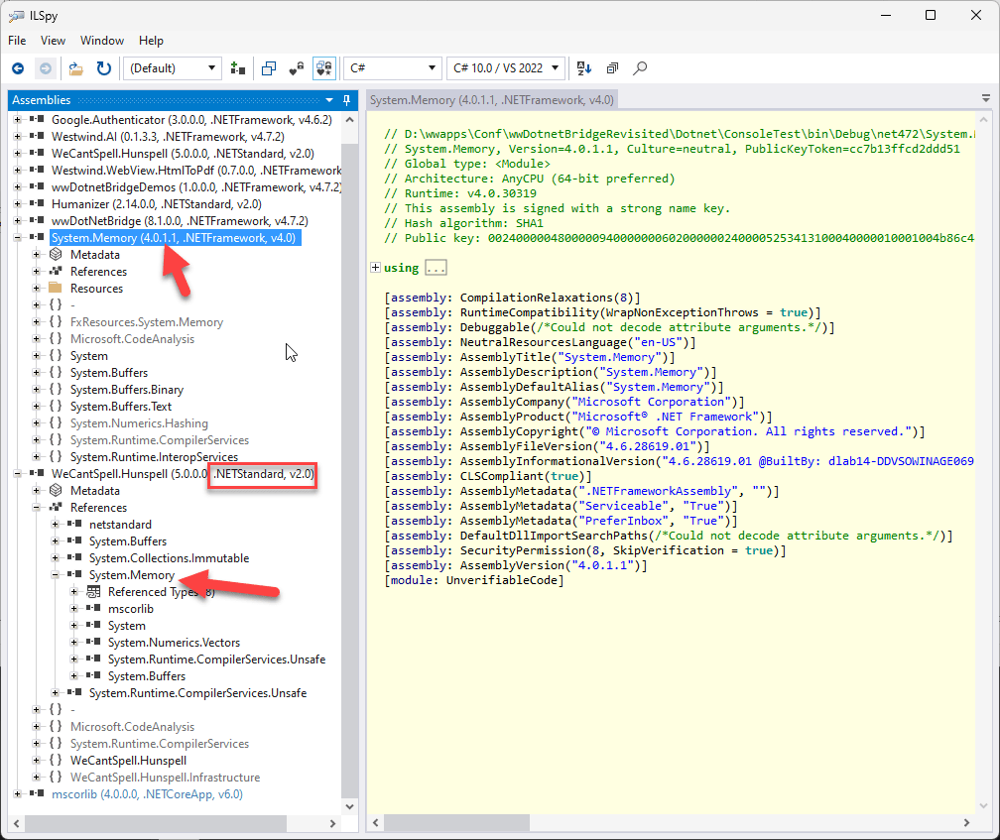
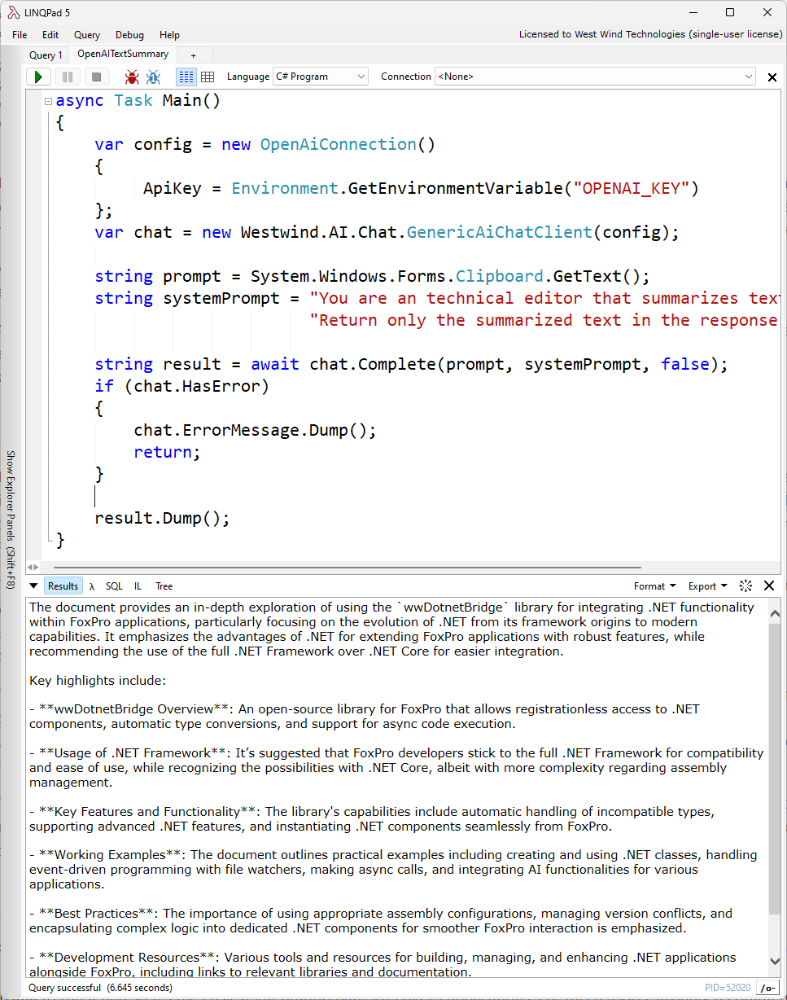
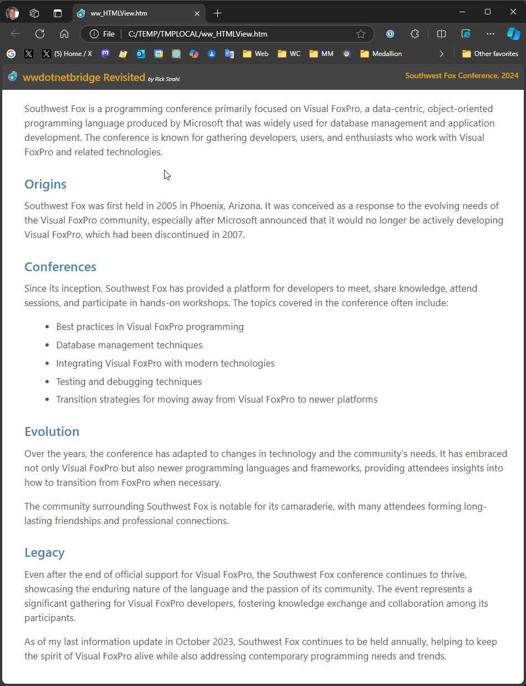
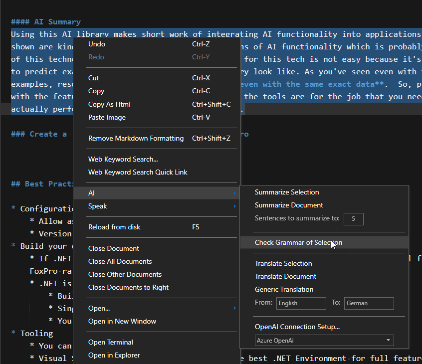
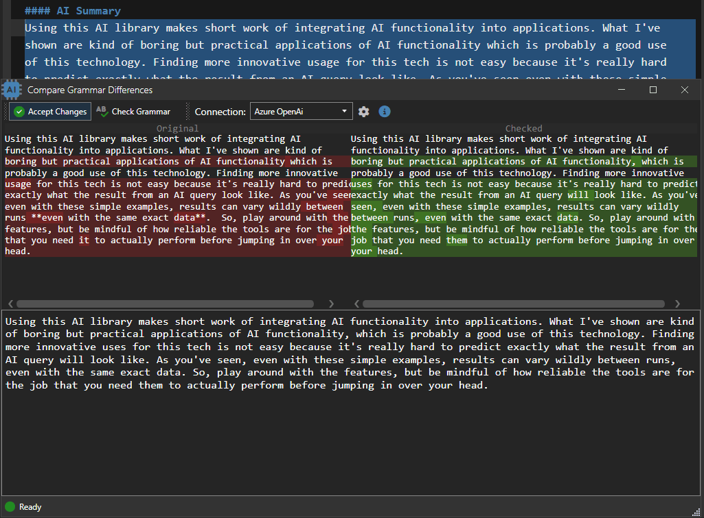
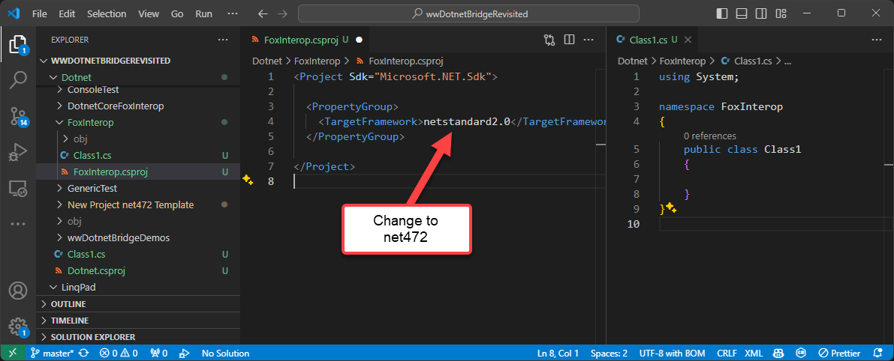
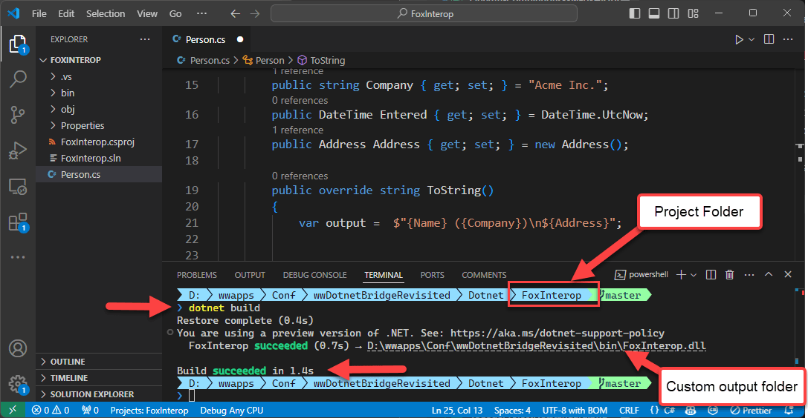
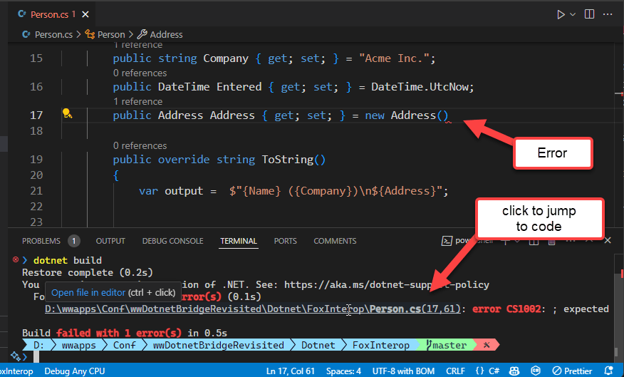

# Revisiting wwDotnetBridge and .NET Interop from FoxPro


<div style="margin: 1em 0 3em 0; font-size: 0.8em;">

*by **Rick Strahl***  
*prepared for **Southwest Fox 2024***  

[Session Example Code](https://github.com/RickStrahl/swfox2024-wwdotnetbridge-revisited) on GitHub  
[Session Slides](https://github.com/RickStrahl/swfox2024-wwdotnetbridge-revisited/raw/master/Documents/Strahl-swFox2024-wwDotnetBridge-Revisited.pptx)   
[wwDotnetBridge Repo](https://github.com/RickStrahl/wwDotnetBridge) on GitHub  
[wwDotnetBridge Docs](https://webconnection.west-wind.com/docs/_24n1cfw3a.htm)
</div>

.NET has proliferated as the dominant Windows development environment, both for Windows application development using a variety of different Windows-specific platforms and as the high-level API surface chosen by Microsoft to expose Windows system functionality besides low-level, native C++.

More importantly though, .NET has garnered a huge eco system of open source and commercial libraries and components that provide just about any kind of functionality and integration you can think of. 

All of this is good news for FoxPro developers, as you can take advantage of most of that .NET functionality to **extend your own FoxPro applications** with rich functionality beyond FoxPro's native features using either basic COM interop (very limited) or more usefully with the open source [wwDotnetBridge library](https://github.com/RickStrahl/wwDotnetBridge).

> In this very long White Paper, I'll introduce wwDotnetBridge and some of the things that you probably need to know about working with .NET before diving into 10 separate examples along with some background on each, that each demonstrate different features of wwDotnetBridge. Most of the size is in these examples as they provide some background and in some cases quite a bit of code and you can skip those that don't interest you.

## .NET History: .NET Framework to .NET Core
.NET has been around since the early 2000's and in those nearly 25 years it has undergone a number of transformations. From its early days as a limited distributed runtime, to integration into Windows as a core Windows component, to the splitting off of .NET Core as a cross platform capable version of .NET, to full cross-platform support for .NET Core, to recent releases that provide nearly full compatibility with .NET Framework for .NET Core including of Windows specific platforms (ie. WinForms, WPF, WinUI).

The most significant change occurred in 2016, when .NET split off into the classic **.NET Framework** (the Windows native Runtime build into Windows) and **.NET Core**, which is a newly redesigned version of .NET that is fully cross-platform enabled and can run on Windows, Mac and Linux and that is optimized for performance and optimized resource usage. The new version has greatly expanded .NET's usefulness and developer reach with many new developers using the platform now.

This new version of .NET - although it had a rough initial start - is also mostly compatible with the classic .NET Framework and can for the most part run code on both frameworks interchangeably. .NET Core brought a ton of improvements to .NET in terms of performance and resource usage, as well as new server side frameworks (ASP.NET, Blazor, Maui etc.),and much simpler and universally available tooling that removed the requirement for developing applications exclusively on Windows using Visual Studio. 

Today you can build applications for Windows, Mac or Linux, developing applications on these platforms using native editors either with integration tooling or command line tools that are freely available via the .NET SDK. The SDK includes all the compiler tools to build, run and publish .NET applications from the command line without any specific tooling requirements.

## .NET and FoxPro
**For FoxPro developers it's preferable to use components that use the old 'full framework' libraries** when available even though .NET Core is the *new and shiny* new framework. The full .NET Framework (NetFX) is part of Windows and so it's always available - **there's nothing else to install** to run it and so it's the easiest integration path for FoxPro applications. For this reason I strongly recommend you use .NET Framework in lieu of .NET Core or .NET Standard components *if possible*.

However, it is possible to use .NET Core components with FoxPro and wwDotnetBridge. But the process of doing so tends to be more complicated as .NET Core's assembly loading is more complex, often requiring many more support assemblies that are not always easy to identify.

In order to use .NET Core you need to ensure a matching .NET Core runtime is installed to support the minimum version of any components you are calling. .NET Core goes back to requiring installable runtimes, rather than having a single system provided runtime as .NET Framework does. This means you have to ensure the right version of the runtime is installed. Although .NET Core also supports fully self contained installs, that's not really applicable to components or FoxPro applications, so we're always dependent on an installed runtime. Major Runtime Versions rev every year, the current version in late 2024 is v8 with v9 getting released in November. 

The good news is that most components today still use multi-targeting and support both .NET Framework (or .NET Standard which is .NET Framework compatible) and .NET Core targeting and you can generally find .NET Framework components that work more easily in FoxPro. 

> #### @icon-lightbulb Stick to .NET Framework
> Bottom Line: If at all possible aim for using .NET Framework if you're calling .NET code from FoxPro. Only rely on .NET Core components if there is no alternative in .NET Framework available.

## Why .NET for FoxPro?
.NET is a Microsoft platform and for better or for worse, it's the only platform that has good Windows support for desktop applications and that can be integrated relatively easily with Visual FoxPro, mainly because it works with COM. 

FoxPro is very old technology, with the last released version now more than 15 years out of date, so in order to keep FoxPro applications up to date with current functionality **some technology** is needed to extend FoxPro beyond it's old feature set. The original extension technology was COM, but COM has died a slow death right alongside FoxPro, especially for high level languages that use `IDispatch` interface as FoxPro does. You'll be hard pressed to find a 'new' COM component that exposes business or system functionality these days. While COM is still heavily used internally in Windows with C++ code, most of the system functionality exposed to developers these days is exposed via .NET.

Further, these days it's fairly easy to get started building your own .NET components, which facilitates the ability to access more complex .NET code **using your own .NET code** that acts as a front end for the more complex .NET code.

This opens up many avenues of extensibility, both in terms of .NET component feature availability to your application, but also as an avenue for extensibility of your application using an alternate technology. What's nice about using a component based interface like this is that you ease into building functionality selectively in .NET and expose it from FoxPro. It's a great way to experiment with .NET for real world scenarios starting with small components, to potentially larger integrations down the road or even entire switching to a .NET based application eventually with the ability to use the code you've built along the way.

Because .NET is now multi-platform and can run desktop, Web, API, Phone and IOT based applications, any components you build also can be used in all of those environments (assuming they are platform agnostic), so any investments you make in .NET components can be re-used in other .NET based interfaces or even other .NET integrations. So today you might be building an extension interface for your FoxPro desktop application, but tomorrow you may be using that same extension in a .NET Web API application. 

In short, for FoxPro developers .NET offers a path to extensibility via COM integration, that lets you take advantage of most of .NET's features with minimal effort. 

Let's take a look at what that looks like.

## What is wwDotnetBridge?
wwDotnetBridge is an **open source, MIT licensed** FoxPro library, that allows you to load and call most .NET components from FoxPro. It provides registrationless activation of .NET Components and helpers that facilitate accessing features that native COM Interop does not support.

.NET has built-in COM Interop support which allows you to instantiate and then invoke .NET objects via COM. Unfortunately this mechanism is very limited due to the requirement that components are registered in a special way to both COM and .NET, and that components have to be explicitly marked. Effectively this means you can only instantiate COM components that you have created your self.

To work around this wwDotnetBridge provides many improvements that work around the limitations of native .NET COM Interop, while still using COM Interop for the inter-process communication. Everything that works with native COM Interop also works with wwDotnetBridge - it's the same technology after all -  but you get many more support features to work around the limitations.

The key features of wwDotnetBridge are:

* **Registrationless access to most .NET Components**  
Unlike native COM Interop, you can instantiate and access .NET Components and static classes, without requiring those classes to be registered as COM objects. Objects are instantiated from within .NET, so you can access most .NET components by directly loading them from their DLL assembly. Both .NET Framework (`wwDotnetBridge`) and .NET Core (`wwDotnetCoreBridge`) are supported.

* **Instantiates and Interacts with .NET Objects via COM from within .NET**  
wwDotnetBridge is a .NET based component that **runs inside of .NET** and acts as an intermediary for activation, invocation and access operations. A key feature is that it creates .NET instances from within .NET and returns those references using COM Interop. Once loaded you can use all features that COM supports directly: Property access and method calls etc. *as long the members accessed use types that are supported by COM*.

* **Support for Advanced .NET Features that COM Interop doesn't support**  
Unfortunately there are many .NET features that COM and FoxPro don't natively support directly: Anything related to .NET Generics, overloaded methods, value types, enums, various number types to name just a few. But because wwDotnetBridge runs inside of .NET, it provides automatic conversions and helpers to allow access to these features via intermediary Reflection operations. These helpers access the unsupported COM operations from inside of .NET and translate the results into COM and FoxPro compatible results that are returned into your FoxPro application.

* **Automatic Type Conversions**  
Because there are many incompatible types in .NET that don't have equivalents in COM or FoxPro, wwDotnetBridge performs many automatic type conversions. These make it easier to call methods or retrieve values from .NET by automatically converting compatible types. For example: decimals to double, long, byte to int, Guid to string etc. There are also wrapper classes like `ComArray` that wraps  .NET Arrays and Collections and provides a FoxPro friendly interface for navigating and updating collections, and `ComValue` which wraps incompatible .NET values and provides convenient methods to set and retrieve the value in a FoxPro friendly way and pass it to .NET methods or property assignments.

* **Support for Async Code Execution**  
A lot of modern .NET Code uses async functionality via `Task` based interfaces, and wwDotnetBridge includes a `InvokeTaskMethodAsyc()` helper that lets you call these async methods and receive results via Callbacks asynchronously. You can also run **any** .NET synchronous method and call it asynchronously using `InvokeMethodAsync()` using the same Callback mechanism.

There's much more, but these are the most common features used in wwDotnetBridge.

## A quick Primer
Before we jump in with more explanations lets walk through a simple example that shows how to use wwDotnetBridge in a simple yet common scenario. 

I'm going to use a pre-built sample component from a library that's part of the samples called `wwDotnetBridgeDemo.dll` which is one of the simplest things and also very common things we can do.

### Setting up wwDotnetBridge
The first step is that you need wwDotnetBridge. wwDotnetBridge comes in two versions:

* **Free Open Source Version**  
This version is available for free with source code from GitHub. You can go to the repo and copy the files out of the `/Distribution` folder. Copy these files into your FoxPro application path.  
*uses CrlLoader.dll as the Win32 connector*
  
* **Commercial Version in Web Connection and West Wind Client Tools**  
This version of wwDotnetBridge includes a few additional convenience features and .NET components that are not provided in free version. The core feature set however is identical. Unlike the open source version this version uses `wwIPstuff.dll` as the loader.  
*uses wwIPstuff.dll as the Win32 connector*

The three files you need for wwDotnetBridge are:

* CrlLoader.dll (OSS) or wwIPstuff.dll (Commercial)
* wwDotnetBridge.dll
* wwDotnetBridge.prg

Copy these into your root project folder. `CrlLoader.dll` or `wwIPstuff.dll`  **have to live in the root folder** the other two can live along your FoxPro path.

For all examples in this article I use the GitHub repo's root folder as my base directory from which to run the samples. There's a `.\bin` folder that contains all .NET assemblies and for this sample I'll use the `bin\wwDotnetBridgeDemos.dll` assembly.

I'll start with the entire bit of code and we'll break it down afterwards:

```foxpro
*** Set Environment - path to .\bin and .\classes folder
DO _STARTUP.prg

*** Load wwDotnetBridge
do wwDotNetBridge                 && Load library
LOCAL loBridge as wwDotNetBridge  && for Intellisense
loBridge = GetwwDotnetBridge()    && instance

*** Load an Assembly
? loBridge.LoadAssembly("wwDotnetBridgeDemos.dll")

*** Create an class Instance
loPerson = loBridge.CreateInstance("wwDotnetBridgeDemos.Person")

*** Access simple Properties - plain COM
? loPerson.Name
? loPerson.Company
? loPerson.Entered

*** Call a Method
? loPerson.ToString()
? loPerson.AddAddress("1 Main","Fairville","CA","12345")

*** Special Properties - returns a ComArray instance
loAddresses = loBridge.GetProperty("Addresses")  
? loAddresses.Count     && Number of items in array
loAddress = loAddresses.Item(0)
? loAddress.Street
? loAddress.ToString()
```

### Loading wwDotnetBridge and Loading your first .NET Library
The first step is to load the FoxPro `wwDotnetBridge` class:

```foxpro
do wwDotNetBridge                 && Load library
LOCAL loBridge as wwDotNetBridge  && for Intellisense
loBridge = GetwwDotnetBridge()    && instance
```

The first line loads the library into FoxPro's procedure stack so that they library is available. Typically you'd do this at the top of your application once. The `LOCAL` declaration is optional and only done for Intellisense.

`GetwwDotnetBridge()` is a helper function that creates a cached instance of wwDotnetBridge that stays loaded even if `loBridge` goes out of scope. This is to minimize the overhead of having to reload or check to reload the .NET Runtime.  

### Loading Assemblies and Creating an Instance
Next you want to load an assembly (a DLL) which loads the functionality of that library and makes it accessible so that we can access functionality in it. 

```foxpro
*** Load a .NET Assembly
if !loBridge.LoadAssembly("wwDotnetBridgeDemos.dll") 
   ? "ERROR: " + loBridge.cErrorMsg
   RETURN
endif   
```

LoadAssembly is used to load a DLL from the current folder or any folder in your FoxPro path. LoadAssembly returns `.T.` or `.F.` and you can check the `.cErrorMsg` for more information if an error occurs.


Once the assembly is loaded you can create object within it. In this case I want to create a Person class:

```foxpro
*** Create an class Instance
loPerson = loBridge.CreateInstance("wwDotnetBridgeDemos.Person")
IF VARTYPE(loPerson) # "O"
   ? "ERROR: " + loBridge.cErrorMsg
   RETURN
ENDIF
```

The `.CreateInstance()` method takes a fully qualified type name which corresponds to the .NET `namespace.classname` (case sensitive). A namespace is an identifier that's use to separate types with the same name from each other so that if two vendors have components with the same name, they are still separated by their namespaces.

Again you can check for errors of the instance creation with a non-object type and you can use `.cErrorMsg` to get more information on the error.

Common errors for both of these methods are:

* Invalid Names - including case. Make sure you name things EXACTLY
* Missing dependencies (more on that later)

### Direct Invocation of Members
If the class was created you have now received back a .NET Component in the form of a COM object and you can access any properties and methods that have **simple types** directly. Essentially any properties and methods that contain COM compatible types can be accessed directly.

So all of the following works:

```foxpro
*** Access simple Properties - plain COM
? loPerson.Name
? loPerson.Company
? loPerson.Entered

loPerson.Name = "Jane Doe"
loPerson.Company = "Team Doenut"
loPerson.Entered = DateTime()
```

Likewise you can call simple methods:

```foxpro
loPerson.ToString()
? loPerson.AddAddress("1 Main","Fairville","CA","12345")
```

because all of these operations work with simple types they just work with direct access to the .NET object. You can directly call the methods and access properties without any special fix up or proxying.

### Proxy Invocation for Problem Types and Helpers
While simple types work just fine for direct access, .NET has many more types that are not compatible with COM or FoxPro types and can't be converted. This means direct access is simply not possible.

wwDotnetBridge provides a host of helper functions that effectively proxy indirect access to .NET functionality by translating data coming from FoxPro into .NET and vice versa. By hosting this proxy code inside of .NET, the proxy can access all features of .NET and - as best as possible - translate between the .NET and FoxPro incompatibilities.

In the example above, the `loPerson.Addresses` property is an array, a .NET collection type. Collection types and especially generic lists and dictionaries (`List<T>` or `Dictionary<TKey, TValue>` ) are very common in .NET for example. However, FoxPro and COM don't support Generics at all, and even basic arrays and lists are not well supported via COM interop. In addition, Value types, Enums or accessing any static members is not supported, but can be accomplished via wwDotnetBridge helpers.

So `loPerson.Addresses` is an array of address objects, so rather than directly accessing it via:

```cs
loAddress = loPerson.Addresses[1]; && doesn't work
```

you have to indirectly access the address array which returns a ComArray helper:

```cs
loAddresses = loBridge.GetProperty(loPerson,"Addresses");
lnCount = loAddresses.Count
loAddress = loAddress.Item(0);
? loAddress.Street
? loAddress.ToString()
```

`GetProperty()` is one of the most common helper methods along with `InvokeMethod()` and `SetProperty()`. Use these methods when direct access does not work or when you know you're dealing with types that don't work via FoxPro or COM.

These methods use Reflection in .NET to perform their task and you specify an base instance that the operation is applied to (ie. `loPerson`) and a Member that is executed as a string (ie. `"Addresses"`). 

Here's what InvokeMethod looks like:

```cs
lcName = "Rick"
loPerson.InvokeMethod(loPerson,"DifficultMethod", lcName) 
```

There are also methods to invoke static members:

```cs
? loBridge.InvokeStaticMethod("System.String","Format", "Hello {0}", lcName)
```

There are many more helpers in the class and we'll see more of them in the examples in the later part of this article.

## How does wwDotnetBridge Work
wwDotnetBridge acts as an intermediary between FoxPro and .NET. In a nutshell, wwDotnetBridge is a loader for the .NET framework, and a proxy interface for FoxPro which allows FoxPro code to pass instructions into .NET code when native direct access to components is not supported. You get the best of both worlds: Native direct COM access when possible, and proxied indirect execution that translates between .NET and COM/FoxPro types to access features that otherwise wouldn't be available.

Here's a rough outline of how wwDotnetBridge loads and calls a .NET component:

### A .NET Loader
The most important feature of wwDotnetBridge is that it acts as a loader that makes it possible to access most .NET types - including static members - from FoxPro. There's no registration required as wwDotnetBridge loads components from within .NET and passes them back to FoxPro.

wwDotnetBridge works like this:

* It loads the .NET Runtime into the FoxPro Process *(one time)*
* It bootstraps a .NET `wwDotnetBridge.dll` from the loader *(one time)*
* **wwDotnetBridge** is the FoxPro -> .NET proxy interface *(one time)*
* The loaded proxy instance is passed back to FoxPro *(one time)*
* The FoxPro instance is then used to:
    * Load .NET Assemblies (dlls) *(once per library)*
    * Instantiate .NET Types 
    * Access 'simple' properties and methods directly via COM
    * Invoke problem Methods and access problem Properties via indirect execution
    * Convert specialty types that COM doesn't work with directly via specialty helpers

**Figure 1** show what this looks like in a diagram:

  
<small>**Figure 1** - wwDotnetBridge: Loading a component, creating an instance and accessing members repeatedly</small>

Let's break down the parts:

In order to execute .NET code from FoxPro, the .NET Runtime needs to be loaded into your FoxPro executable or the FoxPro IDE. 

There are a couple of ways this can be done: 

* **Native COM Interop via COM Instantiation**  
.NET has native support for COM instantiation, but it requires that .NET Components are **explicitly** marked for COM execution which very few are. COM components that you create yourself also have to be marked with explicit COM Interface markers, and have to be registered using a special .NET COM Registration tool. It works, but it's very limited.  
*not recommended any longer*{style="color: red"}

* **wwDotnetBridge .NET Runtime Hosting**  
wwDotnetBridge includes a small Win32 API loader that bootstraps the .NET Runtime and loads itself into this runtime as the host loader assembly. This is similar to the way native COM Interop hosts the runtime, but it bootstraps the `wwDotnetBridge` .NET component that can directly instantiate .NET types **without requiring COM registration**  or any special marker interfaces/attributes.

### wwDotnetBridge Loader
The wwDotnetBridge is comprised of three components:

* A Win32 native C++ Loader that loads the .NET Runtime
* The `wwDotnetBridge` .NET Proxy class that acts as the bridge interface
* The `wwDotnetBridge` FoxPro class that calls into the .NET Class to
  create classes, invoke methods and set/get properties etc.
  
The FoxPro class kicks off the process by instantiating the `wwDotnetBridge` FoxPro class which internally calls into the Win32 code to check and see whether the .NET Runtime is already running and if not starts it up and bootstraps the wwDotnetBridge .NET class into it. A reference to the .NET Class instance is then marshalled back into FoxPro over COM. The FoxPro class caches this COM references and can now make calls into the .NET Interface.

Once loaded the `wwDotnetBridge` FoxPro class can then communicate with the .NET class by loading assemblies, creating instances and accessing members - in essence it now has full access to the features of the wwDotnetBridge .NET interface.

### Direct Member Access is via COM
Behind the scenes **.NET Interop relies on COM** to instantiate types. Both native COM interop and wwDotnetBridge instantiate or access .NET types and those types return their results over COM. Every call that is made to create an instance, access a method or set or get a property happens over COM regardless of whether you use direct access of objects, or you use wwDotnetBridge's helpers.

Direct COM access is obviously easiest and most efficient from FoxPro and it works with types that are supported by both COM and FoxPro. It works just like you'd expect: You can **call methods and access properties directly on the object instance or use the value as is**. This works for all 'basic' types, strings, integers, floats, dates, bool values etc. and as long as methods only pass and return these compatible types or properties you can directly access them. Easy!

### Indirect Member Access via InvokeMethod(), GetProperty() and SetProperty()
But... .NET has a rich type system and certain types and operations don't translate to matching COM or FoxPro types. For example, you can't access static members via COM but you can with wwDotnetBridge. For problem type access wwDotnetBridge automatically provides translations for many types so that they can be used from FoxPro. For example `long` and `byte` are converted to ints, `Guid` is converted to string, `DbNull` (a COM null) is converted to `null` and so on.

For these 'problem' scenarios wwDotnetBridge supports **indirect invocation** which executes operations through the `wwDotnetBridge` .NET Component, which proxies the method call or property access from within .NET. Because the code executes within .NET it can use all of .NET's features to access functionality and then translate results in a way that COM and FoxPro supports. 

The most commonly used methods are:

* `InvokeMethod()` - Invokes a method on an object
* `GetProperty()` and `SetProperty()` - Gets or sets a property on an object
* `InvokeStaticMethod()` - call a static method by name
* `SetProperty()` and `GetStaticProperty()` - gets or sets a static property by name

These methods automatically translate inbound and outbound parameters so that they work correctly in .NET and FoxPro. 


### wwDotnetBridge Proxy Type Wrappers: ComArray and ComValue
wwDotnetBridge provides wrapper types like [ComArray](https://webconnection.west-wind.com/docs/_3m90jxxxm.htm) and [ComValue](https://webconnection.west-wind.com/docs/_3481232sd.htm) that automatically wrap types that are not directly supported via COM. `ComArray` is automatically returned for .NET Arrays, Lists and Collections and it provides the ability to access list items (via `Items(n)`) and the ability manipulate the list by adding, editing and removing items without the collection ever leaving .NET. Many collection types - especially Generic Ones - cause errors if any member is accessed at all, and so leaving the type in .NET makes it possible to manipulate it and still pass it to methods or assign it to a property.

`ComValue` is similar, and it provides a mechanisms for storing a .NET value with helper methods that convert to and from FoxPro types to extract and set the .NET stored value. 

Both ComValue and ComArray can be passed to the **indirect** calling methods, and are automatically translated into their underlying types when passed. So if a method requires a `List<T>` parameter, you can pass a `ComArray`  and `InvokeMethod()` fixes up the `ComArray` into the required `List<T>` typed parameter.

These features and helpers make it possible to access most of .NET's functionality from FoxPro.

## Figuring out what's available in .NET
One of the biggest hurdles to using .NET from FoxPro is that **you have to figure out what's available, which components you need and what you can call in a .NET component**. 

Let's look at these 3 scenarios:

* How do I get the DLLs I need
* What dependencies are there
* What methods and properties are there to access

### Figuring out what Assemblies (DLLs) to Provide
First and foremost you need to figure out what components you want to use. There are typically three kinds:

* Built-in .NET Framework components (built-in)
* Third Party libraries provided as binary files (dlls)
* Third Party or Microsoft Components that are distributed as NuGet packages (NuGet Packages -> dlls)

#### Raw DLL Distribution
In the old days of .NET there were only DLLs. Everything was either in the GAC, or distributed as a DLL that was attached as a reference to a project. That still works even in modern .NET although raw DLL usage tends to be rare these days as most components are shared as NuGet packages.

Built-in .NET Components that are part of the core framework are easiest as they are built into the .NET framework or they are located in the Global Assembly Cache. Most of these components are pre-loaded as part of the runtime, so you don't even need to call `.LoadAssembly()` to first load an assembly. Those that aren't pre-loaded can just be referenced by their assembly name.

This is obviously easiest because you don't really have to figure out where the DLLs are coming from. To figure out where runtime files live you can look at the .NET documentation - for a specific class. Each class tells you which namespace and the DLL file name. 

The next option is to provide the Dll files for you to use. This is not very common any more as NuGet has taken over that space, but it's still relevant especially when you build your own .NET Components and distribute them. When you build your own components you generally build them into a DLL and then either build directly into the folder where they are needed or you copy them over to that location. At that point you just use `.LoadAssembly()` and you're on your way. 

#### NuGet Package Distribution
These days the most common way .NET components are distributed is via [NuGet packages](https://www.nuget.org/) - and for good reason. By publishing a component as a package an author can make that package available on the NuGet site and the component can be easily shared and accessed by millions of .NET developers as any component shows up in the [NuGet package directory](http://www.nuget.org). 

NuGet Packages are Zip files with `.nupkg` extension, that contain the published package Dlls, potentially for multiple .NET target platforms (ie. net472, net8.0). But the NuGet package Zip file **does not contain any of its dependencies**. Instead dependencies are resolved and unpacked as part of the .NET Build process using either `dotnet build` or `dotnet restore` in the SDK.

FoxPro doesn't have NuGet support, so we have to first manually 'unpack' NuGet packages and their dependencies in a way that we can capture all the required DLLs including the dependencies and add them to our own  projects.

> #### @icon-info-circle Make sure Dependencies are provided
> It's crucially important that when you reference an assembly (dll) that all of its dependencies - and the right versions thereof - are also available in the same location or the app's root folder. The .NET loader has to be able to find the dependencies.

To give you an idea of a dependency graph, here's an example we'll use later on [Westwind.Ai](https://github.com/RickStrahl/Westwind.Ai) which talks to OpenAI services:

  
<small>**Figure 2** - NuGet packages can have dependencies that need to be available in order for a component to work. </small>

Notice that this **Westwind.AI** package has a dependency on [Westwind.Utilities](https://github.com/RickStrahl/Westwind.Utilities) which in turn has a dependency on [Newtonsoft.Json](https://www.newtonsoft.com/json). All three of these are required to load the component - miss one and the component won't load or break later at runtime when the relevant library is used. Make sure you have all of the dependencies available.

> Note that many .NET packages don't have external dependencies, and in that case you can actually unzip and grab the DLLs directly. Just be sure that no other dependencies are required as it's often hard to debug assembly load errors after the fact only to find out you're missing a nested assembly.

### Finding DLLs: Unpacking NuGet Packages and their Dependencies using a .NET Project
If you have a NuGet package and you want to 'unpack' it and all of its dependencies there's a 'proper' way of doing it to ensure you capture all dependencies. To resolve all of these dependencies into DLLs we can actually use with wwDotnetBridge in FoxPro, I recommend that you [install the .NET SDK](https://dotnet.microsoft.com/en-us/download) and build a tiny project that loads the NuGet package. That creates build output, along with all the dependent DLLs that you can then copy into your FoxPro project folder. 

The SDK is a one time, low impact install and it's required in order to build .NET code.

To do this:

* Create a new Console project by copying `.csproj` and `program.cs` files
* Add a package reference to the desired component
* Run `dotnet build`
* Go to the `/bin/Release/net472` folder
* Pick up the DLLs and copy to your application
* Or: reference DLLs in that folder

I use a Console project because it's most lightweight top level executable project you can build.

The project file can be totally generic so lets do it just by creating a couple of files:

* Create a folder name it `ConsoleTest`
* Create a file called `ConsoleTest.csproj`
* Create a file called `program.cs`
* Run `dotnet build` from that folder

Here's the content of these files. The `.csproj` project file looks like this:

```xml
<Project Sdk="Microsoft.NET.Sdk">
  <PropertyGroup>
    <OutputType>Exe</OutputType>
    <TargetFramework>net472</TargetFramework>
  </PropertyGroup>

  <ItemGroup>
    <PackageReference Include="Westwind.AI" Version="*" />    
    <!--<PackageReference Include="GoogleAuthenticator" Version="*" />-->
    <!--<PackageReference Include="WeCantSpell.Hunspell" Version="*" />-->
  </ItemGroup>
</Project>
```

Put the file into its own folder like `ConsoleTest` and name the project `ConsoleTest.csproj`.

Also create a file called `program.cs` file as the main program:

```cs
using System;

namespace ConsoleStart {
    public class Program 
    {
        public static void Main(string[] args) {
            Console.WriteLine("Hello World!");
        }
    }
}
```

> #### @icon-info-circle `dotnet new` doesn't work for .NET Framework Projects
> The SDK  has built-in tools to create projects using `dotnet new console -n ConsoleTest`, but unfortunately newer SDK versions no longer support .NET Framework, even though it does support compilation of .NET Framework code. The problem is that new project types include a number of C# language features that are not supported in .NET Framework, so rather than removing and changing settings, it's simply easier to create or copy the files manually as shown above.
>
> You can find the above template in the `/dotnet/New Project net472 Template`. To create a new project, copy the folder and rename the folder and project name and you're ready to go.

With these files in place and the .NET SDK installed, open a Terminal window in the `ConsoleTest` folder and run:

```ps
dotnet build
```

Output gets generated into the `./bin/Debug/net472` folder. Here's what that looks like using Visual Studio Code as the editor with its built-in Terminal *(note: you can use whatever editor you like)*.

  
<small>**Figure 3** - Building a tiny .NET project with the NuGet package you want to use, produces all DLLs and dependencies you can copy into your own project.</small>

As you can see the output compilation folder contains all 3 of the assemblies from the 3 NuGet packages and you can now copy those DLLs into your application folder.

You can create this project once, and simply add different package references into the project, delete the `bin` folder, then build again to figure out what dependencies you need to deploy:

### Use a Disassembler Tool to discover .NET Types and Members
Once you have the DLLs and you can use them successfully with `LoadAssembly()` the next step is to find the types (classes) you want to load and the members you want to call on them.

There are many tools available that provide IL code inspection that can show you class hierarchies in a DLL:

* [ILSpy](https://github.com/icsharpcode/ILSpy)
* [JetBrain DotPeek](https://www.jetbrains.com/decompiler/)
* Reflector (old, free version included in `.\tools`)

Each tool is a little different, but most modern tools use live decompilation to show the class tree and member signatures. **Figure 2** shows the Markdig Markdown library in ILSpy:

  
<small>**Figure 4** - Inspecting .NET Libraries for call signatures and class naming in ILSpy</small>

There are a number of things to be aware of:

* Classes are instantiated by using `namespace.classname`
* All type names and members **are case sensitive**
* All methods require **exact** parameter matches (default values are not supported over COM)
* Overloaded methods cannot be called directly
* If there are overloads make sure you use the **exact** parameter types

The above `ToHtml()` method - which happens to be a static method that doesn't require an objec instance - would be called like this from FoxPro:

```foxpro
loBridge = GetwwDotnetBridge()
loBridge.LoadAssembly("Markdig.dll")
lcHtml = loBridge.InvokeStaticMethod("Markdig.Markdown","ToHtml",lcMarkdown,null)
```

### Use LinqPad to Test Out Code 
Another extremely useful tool is [LinqPad](https://www.linqpad.net/) which you can think of as a Command Window for .NET. Like the FoxPro Command Window you can use LinqPad to test out code interactively. If you didn't create the component you're trying to access from .NET it's a good idea to try it out before you actually try to call it from FoxPro.

This is useful for several reasons:

* Makes sure you are calling the code correctly, and it works in .NET  
  <small>*if it doesn't work in .NET, it sure as hell won't work in FoxPro!*</small>
* Lets you check for type information interactively  
  <small>*hover over type declaration to see the `namespace.classname` and `class`*</small>
* Lets you see overloads and test with different values/types   
  <small>*hover over a method and check for a drop down list (n overloads)*</small>

There are two versions of LinqPad available for different scenarios:

* LinqPad 5.0  works with .NET Framework
* LinqPad Latest (8.0 currently) works with .NET Core

Although in many cases both .NET Framework and Core work the same there are differences, so if you're testing for FoxPro you generally prefer using LinqPad 5.0 to test the .NET Framework versions of components.

Here's LinqPad checking out the Spell Checking example code:

  
<small>**Figure 5** -  Using LinqPad to test out .NET functionality before creating FoxPro code.</small>

LinqPad is an awesome tool if you're using .NET in general - it allows you to create small snippets for testing as I've shown, but you can also use it as a tool to create small utilities like converters, translators and general purpose tools that you can readily save and then later load. For example, I have several converters that convert TypeScript classes to C# and vice versa, de-dupe lists of email addresses and many other things that are basically stored as LinqPad scripts that I can pull up and tweak or paste different source text into.

## Usage Examples
Ok enough theory - let's jump in and put all of this into practice with some useful examples that you can use in your own applications.

1. wwDotnetBridge 101 – Load, Create, Invoke, Get/Set
2. Create a powerful String Formatter
3. Add Markdown Parsing to your Applications
4. Use a Two-Factor Authenticator Library
5. Add Spellchecking to your applications
6. Humanize numbers, dates, measurements
7. File Watcher and Live Reload (Event Handling)
8. Async: Use OpenAI for common AI Operations
9. Async: Print Html to Pdf
10. Create a .NET Component and call it from FoxPro

### wwDotnetBridge 101 – Load, Create, Invoke, Get/Set

<i><small>

**Demonstrates:**

* Basics of wwDotnetBridge
* Loading the library
* Loading assemblies
* Creating instances
* Accessing members
* Using special unsupported types

</small></i>

Lets start with a basic usage example that demonstrates how wwDotnetBridge works.

For this 101 level example I'm going to use a custom class in custom compiled project I created for examples for this session. We'll talk about how to create this class later, but for now just know that this project creates an external .NET assembly (.dll) from which we'll load a .NET class, and call some of its members. 

Specifically we'll look at how to:

* Load wwDotnetBridge
* Load an Assembly
* Create a .NET Object instance
* Make native COM calls on the instance
* Invoke or access problem members on an instance
* Use Helper Classes to work with problematic .NET Types

#### Simple Invocation
The easiest way to look at this is to look at commented example.

```foxpro
do wwDotNetBridge                 && Load library
LOCAL loBridge as wwDotNetBridge  && for Intellisense only
loBridge = GetwwDotnetBridge()    && Create Cached Instance of wwDotnetBridge

*** Load an .NET Assembly (dll)
loBridge.LoadAssembly("wwDotnetBridgeDemos.dll")

*** Create a class Instance - `Namespace.Classname`
loPerson = loBridge.CreateInstance("wwDotnetBridgeDemos.Person")

*** Access simple Properties - direct access
? "*** Simple Properties:" 
? loPerson.Name
? loPerson.Company
? loPerson.Entered
?

*** Call a Method - direct access
? "*** Method call: Formatted Person Record (ToString):"
? loPerson.ToString()  && Formatted Person with Address
?

*** Add a new address - direct access
loAddress =  loPerson.AddAddress("1 Main","Fairville","CA","12345")

*** Special Properties - returns a ComArray instance
loAddresses = loBridge.GetProperty(loPerson, "Addresses")  

? loBridge.ToJson(loAddresses, .T.)  && Commercial only
? TRANSFORM(loAddresses.Count) + " Addresses"     && Number of items in array

? "*** First Address"
loAddress = loAddresses.Item(0)
? "Street: " + loAddress.Street
? "Full Address (ToString): " + CHR(13) + CHR(10) + loAddress.ToString()
? 

? "*** All Addresses"
FOR lnX = 0 TO loAddresses.Count-1
	loAddress = loAddresses.Item(lnX)
	? loAddress.ToString()
	?
ENDFOR
```

The first steps are pretty straight forward: You create an instance of the wwDotnetBridge object, which you then use to create an instance of a .NET class - or you can also call static methods directly (using `.InvokeStaticMethod()` more on that in the next sample).


Once you have the class you can call its methods and access its properties. For any properties and method signatures that are COM compliant, you can just directly access them the same way as you would for FoxPro members.

#### Indirect Execution
For problem types or some complex types likes arrays and collections, you have to use wwDotnetBridge's indirect invocation methods to access members. The three most common methods are:

* InvokeMethod()
* GetProperty()
* SetProperty()

In this example, the `loPerson` instance includes an `Addresses` property which contains an array of Address object. While you can retrieve the `Addresses` object directly, you can't do anything useful with the array in FoxPro. 

So rather than returning the array `.GetProperty()` returns you a ComArray instance instead which lets you access and manipulate the collection:

```foxpro
*** Returns a ComArray instance
loAddresses = loBridge.GetProperty(loPerson,"Addresses")

? loAddresses.Count   && 2
loAddress1 = loAddresses.Item(0)

FOR lnX = 0 to loAddresses.Count -1 
    loAddress = loAddresses.Item(lnX)
    * ? loAddress.Street
    ? loAddress.ToString()
ENDFOR

loNewAddress = loBridge.CreateInstance("wwDotnetBridge.Address")
loNewAddress.Street = "122 Newfound Landing"
loAddressses.Add(loNewAddress)

loAddresses.Count   && 3
```

#### Using ComArray for .NET Arrays, Lists and Collections
Because arrays and collections are ultra-common in .NET here's how you can add a new item to the collection using the same ComArray structure:

```foxpro
? "*** Add another item to the array"
* loNewAddress = loBridge.CreateInstance("wwDotnetBridgeDemos.Address")
loNewAddress = loAddresses.CreateItem()
loNewAddress.Street = "122 Newfound Landing"
loNewAddress.City = "NewFoundLanding"
loAddresses.Add(loNewAddress)

? TRANSFORM(loAddresses.Count) + " Addresses"  && 3
FOR lnX = 0 to loAddresses.Count -1 
    loAddress = loAddresses.Item(lnX)
    ? loAddress.ToString()
    ? 
ENDFOR
```

#### Summary
You've just seen how to:

* Load a .NET Assembly
* Create a .NET Class from within it
* Call methods and set properties
* Access a complex property and use a helper object
* Work .NET Collections from FoxPro

### Create a powerful String Formatter

<small><i>

**Demonstrates:**

* Using .NET native String functions to format strings
* Calling native .NET methods on objects without assembly loading
* Invoking static methods
* Creating simple wrapper functions for .NET functionality

</i></small>

This example is a little more practical: It makes most of .NET's string formatting features available to Visual FoxPro and exposes these as easy to use FoxPro functions. .NET has built-in string formatteing support that allow powerful formatting of things like dates and numbers along with C style string format templates.

In this example we'll access two native .NET features:

* `ToString()`   
This method is a base method on the lowest level .NET object which is `System.Object` and `ToString()` exists on every object and value in .NET except `null`. Each type can implement a custom implementation relevant to the type, or 
* `System.String.FormatString()`  
Is a C-Style template string expansion method, that can be used to embed values more easily into strings using `{n}` value expansion. Additionally `FormatString()` supports the same format specifiers that `ToString()` supports on any templated values.

#### Formatting Dates and Numbers or any Formattable .NET Type with ToString()
The .NET `System.Object` base class exposes a `ToString()` method which ensures that **every .NET object and value** (except `null`) has a `ToString()` method, which allows you to write out any object as a string. Most common .NET types have practical `ToString()` implementations so that a number will write out the number as string, and date writes out in a common date format. More complex objects have custom `ToString()` implementations, and if you create your own classes you can override `ToString()` with your own string representation that makes sense.

Additionally `ToString()` supports an optional format specifier for many common types, which is specifically useful for numbers and dates since these can be represented in so many different ways. 

`ToString()` with a format specifier is similar in behavior to `Transform()` in FoxPro, except that .NET formatters tend to be much more flexible with many more options.

The most common formatters are Date and Number formatters, but many other types also have formatters. To do this I'll implement  a `FormatValue()` function in FoxPro shown after the examples.

Let's look at some Date formatting first:

* [.NET Date Format Strings Docs](https://learn.microsoft.com/en-us/dotnet/standard/base-types/custom-date-and-time-format-strings)

```foxpro
do _startup.prg

do wwDotNetBridge
LOCAL loBridge as wwDotNetBridge
loBridge = GetwwDotnetBridge()

*** No Format String - Default ToString() behavior
? "Plain FormatValue on Date: "  + FormatValue(DATETIME())
* 6/6/2016 7:49:26 PM

lcFormat = "MMM d, yyyy"
? lcFormat + ": " +  FormatValue(DATETIME(),lcFormat)
* Jun 10, 2016

lcFormat = "MMMM d, yyyy"
? lcFormat + ": " + FormatValue(DATETIME(),lcFormat)
* August 1, 2016

lcFormat = "HH:mm:ss"
? lcFormat + ": " + FormatValue(DATETIME(),lcFormat)
* 20:15:10

cFormat = "h:m:s tt"
? lcFormat + ": " +  FormatValue(DATETIME(),lcFormat)
* 8:5:10 PM

lcFormat = "MMM d @ HH:mm"
? lcFormat + ": " +  FormatValue(DATETIME(),lcFormat)
* Aug 1 @ 20:44

lcFormat = "r"  && Mime Date Time
? lcFormat + ": " +  FormatValue(DATETIME(),lcFormat)
* Mon, 06 Jun 2016 22:41:33 GMT

lcFormat = "u"  
? lcFormat + ": " +  FormatValue(DATETIME(),lcFormat)
* 2016-06-06 22:41:44Z

lcFormat = "ddd, dd MMM yyyy HH:mm:ss zzz"
? "MimeDateTime: " +  STUFF(FormatValue(DATETIME(),lcFormat),30,1,"")
* 2016-06-06 22:41:44Z
```

There are **a lot** of different time formats available including fully spelled out versions. By default all date formats are in the currently active user locale (ie. `en_US` or `de_DE`)  and the value will adjust based on which language you are running your application in. It's also possible to pass a specific .NET Culture to format for some other language and formatting, but that's not supported for the helpers discussed here.

Number formatting is very similar:

* [.NET Number Format Strings Docs](https://learn.microsoft.com/en-us/dotnet/standard/base-types/standard-numeric-format-strings)

```foxpro
? "*** Numberformats"

*** Number formats

lcFormat = "00"  && fills with leading 0's
? lcFormat + ": " + FormatValue(2,"00")
* 02

? lcFormat + ": " + FormatValue(12,"00")
* 12

lcFormat = "c"    && currency (symbol, separator and default 2 decimals
? lcFormat + ": " +  FormatValue(1233.22,lcFormat)
* $1,233.22

lcFormat = "n2"   && separators and # of decimals
? lcFormat + ": " +  FormatValue(1233.2255,lcFormat)
* $1,233.23

lcFormat = "n0"   && separators and no decimals
? lcFormat + ": " +  FormatValue(1233.2255,lcFormat)
* $1,233
?
```

To implement the above `FormatValue()` function, I use a simple FoxPro wrapper function that looks like this:

```foxpro
************************************************************************
*  FormatValue
****************************************
***  Function: Formats a value using .NET ToString() formatting
***            for whatever the text ends up with
***      Pass:  Pass in any .NET value and call it's ToString()
***             method of the underlying type. This 
***             Optional FormatString ("n2", "MMM dd, yyyy" etc)
***    Return: Formatted string
************************************************************************
FUNCTION FormatValue(lvValue,lcFormatString)
LOCAL loBridge 

IF ISNULL(lvValue)
   RETURN "null"
ENDIF   

loBridge = GetwwDotnetBridge()

IF EMPTY(lcFormatString)	
	RETURN loBridge.InvokeMethod(lvValue,"ToString")
ENDIF  

RETURN loBridge.InvokeMethod(lvValue,"ToString",lcFormatString)
ENDFUNC
*   FormatValue
```

This function works off the value that we are passing into .NET and relies on the fact that .NET treats any value or object as an object. So a Date or Number, Boolean all are objects and we can call `ToString(format)` on those values. So it's literally a single method call. 

If no parameter is passed we just call `ToString()` without parameters, otherwise we call `ToString(format)`. Note that each overloaded .NET method requires a separate FoxPro call - even if the .NET method has default values for the method. This is because .NET internally looks at full method signatures and default parameter values are not part of the meta data that is used to match the right signature to call so we **always have to call the exact signature that we want to use** including potentially missing parameters. This can make translating C# code to FoxPro a little more tricky at times and is one of the reasons you should always verify method signatures in a Dissassembler tool like ILSpy or test methods in LinqPad with the full parameter structure.

We'll see this even more vividly in the `FormatString()` function we'll discuss next as it can take a variable number of parameters.

#### String Formatting with C Style String Templates
If you're old skool like me, you probably remember `printf()` from your C Computer Science classes back in the day. Most C style languages have `printf()` style string formatting functionality where you can 'inject' embeddable values into the string. This is not unlike FoxPro's `TextMerge()` function, but much more efficient and with the added benefit of the same string formatting available for embedded values as discussed for `FormatValue()`.

Here's what this looks like when called from FoxPro:

```foxpro
? "*** String Formatting"
? FormatString("Hey {0}, the date and time is: {1:MMM dd, yyyy - h:mm tt}","Rick",DATETIME())
?

? "*** Brackets need to be double escaped"
? FormatString("This should escape {{braces}} and format the date: {0:MMM dd, yyyy}",DATE())
```

You can call `FormatString()` with a string 'template' that contains `{0-n}` expressions inside of it and you then pass parameters to the functions to fill in the `{n}` holes with the parameter values. The numbering is 0 based so you start with `{0}` for the first parameter.

Additionally you can also apply format strings as described in `FormatValue()` so you can use `{0:MMM dd, yyy}` for a  Date expansion for example.

Note that `FormatString()` uses `ToString()` to format the value, so this works with any kind of object, although many actual objects don't implement it and instead return just the object name as `Namespace.Classname`. 

However, if a class implements a custom `ToString()`method, it can do **any kind of custom formatting** - as I did in the `wwDotnetBridge101` example and the `Person.ToString()` method, which outputs a full name and address block as a string:

```csharp
// Person
public string DisplayName => (Name ?? string.Empty) +  
                             (!string.IsNullOrEmpty(Company) ?  $" ({Company})" : string.Empty);
                               
public override string ToString()
{
    return DisplayName + "\r\n" +                  
           Addresses.FirstOrDefault()?.ToString(); 
}

// Address
public override string ToString()
{
    return Street + "\r\n" + City + "\r\n" + State + " " + Zip;
}
```

You can then use that in FoxPro simply with:

```foxpro
*** Load loPerson .NET Object
? loBridge.LoadAssembly("wwDotnetBridgeDemos.dll")
loPerson = loBridge.CreateInstance("wwDotnetBridgeDemos.Person")
loPerson.Name = "Rick Strahl"
loAddresses = loBridge.GetProperty(loPerson,"Addresses")
loAddress = loAddresses.Item(0)
loAddress.City = "Anywhere USA"

*** Both of these work
? FormatValue(loPerson)
? loPerson.ToString()
```

The same also works with `FormatString()`:

```foxpro
? FormatString("Person Object:\r\n{0} and the time is: {1:t}", loPerson, DATETIME())
```

`FormatString()` is very powerful and quite useful to quickly create string structures.

> FormatString() also supports several C# string escape characters like `\r` `\n` and `\t` although that's not natively supported as .NET treats a foxPro string as is and escapes any special characters. However my implementation adds explicit support for `\n\r\t\0` and escape them before passing to .NET (which has its own issue as you can't de-escape those values))

Here's what the FoxPro `FormatString()` function looks like:

```foxpro
************************************************************************
*  FormatString
****************************************
***  Function: Uses a string template to embed formatted values
***            into a string.
***    Assume:
***      Pass: lcFormat    -  Format string use {0} - {10} for parameters
***            lv1..lv10   -  Up to 10 parameters
***    Return:
************************************************************************
FUNCTION FormatString(lcFormat, lv1,lv2,lv3,lv4,lv5,lv6,lv7,lv8,lv9,lv10)
LOCAL lnParms, loBridge
lnParms = PCOUNT()
loBridge = GetwwDotnetBridge()

lcFormat = EscapeCSharpString(lcFormat)

DO CASE 
	CASE lnParms = 2
		RETURN loBridge.InvokeStaticMethod("System.String","Format",lcFormat,lv1)
	CASE lnParms = 3
		RETURN loBridge.InvokeStaticMethod("System.String","Format",lcFormat,lv1,lv2)
	CASE lnParms = 4
		RETURN loBridge.InvokeStaticMethod("System.String","Format",lcFormat,lv1,lv2,lv3)
	CASE lnParms = 5
		RETURN loBridge.InvokeStaticMethod("System.String","Format",lcFormat,lv1,lv2,lv3,lv4)
	CASE lnParms = 6
		RETURN loBridge.InvokeStaticMethod("System.String","Format",lcFormat,lv1,lv2,lv3,lv4,lv5)
	CASE lnParms = 7
		RETURN loBridge.InvokeStaticMethod("System.String","Format",lcFormat,lv1,lv2,lv3,lv4,lv5,lv6)
	CASE lnParms = 8
		RETURN loBridge.InvokeStaticMethod("System.String","Format",lcFormat,lv1,lv2,lv3,lv4,lv5,lv6,lv7)
	CASE lnParms = 9
		RETURN loBridge.InvokeStaticMethod("System.String","Format",lcFormat,lv1,lv2,lv3,lv4,lv5,lv6,lv7,lv8)
	CASE lnParms = 10
		RETURN loBridge.InvokeStaticMethod("System.String","Format",lcFormat,lv1,lv2,lv3,lv4,lv5,lv6,lv7,lv8,lv9)
	CASE lnParms = 11
		RETURN loBridge.InvokeStaticMethod("System.String","Format",lcFormat,lv1,lv2,lv3,lv4,lv5,lv6,lv7,lv8,lv10)
	OTHERWISE
	    ERROR "Too many parameters for FormatString"
ENDCASE

ENDFUNC
*   StringFormat

************************************************************************
*  EscapeCSharpString
****************************************
***  Function:
***    Assume:
***      Pass:
***    Return:
************************************************************************
FUNCTION EscapeCSharpString(lcValue)

lcValue = STRTRAN(lcValue, "\r", CHR(13))
lcValue = STRTRAN(lcValue, "\n", CHR(10))
lcValue = STRTRAN(lcValue, "\t", CHR(9))
lcValue = STRTRAN(lcValue, "\0", CHR(0))

RETURN lcValue
```

The first thing you notice here's is that we are calling a **static method** on the `System.String` class. Static methods are non-instance method, meaning you don't first create an instance. Instead the methods are static and bound to a specific type. In FoxPro this is similar to a UDF() function or plain function that is globally available. Static methods and properties are referenced by the type name - ie. `System.String` instead of the instance, followed by the method or member name. 

Here we call the static Format method with the format string and a single value as a parameter:

```foxpro
loBridge.InvokeStaticMethod("System.String","Format",lcFormat,lv1)
```

In this method, you'll notice the requirement to call each of the overloads for each parameter variation, which looks tedious but actually is the most efficient way to call this method. There are other overloads of `InvokeStaticMethod()` that can be passed an array of parameters, and while that would be cleaner to look at and allow for an unlimited number of parameters, it's less efficient as the array has to be created and parsed on both ends. Passing values directly is significantly faster, and for a low-level utility method like this, it's definitely beneficial to optimize performance as much as possible.

#### Summary
In this example you learned:

* Calling native .NET Methods
* Calling a non-instance Static method
* How .NET Format Strings and ToString() work

### Add Markdown Parsing to your Applications

<small><i>

**Demonstrates:**

* Using a third party NuGet library
* Calling static methods
* Creating a FoxPro wrapper class to abstract functionality

</i></small>

The next example demonstrates using a Markdown to HTML parser. Markdown is a very useful text format that uses plain text mixed with a few readable text markup expressions that allow create rich HTML document text via plain text input. It can be used in lieu of WYIWYG editors and because it can be rendered very quickly allows you to actually preview content as you type in real time. So rather than typing in a simulated text editor to tries to simulate the final markup, you write plain text with markup simple expressions and look at a preview (or not) to see what the final output would look like.

In short it's a great tool for writing text that needs to be a little more fancy than just a wall of plain text. It's super easy to add bold, italic, lists, notes, code snippets, embed link and images using Markdown. 

#### Some Examples of Markdown Usage
I'm a huge fan of Markdown and I've integrated it into several of my applications:

* Markdown Monster (a Markdown Editor)

{style="max-width: 1000px"}

* Help Builder (HTML documentation and HTML preview)
* West Wind Message Board (used for message text)
* My Weblog - posts are written in Markdown and rendered to HTML
* Articles like this one - written in Markdown


#### Using Markdig for Markdown To HTML Conversion
Let's start with the simplest thing you can do which is to use a 3rd party library and it's most basic, default function to convert Markdown to Html which is sufficient for most use cases.

> I'm using an older version of Markdig (`v0.15.2`) because it has no extra dependencies. Later versions work fine (although the `ToHtml()` method signature changes) but it requires that you add several additional dependencies of .NET assemblies. The old version has all the features you are likely to need so for FoxPro use this is the preferred version.

Notice that there are two parameters to the `Markdig.Markdown.ToHtml()` method: The markdown and a markdown parser pipeline that is optional. Remember from FoxPro **we always have to pass optional parameters** so we can pass the default value of `null`.

```foxpro
DO wwutils && For Html Preview

do wwDotNetBridge
LOCAL loBridge as wwDotNetBridge
loBridge = GetwwDotnetBridge()

loBridge.LoadAssembly("markdig.dll")

TEXT TO lcMarkdown NOSHOW
# Raw Markdown Sample using the Markdig Parser

This is some sample Markdown text. This text is **bold** and *italic*.

* [Source Code for this sample on GitHub](https://github.com/../markdownTest.PRG)

 

* List Item 1
* List Item 2
* List Item 3

Great it works!

> #### Examples are great
> This is a block quote with a header
ENDTEXT


***  Actual Markdown Conversion here - Invoke a Static Method
lcHtml = loBridge.InvokeStaticMethod("Markdig.Markdown","ToHtml",;
                                     lcMarkdown,null)

? lcHtml
ShowHtml(lcHtml)  && from wwUtils show in browser unformatted
```

And that works:


We have to load the `markdig.dll` library, but the key feature of this code is the static method call to:

```foxpro
lcHtml = loBridge.InvokeStaticMethod("Markdig.Markdown","ToHtml",;
                                     lcMarkdown,null)
```

This method takes the markdown to parse, plus a parameter of a ParserFactory which we have to pass even though the parameter is null. As I often do I first create the code I want to call in LinqPad to test, then call it from FoxPro. Here's the LinqPad test:


And that works.

#### Adding a more sophisticated Parser Wrapper
The call to `ToHtml()` in its default form with the parser pipeline set to null gets you a default parser, but you might want to take advantage of additional features of add-ons that the parser supports. For example, you can add support for Github Flavored Markdown (Github specific features), Grid Tables, Pipe Tables, automatic link expansion and much more.

To do this it's a good idea to create a wrapper class and build and cache the pipeline so it can be reused easily.

Here's a Markdown Parser class:

```foxpro
*************************************************************
DEFINE CLASS MarkDownParser AS Custom
*************************************************************
oPipeline = null
oBridge = null

lEncodeScriptBlocks = .T.
lSanitizeHtml = .T.
lNoHtmlAllowed = .F.

************************************************************************
FUNCTION Init()
****************************************
LOCAL loBridge as wwDotNetBridge

loBridge = GetwwDotnetBridge()

this.oBridge = loBridge
IF ISNULL(THIS.oBridge)
   RETURN .F.
ENDIF

IF !loBridge.LoadAssembly("markdig.dll")
   RETURN .F.
ENDIF   

ENDFUNC
*   Init

************************************************************************
FUNCTION CreateParser(llForce, llPragmaLines)
****************************************
LOCAL loBuilder, loValue, loBridge

IF llForce OR ISNULL(this.oPipeline)
	loBridge = this.oBridge
	loBuilder = loBridge.CreateInstance("Markdig.MarkdownPipelineBuilder")

	loValue = loBridge.Createcomvalue()
	loValue.SetEnum("Markdig.Extensions.EmphasisExtras.EmphasisExtraOptions.Default")	
	loBuilder = loBridge.Invokestaticmethod("Markdig.MarkdownExtensions","UseEmphasisExtras",loBuilder,loValue)

	loBuilder = loBridge.Invokestaticmethod("Markdig.MarkdownExtensions","UseListExtras",loBuilder)	
	loBuilder = loBridge.Invokestaticmethod("Markdig.MarkdownExtensions","UseCustomContainers",loBuilder)

	loBuilder = loBridge.Invokestaticmethod("Markdig.MarkdownExtensions","UseFooters",loBuilder)
	loBuilder = loBridge.Invokestaticmethod("Markdig.MarkdownExtensions","UseFigures",loBuilder)
	loBuilder = loBridge.Invokestaticmethod("Markdig.MarkdownExtensions","UseFootnotes",loBuilder)
	loBuilder = loBridge.Invokestaticmethod("Markdig.MarkdownExtensions","UseCitations",loBuilder)	
	
	loBuilder = loBridge.Invokestaticmethod("Markdig.MarkdownExtensions","UsePipeTables",loBuilder,null)
	loBuilder = loBridge.Invokestaticmethod("Markdig.MarkdownExtensions","UseGridTables",loBuilder)

	loValue = loBridge.Createcomvalue()
	loValue.SetEnum("Markdig.Extensions.AutoIdentifiers.AutoIdentifierOptions.GitHub")
	loBridge.Invokestaticmethod("Markdig.MarkdownExtensions","UseAutoIdentifiers",loBuilder,loValue)
	loBuilder = loBridge.Invokestaticmethod("Markdig.MarkdownExtensions","UseAutoLinks",loBuilder)
	
	loBuilder = loBridge.Invokestaticmethod("Markdig.MarkdownExtensions","UseYamlFrontMatter",loBuilder)
	loBuilder = loBridge.Invokestaticmethod("Markdig.MarkdownExtensions","UseEmojiAndSmiley",loBuilder,.T.)

	IF this.lNoHtmlAllowed
	   loBuilder = loBridge.Invokestaticmethod("Markdig.MarkdownExtensions","DisableHtml",loBuilder)
	ENDIF

	IF llPragmaLines
	  loBuiler = loBridge.Invokestaticmethod("Markdig.MarkdownExtensions","UsePragmaLines",loBuilder)
	ENDIF

	THIS.oPipeline = loBuilder.Build()
ENDIF

RETURN this.oPipeline
ENDFUNC
*   CreateParser

************************************************************************
FUNCTION Parse(lcMarkdown, llUtf8, llDontSanitizeHtml)
LOCAL lcHtml, loScriptTokens, loPipeline, lnOldCodePage

IF !this.lEncodeScriptBlocks
   loScriptTokens = TokenizeString(@lcMarkdown,"<%","%>","@@SCRIPT")
ENDIF

loPipeline = this.CreateParser()

*** result always comes back as UTF-8 encoded
IF (llUtf8)
   lnOldCodePage = SYS(3101)
   SYS(3101,65001)
   lcMarkdown = STRCONV(lcMarkdown,9)
ENDIF

lcHtml = this.oBridge.InvokeStaticMethod("Markdig.Markdown","ToHtml",lcMarkdown,loPipeline)

IF llUtf8
  SYS(3101,lnOldCodePage)  
ENDIF

IF !THIS.lEncodeScriptBlocks
  lcHtml = DetokenizeString(lcHtml,loScriptTokens,"@@SCRIPT")
ENDIF

IF PCOUNT() < 3
   llDontSanitizeHtml = !THIS.lSanitizeHtml
ENDIF   

IF !llDontSanitizeHtml
  lcHtml = THIS.SanitizeHtml(lcHtml)
ENDIF

lcHtml = TRIM(lcHtml,0," ",CHR(13),CHR(10),CHR(9))

RETURN lcHTML   
ENDFUNC
*   Parse


************************************************************************
*  SanitizeHtml
****************************************
***  Function: Removes scriptable code from HTML. 
************************************************************************
FUNCTION SanitizeHtml(lcHtml, lcHtmlTagBlacklist)

IF EMPTY(lcHtmlTagBlackList)
	lcHtmlTagBlackList = "script|iframe|object|embed|form"
ENDIF
IF EMPTY(lcHtml)
   RETURN lcHtml	
ENDIF

RETURN THIS.oBridge.InvokeStaticMethod("Westwind.WebConnection.StringUtils","SanitizeHtml",lcHtml, lcHtmlTagBlacklist)
ENDFUNC
*   SanitizeHtml

ENDDEFINE
```

The key method is the `CreateParser()` which explicitly adds the features that we want to use with the parser. There are additional methods that help with optionally cleaning up HTML for safe rendering by removing script code and frames and other things that could allow XSS attacks against the rendered HTML as Markdown allows embedded HTML in the Markdown text.

> In the samples there's another sublass called `MarkdownParserExtended` that adds a few more features to the parser that include code snippet parsing, expanding FontAwesomeIcons and a few other things. You can [look at the source code](https://github.com/RickStrahl/swfox2024-wwdotnetbridge-revisited/blob/master/markdownParser.PRG) for more info.

With this code in place you can now just create another helper method that uses this parser and cache it so we don't have to reload the pipeline and instance for each invocation:

```foxpro
************************************************************************
*  Markdown
****************************************
***  Function: Converts Markdown to HTML
***    Assume: Caches instance in __MarkdownParser
***      Pass: lcMarkdown  - text to convert to HTML from Markdown
***            lnMode      - 0/.F. - standard, 2 extended, 1 - standard, leave scripts, 3 - extended leave scripts
***    Return: parsed HTML
************************************************************************
FUNCTION Markdown(lcMarkdown, lnMode, llReload, llUtf8, llNoSanitizeHtml, llNoHtmlAllowed)
LOCAL loMarkdown, lcClass

IF llReload OR VARTYPE(__MarkdownParser) != "O" 
	IF EMPTY(lnMode)
	   lnMode = 0
	ENDIF   

	lcClass = "MarkdownParser"
	IF lnMode = 2
	   lcClass = "MarkdownParserExtended"
	ENDIF
	
	loMarkdown = CREATEOBJECT(lcClass)
	PUBLIC __MarkdownParser
	__MarkdownParser = loMarkdown
	
	IF lnMode = 1 OR lnMode = 3
	   __MarkdownParser.lEncodeScriptBlocks = .F.  	  	   	  
	ENDIF	
	
	__MarkdownParser.lSanitizeHtml = !llNoSanitizeHtml
	__MarkdownParser.lNoHtmlAllowed = llNoHtmlAllowed
ELSE
    loMarkdown = __MarkdownParser
ENDIF

RETURN loMarkdown.Parse(lcMarkdown, llUtf8)
ENDFUNC
*   Markdown
```

#### Using Templates to make the Markdown Look Nicer
Markdown is useful **especially in Web applications** where HTML can be directly displaying inside of a Web Page. But if you just generate the HTML and display it **as is** the output is somewhat underwhelming as you're getting the browser's default styling.

If you're using Markdown in desktop applications what you'd want to do, likely is to create an HTML page template into which to render the generated HTML, with CSS styling applied so you can produce output that looks a little more user friendly:


This actually uses styling I picked up from Markdown Monster via templating. This works by creating an HTML template and embedding the rendered markdown - along with some base paths - into it:

> ##### Beware of TextMerge()
Initially I used the `TextMerge()` function to merge text, but it turns out that it has difficulty with linefeeds only which are common with Markdown content created in external editors. For certain things like code snippets the stripped line breaks are causing problems. So rather than using `TextMerge()` in the code below I'm explicitly placeholder values in the text.


```html
<!DOCTYPE html>
<html lang="en">
<head>
    <base href="${basePath}"/>
    <meta http-equiv="content-type" content="text/html; charset=utf-8" />
    <meta charset="utf-8"/>

    <meta http-equiv="X-UA-Compatible" content="IE=edge"/>
    <link href="${themePath}..\Scripts\fontawesome\css\font-awesome.min.css" rel="stylesheet"/>
    <link href="${themePath}Theme.css" rel="stylesheet"/>

    <!-- All this is for Code Snippet expansion -->
    <script src="${themePath}..\Scripts\jquery.min.js"></script>
    <link href="${themePath}..\Scripts\highlightjs\styles\vs2015.css" rel="stylesheet"/>
    <script src="${themePath}..\Scripts\highlightjs\highlight.pack.js"></script>
    <script src="${themePath}..\Scripts\highlightjs-badge.js"></script>
    <script src="${themePath}..\Scripts\preview.js" id="PreviewScript"></script> 
</head>
<body>
  <!-- Optional header for the page -->   
  <div style="padding: 0.7em; background: #444; color: white; font-size: 0.8em">    
    <div style="float: right; color: goldenrod; font-weight: 600">    
      Southwest Fox Conference, 2024
    </div>
    <div>
      
      <span style="font-size: 1.35em; font-weight: 600; color: goldenrod; font-weight: 600">wwdotnetbridge Revisited</span> 
      <i style="font-size: 0.7em">by Rick Strahl</i>
    </div>    
  </div>

<div id="MainContent">

  <!-- Markdown Monster Content -->
  
  ${htmlContent}
  
  <!-- End Markdown Monster Content -->
</div>

</body> 
</html>
```

As you can see there are areas to be replaced with `${htmlContent}` and `${basePath}` and `${themePath}` variables.

I then use a `ShowWebPage.prg` file to render the HTML into the template to get the desired styling and other feature support.

```foxpro
LPARAMETERS lcHTML, lcFile, lcThemePath

************************************************************************
* FUNCTION ShowWebPage
**********************
***  Function: Takes an HTML string and displays it in the default
***            browser. 
***    Assume: Uses a file to store HTML temporarily.
***            For this reason there may be concurrency issues
***            unless you change the file for each use
***      Pass: lcHTML       -   HTML to display
***            lcFile       -   Temporary File to use (Optional)
***            loWebBrowser -   Web Browser control ref (Optional)
************************************************************************
LOCAL lcBasePath, lcThemePath

lcHTML=IIF(EMPTY(lcHTML),"",lcHTML)
lcFile=IIF(EMPTY(lcFile),SYS(2023)+"\ww_HTMLView.htm",lcFile)
lcBasePath = ADDBS(SYS(5) + CURDIR())
lcThemePath = lcBasePath + "Assets\Westwind\"
lcTemplate = "./Assets/Westwind/Theme.html"

IF !EMPTY(lcTemplate)
   lcT =  FILETOSTR(lcTemplate)

   *** TextMerge does weird shit with LineBreaks so do explicit replacements	
   * lcMerged = TEXTMERGE(lcT)
   
   *** For some reason TEXTMERGE strips line feeds
   lcT = STRTRAN(lcT,"${basePath}", lcBasePath)
   lcT = STRTRAN(lcT,"${themePath}", lcThemePath)
   lcHtml = STRTRAN(lcT, "${htmlContent}", lcHtml)
ENDIF

*** Dump to file and preview in Browser
STRTOFILE(STRCONV(lcHtml,9),lcFile)
ShellExecute(lcFile)

RETURN


FUNCTION ShellExecute(tcUrl, tcAction, tcDirectory, tcParms, tnShowWindow)

IF VARTYPE(tnShowWindow) # "N"
   tnShowWindow = 1
ENDIF

IF EMPTY(tcUrl)
   RETURN -1
ENDIF
IF EMPTY(tcAction)
   tcAction = "OPEN"
ENDIF
IF EMPTY(tcDirectory)
   tcDirectory = SYS(2023) 
ENDIF

DECLARE INTEGER ShellExecute  ;
    IN SHELL32.dll as ShellExec_1;
    INTEGER nWinHandle,;
    STRING cOperation,;
    STRING cFileName,;
    STRING cParameters,;
    STRING cDirectory,;
    INTEGER nShowWindow
    
IF EMPTY(tcParms)
   tcParms = ""
ENDIF

RETURN ShellExec_1( _Screen.HWnd,;
                    tcAction,tcUrl,;
                    tcParms,tcDirectory,tnShowWindow)
ENDFUNC
*   ShellExecute

```

To use this now becomes pretty simple:

```foxpro
loParser = CREATEOBJECT("MarkdownParserExtended")

TEXT TO lcMarkdown NOSHOW
This is some sample Markdown text. This text is **bold** and *italic*.

* List Item 1
* List Item 2
* List Item 3

Great it works!

> #### @icon-info-circle Examples are great
> This is a block quote with a header


### Link Embedding is easy

* [Sample Repositor](https://github.com/RickStrahl/swfox2024-wwdotnetbridge-revisited)
* [Source Code for this sample on GitHub](https://github.com/RickStrahl/swfox2024-wwdotnetbridge-revisited/blob/master/markdownTest.PRG)

### Markdown Monster wants to eat your Markdown!

* [Download Markdown Monster](https://markdownmonster.west-wind.com)


### The Markdown Editor for Windows

ENDTEXT

*** Render the page
lcHtml = loParser.Parse(lcMarkdown)
? lcHtml

*** 
ShowWebPage(lcHtml)
```

Note that this example is hacked together using the existing Markdown Monster templates, so it it needs a little work to render quite right, but the idea is this:

* Set up a base HTML page
* Text Merge any paths and related things into the page
* Text Merge the rendered Html

Have a fully reusable HTML template that you can easily call to render consistent looking Markdown. This is essentially what I do in Markdown Monster, Help Builder (both desktop apps) as well as on my Weblogs - all use Markdown text rendered into a base template.

Markdown is an extremely powerful tool, and once you use it for a few things it becomes addicitive and you will loathe going back to a full editor like Word for most writing or documentation tasks.

### Use a Two-Factor Authenticator Library

<small><i>

**Demonstrates:**

* Use a third party library
* Make simple direct COM calls
* Very useful to create Two-Factor Auth for Web and Desktop apps
* NuGet Library used: [GoogleAuthenticator](https://github.com/BrandonPotter/GoogleAuthenticator)

</i></small>

Two factor authentication is a second level of security that you can use **in addition** to typical username/password or similar login style security. Two-Factor auth serves a second unrelated safety mechanism to verify an account which makes it much harder to hack an account even if passwords are compromised.

There are many mechanisms that can be used for two-factor auth including using SMS messages to verify a user, or using a separate email address. However, a somewhat newer approach uses Authenticator apps that can be used to generate a **key generator** that can then generate new validation codes that can be checked. The two factor one time passwords use a standard hashing mechanism that is supported by many different tools including third party apps like Google Authentication, Microsoft Authenticator and Authy, as well as password managers like 1Password, LastPass and so on as hardware keys like Yubikey. All of these apps and devices uses the same algorithms to set up and then validate two factor one time codes. Any of these apps or devices can be used but once you create a two-factor setup you have to use the same app or device to validate.

Two-Factor auth is fully self-contained which means there's no need to use a third party service or any special tools beyond some software or hardware device that can handle creating the setup and validation logic.

Two factor authentication is made of two specific steps:

* **Setting up Two-Factor Authentication**  
This involves creating a setup key that is maintained by the two-factor app or device. Typically this is displayed as a QR Code that can be scanned with a phone or from a Web app (in desktop Web browser). Alternately this code is also displayed as a numeric key you can manually type into an authenticator or hardware device where QR codes are not supported. To generate a new two-factor setup you typically provide some unique secret identifier that is then later also used to validate two-factor codes.

* **Validating a One Time Passkey**  
Once a Two-Factor auth setup has been configured, you then need to validate it. To validate you ask the Authenticator app for a new two-factor one time code and you validate it in combination with your unique application level secret identifier. Based on the two-factor one time code and and the identifier the code can be validated as valid within a given time frame.

Here's what the sample looks like:


What I'm presenting here are the **tools to do two-factor** authentication, not an actual implementation as that's way too complex to tackle here. If you are interested in full two-factor implementation for a Web site see my [post on Two-Factor authentication in a .NET Web application](https://weblog.west-wind.com/posts/2023/May/17/Implementing-TwoFactor-Auth-using-an-Authenticator-app-in-ASPNET).

In a live appplication here's what this looks like.

**QR Code Setup**


As a user you can capture the QR code in an authenticator app like Authy here:


or, more conveniently as part of a password manager like 1Password as I do:


App presents a QR code to initially set up two factor authentication. This is a one time operation where the app generates a new secret key and then stores that secret key with the user/customer record to later use for validation.

Then when a user logs in, they first log in with their username and password, and then are immediately asked for the two-factor one time code as well.


And you can fill that in via your authenticator app, or as I do here with 1Password:


#### Two-Factor Auth with the GoogleAuthentor Library
Unlike the name suggests, this library is not limited to Google Authenticator. It works with any two-factor authenticator like Authy, Microsoft Authenticator and 1Password. The algorithm that is used for two-factor auth hashing is generic so it works with any tool that supports these protocols.

The code to use this library from FoxPro is very simple. The easiest way to use it is to create a small wrapper class:

```foxpro
*************************************************************
DEFINE CLASS TwoFactorAuthentication AS Custom
*************************************************************

oBridge = null
oAuth = null

************************************************************************
FUNCTION Init()
****************************************
this.oBridge = GetwwDotnetBridge()

IF (!this.oBridge.LoadAssembly("Google.Authenticator.dll"))
   ERROR this.oBridge.cErrorMsg
ENDIF  
THIS.oAuth = this.oBridge.CreateInstance("Google.Authenticator.TwoFactorAuthenticator")
IF VARTYPE(THIS.oAuth) # "O"
   ERROR "Failed to load TwoFactorAuthenticator: " + this.oBridge.cErrorMsg
ENDIF

ENDFUNC

*********************************************************************************
FUNCTION GenerateSetupCode(lcApplicationName, lcEmail, lcSecretKey, lnResolution)
****************************************
***  Function: Generates a structure that generates an object containing 
***            a QR code image and manual setup code
***    Assume: Application and Email have no effect on code/qr generation
***      Pass: lcApplicationName  - Name of application
***            lcEmail            - An email address to identify user
***            lcSecretKey        - Secret key tied to the user to identify
***            lnResolution       - larger numbers result in larger CR codes (10)
***    Return: TwoFactorSetup object or null
************************************************************************
LOCAL loAuth

IF EMPTY(lnResolution)
   lnResolution = 10
ENDIF   

loSetupInfo = THIS.oAuth.GenerateSetupCode(lcApplicationName,;
   lcEmail, ;
   lcSecretKey, ;
   .F., lnResolution)
   
loResult = CREATEOBJECT("TwoFactorSetup")
loResult.cQrCodeImageData = loSetupInfo.QrCodeSetupImageUrl
loResult.cSetupKey  = loSetupInfo.ManualEntryKey
loResult.cCustomerSecret = lcSecretKey

RETURN loResult
ENDFUNC

************************************************************************
FUNCTION ValidatePin(lcSecretKey, lcPin)
****************************************
lcPin = STRTRAN(lcPin, " " ,"")
RETURN THIS.oAuth.ValidateTwoFactorPIN(lcSecretKey, lcPin)
ENDFUNC

ENDDEFINE


*************************************************************
DEFINE CLASS TwoFactorSetup AS Custom
*************************************************************

*** Base64 Data Url that contains the image data 

cQrCodeImageData = ""


*** Typable Version of the QrCode data
cSetupKey = ""

*** Unique Customer Key - pass and save with your app
cCustomerSecret = ""

************************************************************************
FUNCTION QrCodeHtml(llImageOnly)
****************************************
IF (llImageOnly)
   RETURN []
ENDIF

TEXT TO lcHtml NOSHOW TEXTMERGE
<html>
<body>
<div style="text-align: center; max-width: 500px">
	>" />
	<div style="font-size: 1.5em; font-weight: 600">
	<<this.cSetupKey>>
	</div>
</div>
</body>
</html>
ENDTEXT

RETURN lcHtml
* QrCodeHtml

ENDDEFINE
*EOC TwoFactorSetup
```

The class only has two methods that wrap the basic behavior to create a new Two-Factor setup and to validate it.

#### Generating and Displaying a QR Setup Code
Let's start with how to generate and then display the QR Code:

```foxpro
*** For demo only (ShowHtml()/InputForm()/GetUniqueId())
DO wwutils

*** Generate a Customer Secret key 
*** In an application this will be something that identifies the user
*** with a given account, but it needs to be something that is not known
*** typically a generated UniqueId stored in a customer record (TwoFactorKey in db for example)
lcSecret = GetUniqueId(12)    

loAuth = CREATEOBJECT("TwoFactorAuthentication")
loSetup  = loAuth.GenerateSetupCode("Westwind.Webstore",;
                                    "rick@test-my-site.com", lcSecret)

ShowHtml( loSetup.QrCodeHtml())
```

Yeah pretty simple, eh? To start you need some sort of unique ID that you need to store with your application once the two-factor authentication has been enabled. This key is the shared secret between you and the authenticator and it's needed to validate two-factor codes. Ideally you want a random value for this and store it as a seperate field in your user or customer database that identifies a user.

You call `GenerateSetupCode()` to generate the QrCode or manual setup code which are used initialiaze the Authenticator for your app. 

The method returns an `loSetup` structure that contains the `cQrCodeImageData` which is HTML base64 encoded image data that can be directly assigned to an `` attribute. We can take advantage of that to display the QR code quite easily in an HTML page as shown in the initial examples.

The Setup class includes a mechanism to render the image as HTML into a page that can be displayed:


You can see the image tag:

```html
"  />
```

Alternately if you want to capture the actual image data you can parse the encoded `cQrCodeImageData`, extract the base64 text and use `STRCONV()` to turn that into binary data that you can display in an image control which would also work.

The idea with this method is that you do this for setting up your authenticator from the QR code or setup code.

As part of the setup process you'll also need to verify that it's working **before you enable two-factor authentication**. So a typical Web Form will ask to scan the QR Code and then also provide an initial one time code to verify that it works. Only after that code has been verified should you actually enable two-Factor auth in your application.

#### Validating a Two-Factor One-Time Code
Once Two-Factor auth has been enabled, you can now log in with your username/password auth and then immediately also check the two factor auth.

```foxpro
loAuth = CREATEOBJECT("TwoFactorAuthentication")

*** Test with a 'known' Customer Secret Key (from my site's test account)
*** In a real app you'd retrieve this from a user/customer record
lcSecret = GETENV("TWOFACTOR_SECRETKEY")

*** Capture Pin (lookup in 1Password, Authy, Google or Microsoft Authenticator, Yubikey etc.
lcPin = InputForm("","Enter generated two-factor pin")
IF EMPTY(lcPin)
   RETURN
ENDIF

*** Check the One Time Code
If(loAuth.ValidatePin(lcSecret,lcPin))
   ? "Pin has been validated"
ELSE
   ? "Invalid Pin code"   
ENDIF
```

So then I can use my matching user account that matches the secret key, and now use the generated one-time code out of 1Password:


I can paste the value and the Authenticator checks for validity.

#### Two-Factoring: Logic is up to you
The code I've shown provides the logistics, but how you implement is up to you. You can use Two-Factor auth in Web apps where it's quite common, but as you've seen here it's also possible to do this in Desktop applications as long as you can display a QR code - or you can optionally just use the Manual Setup code.

### Add Spellchecking to your applications

<small><i>

**Demonstrates:**

* Using a third party library
* Dealing with Assembly Version Mismatches
* Using a static Factory method
* Using instance methods
* Creating a wrapper class
* Using a Generic List 
* Wrapping a .NET Collection with FoxPro Collection
* Checking text spelling and generating spelling suggestsions
* NuGet Library used: [WeCantSpell.HUnspell]https://github.com/aarondandy/WeCantSpell.Hunspell

</i></small>

Spellchecking is a useful feature if you're dealing with text applications and you can easily integrate a library that can check for misspelled words and suggests correctly spelled words on a misspelling.
  
Again, I'm not going to provide an integrated solution here, but just the tools to access this functionality. For a complete solution you likely need additional text parsing of larger blocks of text that looks at each word and then somehow highlights each misspelled word and displays a dropdown of suggestions.

Here's an implementation in [Westwind Html Help Builder](https://helpbuilder.west-wind.com/) (a FoxPro application using an HTML based Markdown editor interface):


The editor parses each paragraph for individual words and then feeds each words into the spell checker in FoxPro. If a word is not spelled correctly the editor highlights the word, and on right click requests a list of suggestions that are then displayed in the drop down. 

#### Spell Checking with WeCantSpell.Hunspell
The interface to this library is pretty straight forward:

* A static factory method initializes a 'word list'
* The word list is used to check spelling
* The word list is used to provide a list of suggestions

A good way to start is to look at LinqPad to see what the .NET code looks like which is often cleaner and helps with figuring out what the exact types are:


One thing that jumps out here is that the list of suggestions is returned as a `IList<string>` result. This is a **generic list** result which is significant in that generic types are not directly supported in COM or FoxPro and can't be passed back into FoxPro. So we know that the call to the `Suggest()` method will have to be an indirect call via `loBridge.InvokeMethod()`.

Let's look at the mapped FoxPro code:

```foxpro
loBridge = GetwwDotnetBridge()

loBridge.LoadAssembly("WeCantSpell.Hunspell.dll")

*** Location of Dictionary Files *.dic and *.aff
dictFolder = FULLPATH("bin\")

*** Creates a Spellchecker instance by loading dictionary and grammar files
loSpell = loBridge.InvokeStaticMethod("WeCantSpell.Hunspell.WordList",;
                                    "CreateFromFiles",;
                                    dictFolder +"en_US.dic",;
                                    dictFolder + "en_US.aff")

? "*** Check 'Colour' (en_US)"
? loSpell.Check("Colour")   && false
?
? "*** Check 'Color' (en_US)"
? loSpell.Check("Color")   && true
?

? "*** Suggestions for misspelled 'Colour'"
loSuggestions = loBridge.InvokeMethod(loSpell,"Suggest","Colour")

*** loSuggestions is a  `ComArray` Instance (IList<string>)
? loSuggestions.Count

*** Iterate over array items
FOR lnX = 0 TO loSuggestions.Count -1
   ? loSuggestions.Item(lnX)
ENDFOR
```

And that works just fine. We can call `.Check()` directly because it's a very simple method with simple parameters. The `.Suggest()` method returns a list and in order to access collection values and especially generic list values, we need to use `InvokeMethod()` to execute the code from within .NET. The result is returned as a `ComArray` instance, and we can use the `.Count` and `.Item()` method to retrieve the individual values.

#### Wrapper Class Makes it easier
Although the above code is easy enough to use, it's really a good idea to abstract this functionality into a class. You don't want to have to remember how to make the two `InvokeMethod()` calls and then deal with the `ComArray` instance. Instead we could create a class that automatically initializes the wordlist and then stores it internally. We can implement a `.Spell()` method that simply passes through, but for the `.Suggest()` method we can perhaps turn the `ComArray` into a native FoxPro Collection.

Here's what that looks like:


```foxpro
*************************************************************
DEFINE CLASS HunspellChecker AS Custom
*************************************************************

oBridge = null
oSpell = null
cLanguage = "en_US"
cDictionaryFolder = "" && root

************************************************************************
FUNCTION init(lcLang, lcDictFolder)
****************************************
IF EMPTY(lcLang)
   lcLang = this.cLanguage
ENDIF
IF EMPTY(lcDictFolder)
   lcDictFolder = this.cDictionaryFolder
ENDIF
   
this.oBridge = GetwwDotnetBridge()
IF ISNULL(this.oBridge)
      ERROR "Failed to load HUnspell: " + this.oBridge.cErrorMsg
ENDIF

LOCAL loBridge as wwDotNetBridge
loBridge = GetwwDotnetBridge()
if(!loBridge.LoadAssembly("WeCantSpell.Hunspell.dll"))
  ERROR "Failed to load WeCantSpell.Hunspell.dll: " + this.oBridge.cErrorMsg
ENDIF

IF !EMPTY(lcDictFolder)
	lcDictFolder = ADDBS(lcDictFolder)
ELSE
    lcDictFolder = ""
ENDIF

THIS.oSpell = loBridge.InvokeStaticMethod("WeCantSpell.Hunspell.WordList",;
                                    "CreateFromFiles",;
                                  lcDictFolder + lcLang + ".dic",;
                                  lcDictFolder + lcLang + ".aff")

IF ISNULL(this.oSpell)
  ERROR "Failed to load HUnspell: " + this.oBridge.cErrorMsg
ENDIF

ENDFUNC
*   init

************************************************************************
FUNCTION Spell(lcWord)
****************************************
LOCAL llResult

IF ISNULLOREMPTY(lcWord) OR LEN(lcWord) = 1
   RETURN .T.
ENDIF

llResult = this.oSpell.Check(lcWord)

RETURN llResult
ENDFUNC
*   Spell

************************************************************************
FUNCTION Suggest(lcWord)
****************************************
LOCAL loWords, lnX

loCol = CREATEOBJECT("collection")

*** Returns a Collection of values (not an array)
loWords = this.oBridge.InvokeMethod(this.oSpell,"Suggest",lcWord)

lnCount = loWords.Count

FOR lnX = 0 TO lnCount -1
    *** return indexed value (0 based) from the list collection
    lcWord = loWords.Item(lnX)
    loCol.Add( lcWord )
ENDFOR


RETURN loCol
ENDFUNC
*   Suggest

************************************************************************
FUNCTION Destroy()
****************************************

*** MUST dispose to release memory for spell checker
*this.oSpell.Dispose()
this.oSpell = null

ENDFUNC
*   Destroy

ENDDEFINE
```

This makes it much easier to create an instances of the class and keep it around for the duration of the application. You'll want to minimize loading this class as loading the dictionary from disk initially can be on the slow side (takes a second or two).

Beyond that the `Suggest()` method returns a cleaner FoxPro collection that you can `FOR EACH` over and use with more familiar 1 based array logic.

Using this class the previous code gets a little simpler yet:

```foxpro
*** Using the Wrapper Class
CLEAR

*** Loads library and dictionary - you can cache this for reuse
loSpell = CREATEOBJECT("HunspellChecker","en_US",".\bin")   


? "*** Check spelling for:"
? "Testing: " + TRANSFORM( loSpell.Spell("Testing")  )

? "Tesdting: " + TRANSFORM(loSpell.Spell("Tesdting")      )


lcWord = "aren'tt"
? "Suggestions for " + lcWord
loSug = loSpell.Suggest(lcWord)
? loSug.Count
FOR EACH lcWord in loSug
  ? lcWord
ENDFOR
loSpell = null

loSpell = CREATEOBJECT("HunspellChecker","de_DE",".\bin")

? "*** Using German Dictionary:"
? "Zahn: " + TRANSFORM(loSpell.Spell("Zahn"))
? "Zahnn: " + TRANSFORM(loSpell.Spell("Zahnn"))     
? "Zähne: " + TRANSFORM(loSpell.Spell("Zähne"))  
? "läuft: " + TRANSFORM(loSpell.Spell("läuft"))

? "***  Suggest for Zähjne"
loSug = loSpell.Suggest("Zähjne")
FOR EACH lcWord in loSug
  ? lcWord
ENDFOR
     
? loSug.Count
loSpell = null


? "*** Text to check:"
TEXT TO lcText
These ae somme of the worsd that are badly mispeled.

I cannot imaggine that somebody can spel so bad.

ENDTEXT
```

Note that you can spell check for different languages by applying the appropriate dictionary files. HUnspell uses standard dictionary files that are also used by OpenOffice and you can download other languages from there.

Finally, here's a rudimentary implementation that lets you get all misspelled words in a paragraph or other lengthy block of text and then also return the suggestions for the misspelled words:

```foxpro
loSpell = CREATEOBJECT("HunspellChecker","en_US",".\bin")   
loWords = GetWords(lcText)

LOCAL lnX
? "*** Mispelled words:"
FOR lnX = 1 TO loWords.Count   
   lcWord = loWords.Item(lnX)
   lcSuggest = ""

   IF (!loSpell.Spell(lcWord))
      loSug = loSpell.Suggest(lcWord)
      IF (loSug.Count > 0)
      	  
          FOR lnY = 1 TO loSug.Count
			lcSuggest = lcSuggest + loSug.Item(lnY) + " "
	   	  ENDFOR
	  ENDIF
	  
	  ? lcWord + " - " + lcSuggest   
	ENDIF
	
ENDFOR
```

From here you can build an interactive solution to integrate spellchecking into your own applications.

#### A Library with Dependency Issues
It turns out this library is distributes as a .NET Standard library which means that it's not specifically targeted at .NET Framework (ie. 4.72 or later) but rather uses a more generic target. It also takes advantage of some newer .NET features that are not part of the core framework and require additional dependencies.



As you can see there are several extra libraries that have to be distributed. That's easy enough, however it turns out that other applications also have dependencies on these same libraries and require slightly different versions.

When this happens it's necessary to set up the appropriate assembly redirects that roll up to the latest version of each library. To do this you have to edit the following files:

* Yourapp.exe.config
* vfp9.exe.config  (in the VFP9 install folder)


```xml
<?xml version="1.0"?>
<configuration>
  <startup>   
	<supportedRuntime version="v4.0" sku=".NETFramework,Version=v4.8" />	
  </startup>
  <runtime>
    <loadFromRemoteSources enabled="true"/>
      
    <assemblyBinding xmlns="urn:schemas-microsoft-com:asm.v1">
      <dependentAssembly>
            <assemblyIdentity name="Newtonsoft.Json" publicKeyToken="30ad4fe6b2a6aeed" culture="neutral" />
            <bindingRedirect oldVersion="0.0.0.0-13.0.0.0" newVersion="13.0.0.0" />
            </dependentAssembly>
            <dependentAssembly>
            <assemblyIdentity name="System.Runtime.CompilerServices.Unsafe" publicKeyToken="b03f5f7f11d50a3a" culture="neutral" />
            <bindingRedirect oldVersion="0.0.0.0-6.0.0.0" newVersion="6.0.0.0" />
            </dependentAssembly>
            <dependentAssembly>
            <assemblyIdentity name="System.Memory" publicKeyToken="cc7b13ffcd2ddd51" culture="neutral" />
            <bindingRedirect oldVersion="0.0.0.0-4.1.0.0" newVersion="4.0.1.2" />
            </dependentAssembly>
            <dependentAssembly>
            <assemblyIdentity name="System.Buffers" publicKeyToken="cc7b13ffcd2ddd51" culture="neutral" />
            <bindingRedirect oldVersion="0.0.0.0-4.1.0.0" newVersion="4.0.3.0" />
       </dependentAssembly>
     </assemblyBinding>     
     
  </runtime>
  
</configuration>  
```

> It's important to note that the versions in the assembly bindings are **Assembly Versions** *not File Versions*. You can find assembly versions in tools like ILSpy by looking at each assembly and looking at the metadata for the assembly.
>
> 

### Humanize numbers, dates, measurements

<small><i>

**Demonstrates:**

* Using a third party library
* Creating a Wrapper Class in .NET to avoid type complexity
* Create a Wrapper class in FoxPro for ease of use
* Work with Extensions Methods in .NET
* Nuget Library: [Humanizer](https://github.com/Humanizr/Humanizer)

</i></small>

In this example, we'll see an example of creating a custom .NET DLL of our own and calling it from FoxPro. Humanizer is a cool library for text formatting that - as the name suggests - provides friendly naming for many common types. For example, things like using *Today* or *10 days ago* for dates, turning numbers into strings, pluralizing text, camel or snake casing un-casing of text, turning bytes into friendly descriptions and so on.

#### Examples of Humanizing Number, Dates, Words, Sizes, and more
What's different with this example and why I prefer to delegate access of features to a .NET wrapper class is that Humanizer implements most of its functionality as extension methods and it uses a lot of nullable types. It's possible to access these features through wwDotnetBridge, but it's just significantly easier to do from within .NET and it's possible to create a very simple .NET class that exposes the features we want directly to FoxPro without the need of a FoxPro wrapper class.

To demonstrate some of the features of Humanizer and the functions I've exposed here's an example of the FoxPro code that uses the .NET wrapper component first:

```foxpro
loBridge = GetwwDotnetBridge()
loBridge.LoadAssembly("wwDotnetBridgeDemos.dll")

*!*	? "*** Raw Date to String"
*!*	*  public static string Humanize(this DateTime input, bool? utcDate = null, DateTime? dateToCompareAgainst = null, CultureInfo culture = null)      
*!*	ldDate = DATE() + 22
*!*	? loBridge.InvokeStaticMethod("Humanizer.DateHumanizeExtensions","Humanize",ldDate,null,null,null)  
?

*!*	? "*** Raw Number to String"
*!*	lnValue = 121233
*!*	* public static string ToWords(this int number, CultureInfo culture = null)       
*!*	? loBridge.InvokeStaticMethod("Humanizer.NumberToWordsExtension","ToWords",lnValue, null) + ;
*!*	"  (" + TRANSFORM(lnValue,"9,999,999") + ")"
*!*	?

*** Using a .NET Wrapper Class

LOCAL loHuman as wwDotnetBridge.FoxHumanizer
loHuman = loBridge.CreateInstance("wwDotnetBridgeDemos.FoxHumanizer")

? "*** Human Friendly Dates"
? loHuman.HumanizeDate(DATE()-1)            && yesterday
? loHuman.HumanizeDate(DATETime() + 86500)  && tomorrow
? loHuman.HumanizeDate(DATE() + 2)          && 2 days from now
? loHuman.HumanizeDate(DATETIME() - 55)     && 55 seconds ago
? loHuman.HumanizeDate(DATETIME() - 3800)   && an hour ago
?

? "*** Number to Words"
? loHuman.NumberToWords(10)        && ten 
? loHuman.NumberToWords(1394)      && one thousand three hundred ninety four
?
? "*** Pluralize"
? loHuman.Pluralize("Building")    && Buildings
? loHUman.Pluralize("Mouse")       && Mice
?

? "*** Numbers and Pluraize together"
? loHuman.ToQuantity("Car",3)       && three cars
? loHuman.ToQuantity("Mouse",3)     && three mice
?

? "*** Bytes, kb, megabytes etc. from bytes"
? loHuman.ToByteSize(13122)         && 12.81 KB
? loHuman.ToByteSize(1221221)       && 1.16 MB           
? loHuman.ToByteSize(1221221312)    && 1.14 GB
```

Humanizer has a ton of features and I've just exposed a few of them in the .NET class. Here's the C# class code:

```csharp
/// <summary>
 /// Helper to create humanized words of numbers dates and other occasions
 /// 
 /// Wrapper around hte Humanizer library:
 /// https://github.com/Humanizr/Humanizer
 /// </summary>
 public class FoxHumanizer
 {

     /// <summary>
     /// Humanizes a date as yesterday, two days ago, a year ago, next month etc.
     /// </summary>
     public string HumanizeDate(DateTime date)
     {            
         return date.Humanize(utcDate: false);
     }

     /// <summary>
     /// Turns integer numbers to words
     /// </summary>
     public string NumberToWords(int number)
     {            
         return number.ToWords();
     }

     /// <summary>
     /// Returns a number like 1st, 2nd, 3rd
     /// </summary>
     public string NumberToOrdinal(int number)
     {
         return number.Ordinalize();
     }

     public string NumberToOrdinalWords(int number)
     {
         return number.ToOrdinalWords();
     }

     /// <summary>
     /// creates expression like one car or two bananas
     /// from a qty and a string that is pluralized as needed
     /// </summary>
     public string ToQuantity(string single, int qty)
     {
         return single.ToQuantity(qty, ShowQuantityAs.Words);
     }


     public string ToCamelCase(string input)
     {
         return input.Camelize();
     }

     /// <summary>
     /// Truncates a string and adds elipses after length is exceeded
     /// </summary>
     public string TruncateString(string input, int length)
     {
         return input.Truncate(length);
     }

     /// <summary>
     /// Takes a singular noun and pluralizes it
     /// </summary>
     public string Pluralize(string single)
     {
         return single.Pluralize(true);
     }

     /// <summary>
     /// Takes a pluralized noun and turns it to singular
     /// </summary>
     public string Singularize(string pluralized)
     {
         return pluralized.Singularize(true);
     }

     /// <summary>
     /// Returns a byte count as kilobytes, Mb or Gb
     /// </summary>
     public string ToByteSize(int byteSize)
     {
         return byteSize.Bytes().Humanize("#.##"); 
     }
     
 }
```

Humanizer has a ton of features, so I picked specific features that I am interested in to expose in the FoxPro class. If there are other use cases that I have not figured out here I can add them separately.

If I want to update the code I can simply update the code and rebuild the `wwDotnetBridgeDemos.csproj` project which lives in its own folder in `.\Dotnet\wwDotnetBridgeDemos`. 

To update the code and assuming I have the .NET SDK installed on my machine I can simply run the following from a terminal in that folder:

```cs
dotnet build wwDotnetBridgedemos.csproj
```

The project is set up to automatically build into the `.\bin` folder but make sure you've shut down FoxPro if the library was previously loaded.

#### Why use a .NET Class?
So why did I use a .NET class if it's possible to call the code from FoxPro? In some cases it's simply easier to use .NET code to call functionality in .NET. Humanizer in particular uses a couple of features that are a little tricky to access from FoxPro.

Consider this LinqPad code:


Most of Humanizer's methods are heavily overloaded extension methods that use nullable types all of which are not super easy to call from FoxPro using wwDotnetBridge. It's possible, but it's super time consuming to find the right overload to call and then set up the ComValue structure correctly to support the nullable values.

It's simply easier and also considerably more efficient to use a .NET wrapper directly for these calls especially since our own classes can be designed to be explicitly FoxPro friendly so they can be directly invoked without any of the wwDotnetBridge proxy helper methods.

### A File System Watcher and Live Reload (Event Handling)

<small><i>

**Demonstrates:**

* Using built-in .NET functionality
* Handling events via a Callback class
* Useful for document change notifications
* Useful for a Live Reload Manager
* Uses `System.Net.FileSystemWatcher`

</i></small>

The .NET `FileSystemWatcher` is a very useful built-in class that can be used to monitor changes in the file system. You can enable the file watcher to notify you when files change, are added, deleted or renamed. There are many uses for this functionality especially in document centric applications.   

#### Real World Examples of Monitoring Files  
For example, I use this functionality in Markdown Monster for example to detect when a document I'm editing has changed. If my document has no changes I can automatically update the document with the new changes from disk, or if there are changes I can pop up a notice when saving that the file has been changed since opening. At that point I can pop up a dialog letting me choose between my copy, the changed copy, or do text merge in a Comparison Tool (BeyondCompare for me). Here's what this looks like:


The way this works is that the File Watcher is created when the document is opened and I check for any changes for that specific file only. Then based on current document state the code executes an update or sets a flag that triggers the dialog on save.

Another use case for this is in Web Connection for the Live Reloading the server if FoxPro code has changed. I can basically monitor for any code changes to PRG files, and if one has been change I can automatically restart the Web server application and run with the new change and at the same time trigger a page refresh in the browser to reload the page. Meanwhile the Web Connection Web connector which also uses a `FileSystemWatcher` monitors for changes to Web files and automatically triggers a browser refresh when HTML, CSS or JS files change.

It's a powerful feature and there are lots of use cases for it.

#### Using Async Callbacks to get File System Notifications in FoxPro
The `FileSystemWatcher` is a tricky component to work with, as it doesn't allow for filtering, so you basically monitor changes to **all files** and then handle filtering as part of your event handling code. The component uses events which is something new to discuss in regards of FoxPro and wwDotnetBridge access to this component.

Let's start with the setup code that starts the file monitoring:

```foxpro
loBridge = GetwwDotnetBridge()

IF EMPTY(lcFileList)
   lcFileList = "*.prg,*.ini,*.fpw,*.bak,"
ENDIF
IF EMPTY(lcFolder)
   lcFolder = SYS(5) + CurDir()
ENDIF

*** Create an instance of the file watcher: MUST PERSIST!!!
PUBLIC __WWC_FILEWATCHER
__WWC_FILEWATCHER = loBridge.CreateInstance("System.IO.FileSystemWatcher",lcFolder)
__WWC_FILEWATCHER.EnableRaisingEvents = .T.
__WWC_FILEWATCHER.IncludeSubDirectories = .T.

*** Create the Handler Object that responds to events
loEventHandler = CREATEOBJECT("FileWatcherEventHandler")
loEventHandler.cFileList = lcFileList

*** Create a subscription to the events
loSubscription = loBridge.SubscribeToEvents(__WWC_FILEWATCHER, loEventHandler)
loEventHandler.oSubscription = loSubscription  && so we can unsubscribe

? "Watching for file changes in: " + lcFolder + " for  " + lcFileList
```

The code creates a new `FileSystemWatcher` instance and enables listening to events. We specify a folder to monitor recursively and allow raising of events. The watcher exposes a number of events and we need to implement all events of the interface even if we are only interested in a few or even one event. This is similar to the way COM events are handled via FoxPro `INTERFACE`.

Next we create an Event Subscriptiong by calling `SubscribeToEvents()` to which we pass the object that we want to handle events on and an event handler object - that's the object that implements the methods matching the event signatures in .NET.

The events are fired **asynchronously**, meaning the event handler methods are fired out of band and the code immediately following the `SubscribeToEvents()` immediately returns and keeps on running. The events fire in the background, out of band.

The event handler class is then called when something interesting happens - in this case when files are changed in some way. For this example, I'm simply writing the operation and filename to the desktop, but you can do anything you want from within the event code. 

You do however, want to **minimize the code you run in the event handler** and have it touch as little shared data as possible. It's best to consider event handlers as data drops where you dump some data that can be picked up by the main application at a later time. This can be as simple as setting one or more variables that are later read, or writing a record to a database table that is later read.

Here's the EventHandler class:

```foxpro
*************************************************************
DEFINE CLASS FileWatcherEventHandler AS Custom
*************************************************************

*** File extensions to monitor
cFileList = "*.prg,*.vcx,*.exe,*.app,*.ini"

*** Optional comma list of folders to exclude (ie: \temp\,\web\)
cFolderExclusions = ""

*** File watcher subscription
oSubscription = null

nLastAccess = 0

************************************************************************
FUNCTION HasFileChanged(lcFilename as String)
****************************************
LOCAL lcFileList, lnX, lnFiles, lcExtension, lnExclusions
LOCAL ARRAY laExtensions[1]
LOCAL ARRAY laExclusions[1]

IF EMPTY(lcFileName)
   RETURN .F.
ENDIf


IF ATC("\temp\",lcFileName) > 0
   RETURN .F.
ENDIF

lnExclusions = 0
IF !EMPTY(THIS.cFolderExclusions)
	lnExclusions = ALINES(laExclusions,this.cFolderExclusions,1 + 4, ",")
	FOR lnX = 1 TO lnExclusions
	    IF ATC(LOWER(laExclusions[lnX]),lcFileName) > 0
	       RETURN .F.
	    ENDIF
	ENDFOR
ENDIF

lcFileList = STRTRAN(THIS.cFileList,"*.","")
lnFiles =  ALINES(laExtensions,lcFileList,1 + 4,",")
        
FOR lnX = 1 TO lnFiles
    lcExtension = LOWER(JUSTEXT(lcFileName))
    IF lcExtension == LOWER(laExtensions[lnX])
       this.nLastAccess = SECONDS()
       RETURN .T.
    ENDIF
ENDFOR

RETURN .F.
ENDFUNC
*   HasFileChanged


************************************************************************
FUNCTION OnCreated(sender,ev)
****************************************
LOCAL lcFile 

lcFile = THIS.GetFilename(ev)
IF THIS.HasFileChanged(lcFile)
   ? "File has been created: " +lcFile
ENDIF
	
ENDFUNC

FUNCTION OnChanged(sender,ev)
LOCAL lcFile 

lcFile = THIS.GetFilename(ev)

IF THIS.HasFileChanged(lcFile)
	? "File has been changed: " + lcFile
ENDIF

ENDFUNC

************************************************************************
FUNCTION OnDeleted(sender, ev)
******************************
LOCAL lcFile 

lcFile = THIS.GetFilename(ev)
IF THIS.HasFileChanged(lcFile)
	? "File has been deleted: " + lcFile
ENDIF

ENDFUNC

************************************************************************
FUNCTION OnRenamed(sender, ev)
******************************
LOCAL lcFile 

IF VARTYPE(ev) # "O"
   RETURN
ENDIF

*** RenamedEventArgs apparently doesn't allow direct access
loBridge = GetwwDotnetBridge()
lcOldFile = loBridge.GetProperty(ev,"OldFullPath")
IF EMPTY(lcOldFile)
   RETURN
ENDIF
lcNewFile = loBridge.GetProperty(ev,"FullPath")
IF EMPTY(lcNewFile)
   RETURN
ENDIF

? "File has been renamed: " + lcOldFile + " to " + lcNewFile

ENDFUNC

************************************************************************
FUNCTION Destroy()
******************

IF THIS.oSubscription != null
	THIS.oSubscription.UnSubscribe()
	THIS.oSubscription = null
ENDIF
   
IF VARTYPE(__WWC_FILEWATCHER) = "O"
   __WWC_FILEWATCHER.Dispose()
   __WWC_FILEWATCHER = .F.
ENDIF

ENDFUNC

ENDDEFINE
```

The file watcher has no file matching filters that can be applied to the events which means that you have to filter for files that you want to watch as part of the event handlers you implement. If you're only interested in PRG files you need to check what files are incoming and immediately exit if it's not what you want. 

Another tricky part about the file watcher is knowing exactly what the event interface looks like which [in this case can be found here](https://learn.microsoft.com/en-us/dotnet/api/system.io.filesystemwatcher.changed?view=net-8.0).

As mentioned **all events on the event interface have to be implemented**, but you can certainly provide do nothing event handling the simple exit immediately. If you don't care about renaming, just immediately return in the `OnRenamed` event.

When you run this demo you might also notice that some events like the change events fire multiple times. That's because there are filters that you can set on what can be monitored and many file operation might trigger for multiple matches to these triggers. It might be file data change and data change. Making the file watcher behave often involves ignoring repeated events and playing around with the event filters.

Regardless of the minor issues, a Filewatcher is a powerful tool that's useful for a ton of features.

### Async: Print Html to Pdf 
<small><i>

**Demonstrates:**

* Calling async Task methods 
* Using Callback handlers to handle async completions
* Find out how to turn HTML to PDF
* NuGet Library: [Westwind.WebView.HtmlToPdf](https://github.com/RickStrahl/Westwind.WebView.HtmlToPdf)

</i></small>

This is a small example that demonstrates how to print HTML documents to PDF files. This is useful for Web and desktop applications that can output reports and documents to HTML and turn that HTML into PDF files that can be emailed or published.

This and the following example require the use of `async Task` code in .NET as the task of printing to PDF can take a bit of time. So rather than waiting for completion the operation is `async` and calls you back when the task is complete. 

#### Introducing InvokeTaskMethodAsync()
wwDotnetBridge includes a `InvokeTaskMethodAsync()` which calls an async method and responds back via a Callback object that you pass in. This is similar to the way the FoxPro `EVENTHANDLER()` function works except that we're passing the callback and event method through to .NET rather than to a COM object.

The `AsyncCallbackEvents` handler object that is passed to the method is notified when the async operation completes either via a `OnComplete()` or `OnError()` handler. Unlike the event interface we discussed in the last example, here we only have to implement two methods and they always have the same signature, although `OnComplete()` will receive a different result each time, depending on a successful return value from the async operation.

#### Printing PDF Output from HTML Input
Let's take a look by way of an example that uses a third party (mine) .NET component that converts PDF documents to HTML using the Edge WebView runtime in Windows using the `Westwind.WebView.HtmlToPdf` component.

Let's start with the mainline setup code that starts the Html to Pdf operation.

```foxpro
LPARAMETER lcUrl, lcOutputFile

*** Has to be persist after program ends 
PUBLIC loCallbacks

IF EMPTY(lcUrl)
   lcUrl = "Assets/HtmlSampleFile-SelfContained.html"
ENDIF
IF EMPTY(lcOutputFile)
   lcOutputFile = "c:\temp\htmltopdf.pdf"
ENDIF   
IF !StartsWith(lcUrl, "http")  
   *** Assume it's a path - fix it up
   lcUrl = GetFullPath(lcUrl)
ENDIF

CLEAR 
? "*** Generating PDF from " + lcUrl
? "*** To " + lcOutputFile

LOCAL loBridge as wwDotNetBridge
loBridge = GetwwDotnetBridge()
loBridge.LoadAssembly("Westwind.WebView.HtmlToPdf.dll")

*** Create the .NET class
loPdf = loBridge.CreateInstance("Westwind.WebView.HtmlToPdf.HtmlToPdfHost")

*** Create the Callback Handler Object
loCallbacks = CREATEOBJECT("PdfCallbacks")
loCallbacks.cOutputFile = lcOutputFile
ERASE (lcOutputFile)

loSettings = null
loSettings = loBridge.CreateInstance("Westwind.WebView.HtmlToPdf.WebViewPrintSettings")

*** Async PDF Generation Method: Exits immediately
loBridge.InvokeTaskmethodAsync(loCallbacks, loPdf,
                               "PrintToPdfAsync", lcUrl, 
                               lcOutputFile, loSettings)

? "*** Converting to PDF - this may take a few seconds..."
GoUrl(lcUrl)   && Display PDF
```

The base behavior for this class is very simple - you call a single method to perform the Html to PDF conversion. You basically provide a Url or Filename to an HTML document, and an optional output filename. The engine then renders the HTML in the WebView instance and uses the WebView's built-in PDF engine - the same engine that's used for printing and PDF printing - and renders the active HTML document as best as it can to PDF. 

> ##### @icon-info-circle PDF Output Generation isn't an exact Science
> PDF output is basically **Print output**, so the PDF output generated will be the same as what you see in Print Preview window of any Chromium browser. So if you want to get an idea how well PDF printing works for a specific document/url you can test the output before you ever try to print it.
> 
> Print output of HTML can be effected by HTML styling - not everything that renders well as HTML prints well. Additionally it's very useful to add print specific CSS styling that simplifies HTML rendering, uses specific built-in fonts etc. to optimize printing.  When it comes to print output simpler is better - and plain semantic HTML (ie. document centric output) works best.

The call `PrintToPdfAsync()` is async so it returns immediately. You pass in a Callback handler object that is called back when the print operation completes - or fails. You also pass the Url, output file and a settings object which allows customizing a few things about the PDF output generation.

Here's what the Callback object looks like:

```foxpro
DEFINE CLASS PdfCallbacks as AsyncCallbackEvents

*** Capture output file 
cOutputFile = ""

FUNCTION OnCompleted(lvResult,lcMethod)

IF !lvResult.IsSuccess
   ? "ERROR: " + lvResult.Message
   RETURN
ENDIF

GoUrl(THIS.cOutputFile)
? "*** PDF Output Generated!"

ENDFUNC

FUNCTION OnError(lcMessage, loException, lcMethod)

? "Error: " + lcMethod,lcMessage

ENDFUNC

ENDDEFINE
```

You inherit from AsyncCallbackEvents and implement two methods:

* OnCompleted(lvResult, lcMethod)
* OnError(lcMessage, loException, lcMethod)

The reason for inheriting is that in some cases you may not need to handle either of these methods - in fire and forget scenarios for examples. In other cases you don't care about errors and you can omit the `OnError` handler - the base class can capture and ignore the events. **One of these two events will always be called** though - and hence the base class to ensure that the methods exist. 

In this example, on success we simply go and display the PDF file in the browser via `GoUrl(this.cOutputFile)`. Note that the class adds a custom `cOutputFile` property that is set when the class is instantiated. Use the property interface to pass values that you need from the mainline into the callback class.

As with the Event code in the previous example, keep event handler methods very short running and have minimal impact on the application state. Ideally capture what you need store it somewhere and then process it from the mainline code.

Here's what the output from the parameterless sample looks like from a local self-contained long HTML document printed to PDF:


The demo displays both the original HTML and converted PDF document. Here's another example by running to a specific Url:

```foxpro
DO PrintToPdf with "https://microsoft.com"
```

Here's what the Microsoft Site output looks like (they do a pretty good job with their Print stylesheet):


Note that the print results may very in quality, depending how well the URL/HTML support print output via a print specific stylesheet. The library adds some basic print styling but PDF rendering may not do a great job on really complex, and non-semantic HTML documents. It does however very well with very document centric output like documentation or output from - Markdown documents.

### Async: OpenAI Calls

<small><i>

**Demonstrates:**

* Calling async Task methods 
* Using Callback handlers to handle async completions
* Use an OpenAI API library to access various OpenAI services online and locally
* Some useful scenarios for AI 
* NuGet Library: [Westwind.Ai](https://github.com/RickStrahl/Westwind.Ai)

</i></small>

For this example I'll create several different types of AI interfaces that perform specific tasks:

* Text Summarization
* Translations
* Generic Chat Completions
* Image Generation

OpenAI is a company, but the company was one of the first to expose AI as a service, using the OpenAI HTTP API. This API has become an unofficial open standard and so you find OpenAI style APIs that work with multiple AI engines. In this example, we'll use the HTTP service via front end library that abstracts and wraps the API communications and handles the async calls to the server.

#### Westwind.AI Library
To do this I'll use one of my own .NET Libraries called [Westwind.AI](https://github.com/RickStrahl/Westwind.Ai) that can interface via HTTP with any OpenAI style API. Using this library you can easily connect to:

* OpenAI
* Azure OpenAI
* Local Ollama Models
* Any generic OpenAI server

The library is set up in a way that you can easily switch between service providers so you can quickly switch between online models and local models.

The library supports both Chat Completion interfaces as well as image generation via the OpenAI Dall-E 3 model.

#### Online or Local AIs? LLMs and SLMs - Oh my!
AI comes in all sorts of sizes, but most of you are probably familiar with the large public models or LLMs (Large Language Models) like ChatGPT or CoPilot (Microsoft), Gemini (Google), Llama (Meta) and Grok (X). These are commercial Chat bots that typically run in the browser and communicate with online APIs to provide AI results.

ChatGPT and CoPilot both use OpenAI's models, and they are at the moment typically using GTP-4 or GPT-4o-mini to serve chat requests. 

Web based chat bots are cool to play with and useful for assistance tasks, but you can also access these very same models directly from your applications, by using the OpenAI API that is exposed by OpenAI, and Microsoft's Azure services online, or for local machines and many supported local models using Ollama (there are others that also use OpenAI APIs but I haven't tried them since Ollama works well). In other words you can use the APIs to access the power of both online LLMs and offline SLMs (Small Language Models) that can run offline on your own machine.

At the moment online models tend to be much better at providing results, and also much faster than local models. Running local models on non-AI optimized hardware is pretty slow even when running on a reasonably poweful GPU. While many results for say summarizing a 5000 word document via an LLM takes maybe 5 seconds, it can take 30 seconds with a local SLM. The results also tend to be much more... variable with local SLMs. Most of the SLMs I've used for the examples I show here, produce very inconsistent results while the online LLM provide pretty solid results. I suspect this will improve in the future as LLMs are quickly becoming unsustainable for energy and resource usage, and more AI processing eventually will have to local machines. But we're not there yet...

So for best results you'll likely want to use one of the major online LLMs and this library specifically supports OpenAI and Azure OpenAI. Both of these run OpenAI models and if you're using one of these you'll likely use either `gpt-4o-mini` or `gpt-4o`. The mini model is smaller, faster and much cheaper version of the full blown `gpt-4` models. 

Both of these online models are paid services and you pay for API access. OpenAI has a pretty simple credit card signup process and you are charged in relatively small increments. Pricing is quite reasonable even though I use the Image Generation and AI features in Markdown Monster extensively I only replenish my account's $20 balance limit once every two months.  Azure Open AI has more complex billing tied to Azure and it uses the same models that OpenAI publishes (with some delay in latest model availability). But it's much more complex to host models as you in effect host your own model service that is tied to a specific model type. Using Azure only makes sense if you have free credits because of a subscription or benefit of some kind, or if you are already heavily using Azure.

#### Running Local AI Models
Although I mentioned that local models tend to be slower and generally less accurate, it's still very cool that you can run models locally. One big benefit of running local models in a tool like [Ollama](https://ollama.com) is that you are not sending your inputs to an online provider so you have privacy. Also the offline models tend to have much more lax rules of what is allowed in AI output generation. With online models it's very easy to run into **safety restrictions** when running chat or image queries. There are definite free speech restrictions that come into play often in unexpected ways as chat and image queries fixed up by the AI engines. It's much more pronounced with the online services, less so with local AIs although it all depends on how the AI model was tuned.

IAC, for local models I recommend using [Ollama](https://ollama.com/) which is a locally installable AI Host server. You can download and install it on Windows, and then use command line commands to pull down and run models locally. By default there's a command line interface that you can use, but a better way is to install [Open WebUI](https://github.com/open-webui/open-webui) which lets you run a local browser Chat interface to Ollama. This is similar to ChatGPT or CoPilot, but using local models. Open WebUI also lets you find and download models, and easily switch between multiple installed local models.

#### Generic Chat Completions from FoxPro
Ok, let's take a look at a few practical examples using **Chat Completions**. Chat completions is basically the same interface that you use with ChatGPT or CoPilot where **you specify a prompt** and the AI provides a response. You can provide an **Input Prompt** which is your request, and also a **System Prompt** which assigns the AI a **Role**. The default role of most general purpose AIs is *You are a helpful assistant.*, but you can modify that.

So I start with two practical examples that provide Text Summaries and Language Translation.

###### Text Summary
So the first example is using chat completions to do text summaries of a block of text. This is a quite useful feature and using the library I use here, relatively easy to do.

Let's start with LinqPad to see what the .NET code looks like:



As you can see the key bit of code is the `async` call:

```cs
string result = await chat.Complete(prompt, systemPrompt, false);
```

Like in the Html to Pdf example we'll need to using `InvokeTaskMethodAsync()` with a Callback object in FoxPro in order to get asynchronously called back when the relatively slow chat completion returns:

```foxpro
LPARAMETERS lcTextToSummarize
LCOAL loBridge as wwDotNetBridge, loCompletions

loBridge = GetwwDotnetBridge()

*** Using OpenAI API
loConnection = loBridge.CreateInstance("Westwind.AI.Configuration.OpenAiConnection")
loConnection.ApiKey = GETENV("OPENAI_KEY")
loConnection.ModelId = "gpt-4o-mini"  && "gpt-3-turbo" (default so not really neccessary)

IF EMPTY(lcTextToSummarize)
    ? "Please provide some text to summarize."
	RETURN
ENDIF

*** Create Chat client and pass configuration
loCompletions = loBridge.CreateInstance("Westwind.AI.Chat.GenericAiChatClient", loConnection)

*** Our prompt text/question
lcPrompt = lcTextToSummarize

*** Specify a role for the AI
lcSystem = "You are a technical writer and are tasked to summarize input text succinctly " +;
           "in no more than 4 sentences. Return only the result summary text."

*** Callback object that fires OnComplete/OnError events translation is done
loCallback = CREATEOBJECT("OpenAiCallback")
loCallback.oCompletions = loCompletions  

*** Async call starts here - returns immediately
loBridge.InvokeTaskMethodAsync(loCallback, loCompletions,"Complete",lcPrompt, lcSystem, .F.)

? "*** Program completes. Async call continues in background."
? "Summarizing..."
```

This code is made up of three steps:

* Setting up the OpenAI Connection
* Setting up the prompt
* Calling the OpenAI API

The code's comments describe each operation, as it occurs. The async call returns immediately and there's no success or failure information. Instead the result is handled in the `OpenAiCallback` class which implements the `OnCompleted()`  and `OnError()` methods:

```foxpro
DEFINE CLASS OpenAICallback as AsyncCallbackEvents

oCompletions = null

*** Returns the result of the method and the name of the method name
FUNCTION OnCompleted(lcResult,lcMethod)

IF (this.oCompletions.HasError)
    ? "Error: " + THIS.oCompletions.ErrorMessage
    RETURN
ENDIF

? "Summary:"
? "----------"
? lcResult

ENDFUNC

* Returns an error message, a .NET Exception and the method name
FUNCTION OnError(lcMessage,loException,lcMethod)
? "Error: " + lcMethod,lcMessage
ENDFUNC

ENDDEFINE
```

To test this out you can copy some text to the clipboard and let it summarize. Just for kicks I took the massive Markdown content of this very white paper and put it in my clipboard. On my machine the result comes back in about 3-4 seconds with a very capable response.

The `OnCompleted()` method receives the result value from the async call, along with the name of hte method that was called. The latter can be useful if you use the same Callback handler for multiple methods or calls simultaneously and these results might come back at different times.

The value in this case is a text completion, so it's plain text.

OpenAI responses can be returned as text, which in many cases can be markdown. For direct scenarios like the above of text summarization the text is usually returned as plain text as there's nothing to really format. However, for more complex results you will often see Markdown. We'll look at some examples later that demonstrate how to deal with that.

#### Translations
For the next example lets do essentially the same thing, except this time we'll run translations from one language to another. Essentially the code here is nearly identical to the last example, except that the prompt and system prompt are different along with some of the messages:

```foxpro
LPARAMETERS lcTranslateText, lcLanguage

*** We have to keep the completions alive
loBridge = GetwwDotnetBridge()
loBridge.LoadAssembly("Westwind.Ai.dll")

lcOpenAiKey = GETENV("OPENAI_KEY")

loConnection = loBridge.CreateInstance("Westwind.AI.Configuration.OpenAiConnection")

loConnection.ApiKey = lcOpenAiKey
loConnection.ModelId = "gpt-4o-mini"

IF EMPTY(lcTranslateText)
   lcTranslateText = "Genius is one percent inspiration, ninety-nine percent perspiration."
ENDIF
IF EMPTY(lcLanguage)
  lcLanguage = "German"
ENDIF  

loCompletions = loBridge.CreateInstance("Westwind.AI.Chat.GenericAiChatClient", loConnection)
lcSystem = "You are a translator and you translate text from one language to another. " +;
           "Return only the translated text."
lcPrompt = "Translate from English to " + lcLanguage + CHR(13) + CHR(13) + lcTranslateText

*** Set up the callback event handler - OnCompleted/OnError
loCallback = CREATEOBJECT("OpenAiCallback")
loCallback.oCompletions = loCompletions && pass so we can access in callback

*** Make the API call asynchronously - returns immediately
loBridge.InvokeTaskMethodAsync(loCallback, loCompletions,"Complete",lcPrompt, lcSystem, .F.)

? "Translating from English..."
? "--------------"
? lcTranslateText

****************************************************************
DEFINE CLASS OpenAICallback as AsyncCallbackEvents
**************************************************
oCompletions = null

*** Returns the result of the method and the name of the method name
FUNCTION OnCompleted(lcResult,lcMethod)

IF (this.oCompletions.HasError)
    ? "Error: " + this.oCompletions.ErrorMessage
    RETURN
ENDIF

? "To German:"
? "----------"
? lcResult
ENDFUNC

FUNCTION OnError(lcMessage,loException,lcMethod)
? "Error: " + lcMethod,lcMessage
ENDFUNC

ENDDEFINE
```

Again this sample works best with text from the clipboard. Select and copy some text, then translate by doing:

```foxpro
DO openAITranslation with _Cliptext, "German"


DO openAITranslation with _Cliptext, "French"
```

Cool, right?

Again, if you run these operations multiple times, you'll find that each time it'll translate slightly differently using different words or phrasings. OpenAI does a pretty good job however - I speak fluent German and it usually returns even colloquial German text, even though there's variance.

#### Using Local LLMs with Ollama
Using the OpenAI online model uses the OpenAIConnection like this:

```foxpro
*** Using OpenAI API
loConnection = loBridge.CreateInstance("Westwind.AI.Configuration.OpenAiConnection")
loConnection.ApiKey = GETENV("OPENAI_KEY")
loConnection.ModelId = "gpt-4o-mini"  && "gpt-3-turbo"
```

For OpenAI you specify your API key and optionally a model id. In this case the model ID isn't really necessary because currently `gpt-4o-mini` is the default model.

If I want to run this same example with a local SLM model via Ollama I can do that as well - all I have to do is change the connection. Assuming Ollama is running on my machine, I can change the `Connection` configuration to:

```foxpro
*** Using Ollama SMLs Locally
loConnection = loBridge.CreateInstance("Westwind.AI.Configuration.OllamaOpenAiConnection")
loConnection.ModelId = "llama3"    && specify a local model (llama3, phi3.5, mistral etc.)
```

Local Ollama doesn't require an API key so the only thing you have to provide is the local model you want to run. Even that is optional as the default active model is used.

Running against a local model you'll quickly find out that requests are significantly slower and that results are much more variable. 

For example, `llama3` (Meta's model that has an SLM version) often ignores my request to only return the actual results. For summaries it often refuses to stick to the 4 paragraph limit and gives me a freaking novel instead. `phi3.5` (Microsoft's SLM model) often produces bad translations that miss words. 

The OpenAI LLMs do a much better job at returning results quickly, and producing more consistently accurate results.

#### Generic Chat Completions
The last two examples showed how to create specific implementation of chat completions with pre-defined prompts and tasks: Text summarization and translation specifically. 

But sometimes it's also useful to just have a generic AI that can provide completely random information. And that's easy to do by simply changing around the way the prompt and system prompt are handled. 

Same idea as the last examples, except in this version we can pass in the prompt directly along with an optional system prompt. 

```foxpro
LPARAMETERS lcPrompt, lcSystemPrompt

do wwDotNetBridge
DO markdownParser

LOCAL loBridge as wwDotNetBridge, loCompletions
loBridge = GetwwDotnetBridge()
loBridge.LoadAssembly("Westwind.Ai.dll")

lcOpenAiKey = GETENV("OPENAI_KEY")

*** Open AI Connection with gpt-4o-mini
loConnection = loBridge.CreateInstance("Westwind.AI.Configuration.OpenAiConnection")
loConnection.ApiKey = lcOpenAiKey

IF EMPTY(lcPrompt)
   lcPrompt = "How do I make an Http call in FoxPro with wwHttp?"
ENDIF
IF EMPTY(lcSystemPrompt)
  lcSystemPrompt = "You are a general purpose, helpful assistant"
ENDIF  

poCompletions = loBridge.CreateInstance("Westwind.AI.Chat.GenericAiChatClient", loConnection)

loCallback = CREATEOBJECT("OpenAiCallback")
loCollback.oCompletions = loCompletions
loBridge.InvokeTaskMethodAsync(loCallback, loCompletions,"Complete",lcPrompt, lcSystemPrompt, .F.)

? "Thinking..."
? "--------------"
? lcPrompt
```

Nothing new here, except I'm passing in the `lcPrompt` and optional `lcSystemPrompt` so we can do:

```foxpro
DO openAICompletions with "Tell me about the history of Southwest Fox"
```

This time the result will likely be a little different with more information and the interfaces tend to return text as **Markdown**. Notice at the top I `DO MarkdownParser` which was covered in one of the earlier samples. We'll use the Markdown parser to parse the result to HTML and then display the result in a templated HTML template so it looks nice.

As before the results are handled in the Async Callback via the `OpenAiCallback` class:

```foxpro
DEFINE CLASS OpenAICallback as AsyncCallbackEvents

oCompletions = null

*** Returns the result of the method and the name of the method name
FUNCTION OnCompleted(lcResult,lcMethod)

IF (This.oCompletions.HasError)
    ? "Error: " + THIS.oCompletions.ErrorMessage
    RETURN
ENDIF

*** Convert to Markdown (MarkdownParser.prg)
lcHtml = Markdown(lcResult)

? "Done!"

*** Show Web Page with Formatting
ShowWebPage(lcHtml)

ENDFUNC

* Returns an error message, a .NET Exception and the method name
FUNCTION OnError(lcMessage,loException,lcMethod)
? "Error: " + lcMethod,lcMessage
ENDFUNC

ENDDEFINE
```

Here's what the result looks like with the result returned in a couple of seconds:



While it's cool to see this work and come back with a useful result, think hard about whether you need this functionality built into your app. Essentially this is similar to the type of output you get from ChatGPT or CoPilot which frankly might be better options for users for these types of generic queries. Unless you have very specific use cases like the Translation or Summarizing example I showed it's probably best to avoid having generic AI content embedded in your own apps.

#### Image Generation
Ok the last AI example is a little different in that it creates image output from an input prompt. OpenAI's Dall-E model allows turning text into images.

Here's an example:


The results can be pretty cool like the one above, but it might take more than a few tries to arrive at good useful examples. It's also extremely important that you describe your image in great detail, including some directions on what style and coloring the image should use for example.

Without more fanfare here's the code to generate an image:

```foxpro
LPARAMETERS lcPrompt, lcImageFile

do wwDotNetBridge
DO markdownParser

LOCAL loBridge as wwDotNetBridge
loBridge = GetwwDotnetBridge()
loBridge.LoadAssembly("Westwind.Ai.dll")

lcOpenAiKey = GETENV("OPENAI_KEY")

loConnection = loBridge.CreateInstance("Westwind.AI.Configuration.OpenAiConnection")
loConnection.ApiKey = lcOpenAiKey
loConnection.ModelId = "dall-e-3"
loConnection.OperationMode = 1  && AiOperationModes.ImageGeneration=1

IF EMPTY(lcPrompt)
   lcPrompt = "A Fox that is dressed as a grungy punk rocker, " +;
              "rocking out agressively on an electric guitar. " + ;
              "Use goldenrod colors on a black background in classic poster style format."	 
ENDIF

loPrompt = loBridge.CreateInstance("Westwind.AI.Images.ImagePrompt")
loPrompt.Prompt = lcPrompt

loImageGen = loBridge.CreateInstance("Westwind.AI.Images.OpenAiImageGeneration", loConnection)

loEventHandler = CREATEOBJECT("OpenAICallback")

*** Pass these so they stay alive and can be accessed in the event handler
loEventHandler.oPrompt = loPrompt
loEventHandler.oImageGen = loImageGen

*** Here we need to match the signature EXACTLY which means ACTUAL enum object
enumOutputFormat = loBridge.GetEnumValue("Westind.AI.Images.ImageGenerationOutputFormats","Url")
* enumOutputFormat = loBridge.GetEnumValue("Westind.AI.Images.ImageGenerationOutputFormats","Base64")
loBridge.InvokeTaskMethodAsync(loEventHandler, loImageGen, "Generate", loPrompt, .F., enumOutputFormat) 

? "Generating Image..."
? "--------------"
? lcPrompt

DEFINE CLASS OpenAICallback as AsyncCallbackEvents

oPrompt = null
oImageGen = null

*** Returns the result of the method and the name of the method name
FUNCTION OnCompleted(llResult,lcMethod)

IF (!llResult)
    ? "Error: " + this.oImageGen.cErrorMsg
    RETURN
ENDIF

lcUrl = this.oPrompt.FirstImageUrl

? "*** Image URL returned by API:"
? lcUrl

*** Open URL in browser
GoUrl(lcUrl)

*** Download the image
lcImageFile = "d:\temp\imagegen.png"

*** Download the file from URL
LOCAL loBridge 
loBridge = GetwwDotnetBridge()
loWebClient = loBridge.CreateInstance("System.Net.WebClient")
loWebClient.DownloadFile(lcUrl, lcImageFile)

*** Download file with wwHttp if you have it instead
*!*	DO wwhttp
*!*	loHttp = CREATEOBJECT("wwHttp")
*!*	loHttp.Get(lcUrl,  lcImageFile)

GoUrl(lcImageFile)
? "Done!"
ENDFUNC

* Returns an error message, a .NET Exception and the method name
FUNCTION OnError(lcMessage,loException,lcMethod)
? "Error: " + lcMethod,lcMessage
ENDFUNC

ENDDEFINE
```


ImageGeneration uses an `ImagePrompt` class that is used to pass in parameters and also retrieve results. You pass in the `Prompt` property, and when the image generation is complete you get back an array of image image URLs or base64 binary representations of the image. You specify which mode is used via the `ImageGenerationsOutputFormats` enum which is passed as the last parameter into the `Generate()` async method:

```foxpro
*** Here we need to match the signature EXACTLY which means ACTUAL enum object
enumOutputFormat = loBridge.GetEnumValue("Westind.AI.Images.ImageGenerationOutputFormats","Url")
* enumOutputFormat = loBridge.GetEnumValue("Westind.AI.Images.ImageGenerationOutputFormats","Base64")
loBridge.InvokeTaskMethodAsync(loEventHandler, loImageGen, "Generate", loPrompt, .F.,enumOutputFormat)
```

In the example above I returned the URL so the code displays the URL using `GoUrl()` (from `wwUtils.prg`)  to display the image in the browser. For bonus points the result handler also downloads the image using .NET's `System.Net.WebClient` and storing it in a file. Alternately you can also use `wwHttp` if you have it using FoxPro only code.

For returning base64, we can ask for the image to be returned as base64, which is an HTML style image embedding url (`data:image/png;base64,<largeBase64Text>`) , which can be parsed to binary or by using the convenient `loPrompt.SaveImageFromBase64(lcFileToSaveTo)` provided by the .NET library. Both Url and base64 work, but base64 is slower as it has to immediately download the image, while URL can just display the URL. URLs are stored only for a limited time on OpenAI, so you'll want to download the URLs if you want to keep any images as soon as you know you want to hang on to them.

There are two programs that demonstrate both URL and base64 downloads:

* `OpenAiImage.prg` (Url)
* `OpenAiImageBase64.prg`

#### How do I use this?
The features I've described here I've actually integrated in one of my tools Markdown Monster. Markdown Monster has support for Text Summaries, Translation, Grammar Checking and Image AI generation.



Here's an example of the AI based Grammar check of a text selection:



Similar specialized dialogs exist for translations, and text summaries that can be embedded or replace existing text.

Image generation is integrated with an interactive editor and image manager that can be used to capture and embed images:


All of these features are implemented using the same library I've shown in the samples above, so these examples are real world integrations that are in production in a commercial application.

#### AI Summary
Using this AI library makes short work of integrating AI functionality into applications. What I've shown are kind of boring, but practical applications of AI functionality that I've actually used and which is probably a good use of this technology. 

Keep in mind that in the current state, AI serves best as an **assistant** that **helps** with existing tasks and operations, rather than as a reliable automation tool.

Although there's tons of talk how AI will eat the world, finding more innovative usage for this tech is not easy, because it's really hard to predict exactly what the result from an AI queries look like. As you've seen even with these simple examples, results can vary wildly between runs, **even with the same exact data** and even with very simple deterministic requests. 

So, play around with AI features, but be mindful of how reliable the tools are for the job that you need it to actually perform, before jumping in over your head. 

### Create a .NET Component and call it from FoxPro
In the course of the examples I've shown there were a couple ([wwDotnetBridge 101](#create-a-net-component-and-call-it-from-foxpro) and [Humanizer](#humanize-numbers-dates-measurements)) where I demonstrated using a .NET class of our own to create logic. Let's take a look and see how we can actually do that, using the new and much lighter weight .NET SDK tools, that require no specific tools.

The good news is that there's now a .NET SDK that you can download that includes everything you need to compile, build and run .NET applications. It's a single, couple of minutes install and you're ready to start creating .NET code. All you really need is:

* .NET SDK ([download](https://dotnet.microsoft.com/en-us/download))
* A text editor
* A Powershell or Command Terminal Window

You don't need Visual Studio any longer, although if you plan on doing serious .NET development and you want to effectively debug components you build you may still want to use it. Regardless though you can use the SDK and Visual Studio - or any other .NET tools side by side interchangeably.

> ##### @icon-lightbulb It's not your Windows .NET anymore
> Part of the reason for this shift to more generic tooling is that .NET is no longer a Windows only platform - you can build .NET applications for Mac and Linux. In fact any non-UI and Web applications you build tend to be completely cross-platform out of the box unless you explicitly add platform specific features (ie. Windows API calls, or UI features).

For purposes of this discussion, the goal is to create a .NET Class library that we can call from FoxPro, which means we want to create a new **Class Library** project.

#### Creating new Projects
.NET now lets you create new projects from the command line via the `dotnet new` command. 

For FoxPro usage we preferably create projects for .NET Framework - which targets `net472` or `net481` (4.7.2 recommended since it covers a wider ranger of stock installations).

Unfortunately the SDK does not allow creating .NET Framework projects directly,  **even though the SDK certainly supports building NET Framework projects**. The problem is that newer project types use features that aren't supported for .NET framework, so while you can easily create .NET Core projects and make a few changes, it's a bit of a pain.

The closest you'll get is by targeting `netstandard2.0`. .NET Standard works with .NET Framework, but ideally you want to target `net472` so we'll end up using `netstandard2.0` and changing the target.

Let's start by going to a parent folder into which we want to create a new project (for samples, into the `dotnet` folder to create `dotnet\FoxInterop`)

Make sure you explicitly specify the target framework and use `-f netstandard2.0` as it's the only bare bones project type that's close to what you want for .NET framework.

```powershell
# go to a parent folder - project is created below
dotnet new classlib -n FoxInterop -f netstandard2.0
cd FoxInterop

# Open an editor in the folder - VS Code here
code .  
```

Here's what you'll see:



So you'll want to change the target from `netstandard2.0` to `net472`:

```xml
<Project Sdk="Microsoft.NET.Sdk">

  <PropertyGroup>
    <TargetFramework>net472</TargetFramework>
  </PropertyGroup>

</Project>
```

The class generated is empty.

```cs
using System;

namespace FoxInterop
{
    public class Class1
    {

    }
}
```

And now you're off to the races.

#### Output to a specific Folder
If you're building for FoxPro you'll likely want your .NET output to go to a specific. It turns out that by default output is created in a complex folder structure below the project.

If you'd rather put the output in your application's output folder (or a bin folder as I like to do for me dependencies) you can change the project file to the following:

```xml
<Project Sdk="Microsoft.NET.Sdk">

  <PropertyGroup>    
    <TargetFramework>net472</TargetFramework>    

    <!-- Optional: Output to a specific folder -->    
    <OutputPath>..\..\bin</OutputPath>
    <AppendTargetFrameworkToOutputPath>false</AppendTargetFrameworkToOutputPath>    

  </PropertyGroup>
</Project>
```

In this case I dump the output directly into my bin folder where the samples can find it.

#### Creating a Sample Class
To create something semi-useful lets create a .NET class and see if we can compile it and access it from FoxPro:

```csharp
namespace FoxInterop
{
    public class Person
    {
        public string Name { get; set; } =  "Jane Doe";
        public string Company { get; set; } = "Acme Inc.";
        public DateTime Entered { get; set; } = DateTime.UtcNow;
        public Address Address { get; set; } = new Address();

        public override string ToString() 
        {
            return $"{Name} ({Company})\n${Address}";
        }
    }

    public class Address
    {
        public string Street { get; set; }  =  "123 Main St.";
        public string City { get; set; }    =  "Anytown";
        public string State { get; set; }   =  "CA";
        public string PostalCode { get; set; }  =  "12345";

        public override string ToString() 
        {
            return $"{Street}, {City}, {State} {PostalCode}";
        }
    }

}
```

The Person class has a few simple properties as well as a nested `Address` object that is automatically initialized. This is good practice to ensure that the `Address` is never null even if it can be 'empty'.

#### Build the Project
Next you'll need to actually build the project and you can do this from the Terminal via `dotnet build` from the project's folder.

Here's what a sucessful build looks like using the built-in terminal in VsCode:



If the compilation works you'll see a success message, otherwise you'll get an error in the command window along with a line number reference that you can click on:



#### Use it in FoxPro
Assuming you get a successful build, the project has built a .NET Assembly (a DLL) into the `.\bin` folder where it's accessible to our FoxPro code.

> Note that there's `_startup.prg` that adds the `.\Bin` folder to FoxPro's path and allows .NET assemblies to be loaded out of that folder. All samples call the `_startup.prg` just in case it's not explicitly set.

So now we can create an instance of our .NET class quite simply. You can type the following into the FoxPro command window, or - better - create a small PRG file to run the code. 

```foxpro
CLEAR
DO _startup.prg

DO wwDotnetBRidge
loBridge = GetwwDotnetBridge()
? loBridge.LoadAssembly("foxInterop.dll")
loPerson = loBridge.CreateInstance("FoxInterop.Person")

*** Access the default property values
? loPerson.Name
? loPerson.Entered

*** Call a method
? loPerson.ToString()
```

You can also access the nested `Address` object individually:

```foxpro
? loPerson.Address.Street
? loPerson.Address.City
? loPerson.Address.ToString()
```

Next, in the C# code, let's add a collection of addresses and update the `ToString()` code to display those addresses if they are present:


```csharp
public List<Address> AlternateAddresses { get; set; } = new List<Address>();

public override string ToString() 
{
    var output =  $"{Name} ({Company})\n${Address}";

    if (this.AlternateAddresses.Count > 0)
    {
        foreach (var addr in AlternateAddresses)
        {
            output += $"\n${addr}";
        }
    }
    return output;
}
```

Now **rebuild the project** from the Terminal:

```ps
dotnet build
```

But - you likely are running into a problem now, namely that the output assembly is locked, because the FoxPro application has it loaded. So you first have to unload FoxPro (or any running application using the assembly). 

Then do the build again. Now it works!

Launch FoxPro again and let's add some more code to our test program to add a couple of new alternate addresses.

Let's start by accessing the AlternateAddresses. Notice that the type is `List<Address>` which is a Generic List object. If you recall, Generics cannot be accessed by FoxPro directly, so we have to indirectly access using `GetProperty()`:

```foxpro
*** Get ComArray of Address
loAddresses = loBridge.GetProperty(loPerson,"AlternateAddresses")

? loAddresses.Count && 0
```

`GetProperty()` in this case returns a `ComArray` object which is an object wrapper around .NET collections. The wrapper allows you to read, add, update and delete items in many different array, list, collection and dictionary types.

In this case we want to add a new item which we can do by using `CreateItem()` to create a new object of the list's item type, and `Add()` to add the newly

```foxpro
*** Create a new detail items
loAddress = loAddresses.CreateItem()
loAddress.Street = "3123 Nowhere Lane"
loAddress.City = "Nowhere"

*** Add to the list of addresses
loAddresses.Add(loAddress)

loAddress = loAddresses.CreateItem()
loAddress.Street = "43 Somewhere Lane"
loAddress.City = "Somewhere"

*** Add to the list of addresses
loAddresses.Add(loAddress)

*** Print - should include the new address
? loPerson.ToString()
```

#### Using .NET from FoxPro is a good Choice for many Scenarios
And there you have it - it's pretty simple to create a .NET component and call it from FoxPro. 

This is quite useful if you need to interact with .NET components that:

* Require lots of code to interact with
* Require complex types that are hard to access from FoxPro

As a general rule these days for almost every FoxPro application I create one matching .NET assembly into which I can then easily stuff many small .NET components that can all be called from FoxPro rather than having to figure out how to call various components from FoxPro using wwDotnetBridge indirect access methods. Unless code is super simple, I almost always rather opt for writing in .NET code vs. writing verbose code in FoxPro.

As a bonus this allows you to get your feet wet with .NET code. Using class library extensions like this is a great way to create small bits of .NET code without having to go full bore of a full conversion. You can gain external functionality that otherwise wouldn't be there while still maintaining the ability to easily edit and recompile the code for changes.

## Best Practices

### .NET Dependency Version Management
One issue that you can run into and that's somewhat important is one of versioning of depdencies. When you use .NET components you may end up using dependencies that are used by multiple components with each version depending on a different version. 

.NET - and especially .NET framework - is determinisitic about versions it expects so when a component is bind to a component of a certain type by default it expects that specific version to be present. If it's not you may end up getting assembly load errors, that complain that one or another assembly could not resolve its dependencies.

This situation is better in .NET Core which automatically rolls up dependencies to the highest version, but in .NET Framework you have to do this manually via configuration called Assembly Redirects.

Assembly redirects let you specify a minimum version and desired higher version. By having a redirect all components requesting a specific versions are then 'redirected' to the higher version and so all can share the same version safely.

Assembly redirects are set in `.config` files. For FoxPro that means:

* YourApp.exe.config
* VFP9.exe.config

and here is what Assembly Redirects look like if they are needed:

```xml
<?xml version="1.0"?>
<configuration>
  <startup>   
	<supportedRuntime version="v4.0" sku=".NETFramework,Version=v4.8" />	
  </startup>
  <runtime>
    <loadFromRemoteSources enabled="true"/>
      
    <assemblyBinding xmlns="urn:schemas-microsoft-com:asm.v1">
      <dependentAssembly>
            <assemblyIdentity name="Newtonsoft.Json" publicKeyToken="30ad4fe6b2a6aeed" culture="neutral" />
            <bindingRedirect oldVersion="0.0.0.0-13.0.0.0" newVersion="13.0.0.0" />
            </dependentAssembly>
            
            <dependentAssembly>
            <assemblyIdentity name="System.Runtime.CompilerServices.Unsafe" publicKeyToken="b03f5f7f11d50a3a" culture="neutral" />
            <bindingRedirect oldVersion="0.0.0.0-6.0.0.0" newVersion="6.0.0.0" />
            </dependentAssembly>
            <dependentAssembly>
            <assemblyIdentity name="System.Memory" publicKeyToken="cc7b13ffcd2ddd51" culture="neutral" />
            <bindingRedirect oldVersion="0.0.0.0-4.1.0.0" newVersion="4.0.1.2" />
            </dependentAssembly>
            <dependentAssembly>
            <assemblyIdentity name="System.Buffers" publicKeyToken="cc7b13ffcd2ddd51" culture="neutral" />
            <bindingRedirect oldVersion="0.0.0.0-4.1.0.0" newVersion="4.0.3.0" />
       </dependentAssembly>
     </assemblyBinding>     
  </runtime>
  
</configuration>  
```

If you're using a single component you're unlikely to run into issues, but for all these demos I'm doing here, there are many different versions of components used and so a conflict is more likely and we're seeing it here.

`NewtonSoft.Json` is a very widely used JSON parser in .NET so it's often involved in dependency management fix ups. 

The various `System` assemblies are typically caused by components that are using `netstandard2.0` instead of explicitly targeting .NET Framework (`net472` etc.). If there are multiple components that are using `netstandard2.0` it's very likely there will be a version conflict.

So how do you find these problems? When you get an error with a specific assembly you are loading it will typically tell you which dependency is a problem. You can then use a disassembly like ILSpy to check what version is expected and fix the version.
 
> ##### @icon-warning Assembly Versions is what matters for Assembly Redirects
> It's important to note that the versions in the assembly bindings are **Assembly Versions** *not File Versions*. You can find assembly versions in tools like ILSpy by looking at each assembly and looking at the metadata for the assembly. **Don't rely on the File Properties window in Explorer which shows the File version**.
>
> 

Assembly redirects can be a pain to track down, but thankfully they are relatively rare.

### Keep it simple: Use .NET When wwDotnetBridge is a lot of Effort
I want to stress once again, to make sure you don't make things too complicated with trying at all costs to keep code purely in FoxPro. Yes, wwDotnetBridge makes it possible to access most .NET code directly, but trust me when I say that it's much easier to create code with proper Intellisense and the ability to directly access the entire language feature set **directly** rather than having to make indirect calls from FoxPro.

As a bonus by doing this you can isolate the .NET Wrappers in a way so that they are FoxPro friendly so that you can directly access and use the .NET component from FoxPro without a wrapper. 

You can create **many components in a single .NET project**, and .NET assemblies tend to be tiny and very efficient to load. Since you're already going to call into .NET code creating a small wrapper that's FoxPro accessible is going to have virtually no overhead - in fact it'll likely be much more efficient than making indirect calls using wwDotnetBridge.

Take advantage of .NET.

### Get your Feet Wet with .NET
Using components is one of the easiest ways to get your feet wet with some .NET code without having to jump into building an entire application. You can slice off some business functionality into .NET or even just those pieces that you can't directly call from FoxPro otherwise.

Many of the success stories of people that have migrated have come from starting very small and getting a feel for it with a few small features and then expanding outwards from there. wwDotnetBridge makes it entirely feasible to build a hybrid application that works both with FoxPro and .NET. 

As an example, West Wind Html Help Builder which is a very old FoxPro application integrates heavily with .NET. There are entire sub-components that are written in .NET including the Class and Database Importer, the CHM output generation engine, and large parts of the editor interface. There are even a number of UI Dialogs that are .NET based due to odd behaviors of FoxPro dialogs. 

If this sounds like I'm shilling for .NET - in a way I am, but I do so because it has worked extremely well for me. .NET is the easiest platform that you can directly interface with from FoxPro including for desktop applications. There are many other toolsets like NodeJs, Phython, Java etc. that are popular and while I think they are equally as viable as standalone platforms, they don't have anything like .NET in terms of ease of integration with FoxPro or the vast array of Windows system integration. .NET is really the only high level tooling platform that can easily integrate with FoxPro via easy to use COM Interop. 

So, take advantage of this easy integration, while gaining an enormous window of functionality that lets you continue to use FoxPro...

## Summary
Alright that oughta do it! :smile:

Let's do a high level sum-up:

* Lots of cool .NET features available to integrate into FoxPro
    * Many Windows System features are exposed through .NET
    * Thousands of open source and 3rd parties are available
    * With wwDotnetBridge you can access most of it!
    
* wwDotnetBridge makes it EASY!
    * Call any .NET components without registration
    * Opens up most of .NET to FoxPro
    * Access most .NET features including  
    *Generics, Value Types, Collections, Enums, Static members etc.*
    * Helpers for types that suck in FoxPro  
    *ComArray, ComValue*
    
* Create Wrappers for Complex Code
    * Easier to create .NET code to interface with complex APIs
    * Make the wrapper FoxPro friendly
    * Call the Wrapper from FoxPro	
    * Create FoxPro Wrappers for .NET Code

## Resources
* [wwDotnetBridge Documentation](https://webconnection.west-wind.com/docs/_24n1cfw3a.htm)
* [GitHub Repository](https://github.com/RickStrahl/swfox2024-wwdotnetbridge-revisited)
    * Code Samples
    * White Paper
    * Slides
* [Get wwDotnetBridge from GitHub](https://github.com/RickStrahl/wwDotnetBridge)
* [Slides for SWFox 2024 Session](https://github.com/RickStrahl/swfox2024-wwdotnetbridge-revisited/raw/master/Documents/Strahl-swFox2024-wwDotnetBridge-Revisited.pptx) 

 <div style="margin-top: 30px;font-size: 0.8em;
            border-top: 1px solid #eee;padding-top: 8px;">
    
    this white paper was created and published with the 
    <a href="https://markdownmonster.west-wind.com" 
       target="top">Markdown Monster Editor</a> 
</div>