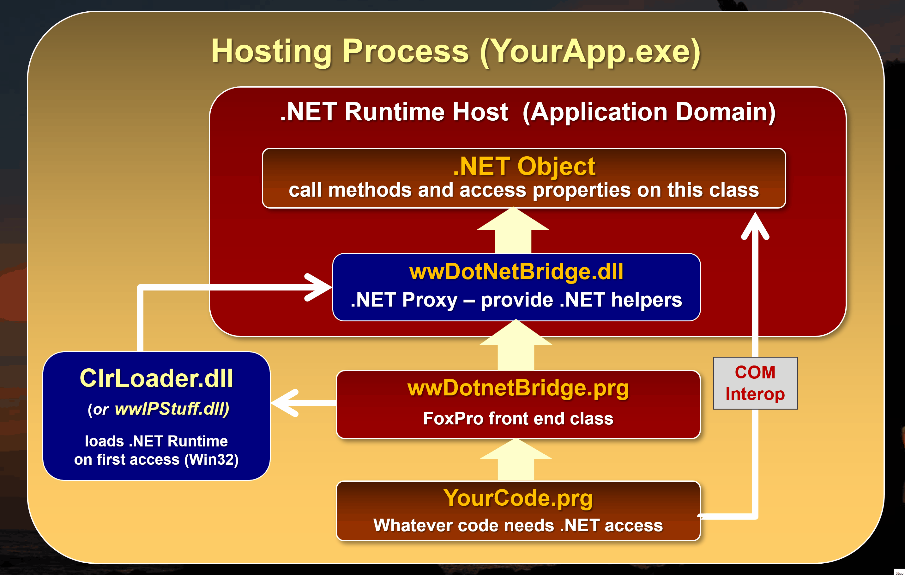

# Revisiting wwDotnetBridge and .NET Interop from FoxPro in the Modern Age of .NET

<div style="margin: 1em 0 3em 0; font-size: 0.8em;">

*by **Rick Strahl***  
*prepared for **Southwest Fox**, 2024*  
*[Session Example Code](https://github.com/RickStrahl/swfox2024-wwdotnetbridge-revisited) on GitHub*  
*[Session Slides](https://github.com/RickStrahl/swfox2024-wwdotnetbridge-revisited/raw/master/Documents/Strahl-swFox2024-wwDotnetBridge-Revisited.pptx)*   
*[wwDotnetBridge Repo](https://github.com/RickStrahl/wwDotnetBridge) on GitHub*  
</div>

.NET has proliferated as the dominant Windows development environment, both for application development using a variety of different Windows-specific platforms and the high-level interface chosen by Microsoft  to expose Windows system functionality. .NET based APIs have mostly replaced COM as the high level Windows system interface that exposes Interop features besides native C++.

More importantly though, .NET has garnered a huge eco system of open source and commercial libraries and components that provide just about any kind of functionality and integration you can think of. 

All of this is good news for FoxPro developers, as you can take advantage of most of that .NET functionality to extend your own FoxPro applications with rich functionality beyond FoxPro's native features using either basic COM interop (very limited) or more usefully with the open source [wwDotnetBridge library](https://github.com/RickStrahl/wwDotnetBridge).

## .NET History: .NET Framework to .NET Core
.NET has been around since the early 2000's and in those nearly 25 years it has undergone a number of transformations. From its early days as a limited distributed runtime, to integration into Windows as a core Windows component, to the splitting off of .NET Core as a cross platform capable version of .NET, to full cross-platform support for .NET Core, to recent releases that provide nearly full compatibility with .NET Framework for .NET Core including of Windows specific platforms (ie. WinForms, WPF, WinUI).

The most significant change occurred in 2016, when .NET split off into the classic **.NET Framework** (the Windows native Runtime build into Windows) and **.NET Core**, which is a newly redesigned version of .NET that is fully cross-platform enabled and can run on Windows, Mac and Linux and that is optimized for performance and optimized resource usage. The new version has greatly expanded .NET's usefulness and developer reach with many new developers using the platform now.

This new version of .NET - although it had a rough initial start - is also mostly compatible with the classic .NET Framework and can for the most part run code on both frameworks interchangeably. .NET Core brought a ton of improvements to .NET in terms of performance and resource usage, as well as new server side frameworks (ASP.NET, Blazor, Maui etc.),and much simpler and universally available tooling that removed the requirement for developing applications exclusively on Windows using Visual Studio. 

Today you can build applications for Windows, Mac or Linux, developing applications on these platforms using native editors either with integration tooling or command line tools that are freely available via the .NET SDK. The SDK includes all the compiler tools to build, run and publish .NET applications from the command line without any specific tooling requirements.

## .NET and FoxPro
Although .NET Core is the *new and shiny* new framework, **for FoxPro developers it's still preferable to continue using the built-in classic .NET Framework**. The .NET Runtime is part of Windows and so it's always available - **there's nothing else to install**. It's the easiest integration path for FoxPro applications. For this reason I strongly recommend you use .NET Framework in lieu of .NET Core or .NET Standard components *if possible*.

However, it is possible to use .NET Core components with FoxPro and wwDotnetBridge. But the process of doing so tends to be more complicated as .NET Core's assembly loading is more complex, often requiring many more support assemblies that are not always easy to identify.

In order to use .NET Core you need to ensure a matching .NET Core runtime is installed to support the minimum version of any components you are calling. .NET Core goes back to requiring installable runtimes, rather than having a single system provided runtime as .NET Framework does. This means you have to ensure the right version of the runtime is installed. Although .NET Core also supports fully self contained installs, that's not really applicable to components or FoxPro applications, so we're always dependent on an installed runtime. Major Runtime Versions rev every year, the current version in late 2024 is v8 with v9 getting released in November. 

The good news is that most components today still use multi-targeting and support both .NET Framework (or .NET Standard which is .NET Framework compatible) and .NET Core targeting and you can geneally find .NET Framework components that work more easily in FoxPro. 

> #### @icon-lightbulb Stick to .NET Framework
> If at all possible aim for using .NET Framework if you're calling .NET code from FoxPro. Only rely on .NET Core components if there is no alternative in .NET Framework available.

## What is wwDotnetBridge?
wwDotnetBridge is an **open source, MIT licensed and therefore free as in free beer** FoxPro library, that allows you to load and call most .NET components from FoxPro. It provides registrationless activation of .NET Components and helpers that facilitate accessing features that native COM Interop does not support.

The key features are:

* **Registrationless access to most .NET Components**  
Unlike native COM Interop, you can instantiate and access .NET Components and features, without requiring those classes to be registered as COM objects. Objects are instantiated from within .NET, so you can access most .NET components by directly loading them from their DLL assembly. Both .NET Framework (`wwDotnetBridge`) and .NET Core (`wwDotnetCoreBridge`) are supported.

* **Instantiates and Interacts with .NET Objects via COM from within .NET**  
wwDotnetBridge is a .NET based component that **runs inside of .NET** and acts as an intermediary for activation, invocation and access operations. A key feature is that it creates .NET instances from within .NET and returns those references using COM Interop. Once loaded you can use all features that COM supports directly: Property access and method calls etc. *as long the members accessed use types that are supported by COM*.

* **Support for Advanced .NET Features that COM Interop doesn't support**  
Unfortunately there are many .NET features that COM and FoxPro don't natively support directly: Anything related to .NET Generics, overloaded methods, value types, enums, various number types to name just a few. But because wwDotnetBridge runs inside of .NET, it provides automatic conversions and helpers to allow access to these features via intermediary Reflection operations. These helpers access the unsupported COM operations from inside of .NET and translate the results into COM and FoxPro compatible results that are returned into your FoxPro application.

* **Automatic Type Conversions**  
Because there are many incompatible types in .NET that don't have equivalents in COM or FoxPro, wwDotnetBridge performs many automatic type conversions. These make it easier to call methods or retrieve values from .NET by automatically converting compatible types. For example: decimals to double, long, byte to int, Guid to string etc. There are also wrapper classes like `ComArray` that wraps  .NET Arrays and Collections and provides a FoxPro friendly interface for navigating and updating collections, and `ComValue` which wraps incompatible .NET values and provides convenient methods to set and retrieve the value in a FoxPro friendly way and pass it to .NET methods or property assignments.

* **Support for Async Code Execution**  
A lot of modern .NET Code uses async functionality via `Task` based interfaces, and wwDotnetBridge includes a `InvokeTaskMethodAsyc()` helper that lets you call these async methods and receive results via Callbacks asynchronously. You can also run **any** .NET synchronous method and call it asynchronously using `InvokeMethodAsync()` using the same Callback mechanism.

There's much more, but these are the most common features used in wwDotnetBridge.

## A quick Primer
Before we jump in with more explanations lets walk through a simple example that shows how to use wwDotnetBridge in a simple yet common scenario. 

I'm going to use a pre-built sample component from a library that's part of the samples called `wwDotnetBridgeDemo.dll` which is one of the simplest things and also very common things we can do.

### Setting up wwDotnetBridge
The first step is that you need wwDotnetBridge. wwDotnetBridge comes in two versions:

* **Free Open Source Version**  
This version is available for free with source code from GitHub. You can go to the repo and copy the files out of the `/Distribution` folder. Copy these files into your FoxPro application path.  
*uses CrlLoader.dll as the Win32 connector*
  
* **Commercial Version in Web Connection and West Wind Client Tools**  
This version of wwDotnetBridge includes a few additional convenience features and .NET components that are not provided in free version. The core feature set however is identical. Unlike the open source version this version uses `wwIPstuff.dll` as the loader.  
*uses wwIPstuff.dll as the Win32 connector*

The three files you need for wwDotnetBridge are:

* CrlLoader.dll (OSS) or wwIPstuff.dll (Commercial)
* wwDotnetBridge.dll
* wwDotnetBridge.prg

Copy these into your root project folder. `CrlLoader.dll` or `wwIPstuff.dll`  **have to live in the root folder** the other two can live along your FoxPro path.

For all examples in this article I use the GitHub repo's root folder as my base directory from which to run the samples. There's a `.\bin` folder that contains all .NET assemblies and for this sample I'll use the `bin\wwDotnetBridgeDemos.dll` assembly.

I'll start with the entire bit of code and we'll break it down afterwards:

```foxpro
*** Set Environment - path to .\bin and .\classes folder
DO _STARTUP.prg

*** Load wwDotnetBridge
do wwDotNetBridge                 && Load library
LOCAL loBridge as wwDotNetBridge  && for Intellisense
loBridge = GetwwDotnetBridge()    && instance

*** Load an Assembly
? loBridge.LoadAssembly("wwDotnetBridgeDemos.dll")

*** Create an class Instance
loPerson = loBridge.CreateInstance("wwDotnetBridgeDemos.Person")

*** Access simple Properties - plain COM
? loPerson.Name
? loPerson.Company
? loPerson.Entered

*** Call a Method
? loPerson.ToString()
? loPerson.AddAddress("1 Main","Fairville","CA","12345")

*** Special Properties - returns a ComArray instance
loAddresses = loBridge.GetProperty("Addresses")  
? loAddresses.Count     && Number of items in array
loAddress = loAddresses.Item(0)
? loAddress.Street
? loAddress.ToString()
```

### Loading wwDotnetBridge and Loading your first .NET Library
The first step is to load the FoxPro `wwDotnetBridge` class:

```foxpro
do wwDotNetBridge                 && Load library
LOCAL loBridge as wwDotNetBridge  && for Intellisense
loBridge = GetwwDotnetBridge()    && instance
```

The first line loads the library into FoxPro's procedure stack so that they library is available. Typically you'd do this at the top of your application once. The `LOCAL` declaration is optional and only done for Intellisense.

`GetwwDotnetBridge()` is a helper function that creates a cached instance of wwDotnetBridge that stays loaded even if `loBridge` goes out of scope. This is to minimize the overhead of having to reload or check to reload the .NET Runtime.  

### Loading Assemblies and Creating an Instance
Next you want to load an assembly (a DLL) which loads the functionality of that library and makes it accessible so that we can access functionality in it. 

```foxpro
*** Load a .NET Assembly
if !loBridge.LoadAssembly("wwDotnetBridgeDemos.dll") 
   ? "ERROR: " + loBridge.cErrorMsg
   RETURN
endif   
```

LoadAssembly is used to load a DLL from the current folder or any folder in your FoxPro path. LoadAssembly returns `.T.` or `.F.` and you can check the `.cErrorMsg` for more information if an error occurs.


Once the assembly is loaded you can create object within it. In this case I want to create a Person class:

```foxpro
*** Create an class Instance
loPerson = loBridge.CreateInstance("wwDotnetBridgeDemos.Person")
IF VARTYPE(loPerson) # "O"
   ? "ERROR: " + loBridge.cErrorMsg
   RETURN
ENDIF
```

The `.CreateInstance()` method takes a fully qualified type name which corresponds to the .NET `namespace.classname` (case sensitive). A namespace is an identifier that's use to separate types with the same name from each other so that if two vendors have components with the same name, they are still separated by their namespaces.

Again you can check for errors of the instance creation with a non-object type and you can use `.cErrorMsg` to get more information on the error.

Common errors for both of these methods are:

* Invalid Names - including case. Make sure you name things EXACTLY
* Missing dependencies (more on that later)

### Direct Invocation of Members
If the class was created you have now received back a .NET Component in the form of a COM object and you can access any properties and methods that have **simple types** directly. Essentially any properties and methods that contain COM compatible types can be accessed directly.

So all of the following works:

```foxpro
*** Access simple Properties - plain COM
? loPerson.Name
? loPerson.Company
? loPerson.Entered

loPerson.Name = "Jane Doe"
loPerson.Company = "Team Doenut"
loPerson.Entered = DateTime()
```

Likewise you can call simple methods:

```foxpro
loPerson.ToString()
? loPerson.AddAddress("1 Main","Fairville","CA","12345")
```

because all of these operations work with simple types. It also work


## How does wwDotnetBridge Work
wwDotnetBridge acts as an intermediary between FoxPro and .NET. In a nutshell, wwDotnetBridge is a loader for the .NET framework, and a proxy interface for FoxPro which allows FoxPro code to pass instructions into .NET code when native direct access to components is not supported. You get the best of both worlds: Native direct COM access when possible, and proxied indirect execution that translates between .NET and COM/FoxPro types to access features that otherwise wouldn't be available.

Here's a rough outline of how wwDotnetBridge loads and calls a .NET component:

### A .NET Loader
The most important feature of wwDotnetBridge is that it acts as a loader that makes it possible to access most .NET types - including static members - from FoxPro. There's no registration required as wwDotnetBridge loads components from within .NET and passes them back to FoxPro.

wwDotnetBridge works like this:

* It loads the .NET Runtime into the FoxPro Process *(one time)*
* It bootstraps a .NET `wwDotnetBridge.dll` from the loader *(one time)*
* **wwDotnetBridge** is the FoxPro -> .NET proxy interface *(one time)*
* The loaded proxy instance is passed back to FoxPro *(one time)*
* The FoxPro instance is then used to:
    * Load .NET Assemblies (dlls) *(once per library)*
    * Instantiate .NET Types 
    * Access 'simple' properties and methods directly via COM
    * Invoke problem Methods and access problem Properties via indirect execution
    * Convert specialty types that COM doesn't work with directly via specialty helpers

**Figure 1** show what this looks like in a diagram:

  
<small>**Figure 1** - wwDotnetBridge: Loading a component, creating an instance and accessing members repeatedly</small>

Let's break down the parts:

In order to execute .NET code from FoxPro, the .NET Runtime needs to be loaded into your FoxPro executable or the FoxPro IDE. 

There are a couple of ways this can be done: 

* **Native COM Interop via COM Instantiation**  
.NET has native support for COM instantiation, but it requires that .NET Components are **explicitly** marked for COM execution which very few are. COM components that you create yourself also have to be marked with explicit COM Interface markers, and have to be registered using a special .NET COM Registration tool. It works, but it's very limited.  
*not recommended any longer*{style="color: red"}

* **wwDotnetBridge .NET Runtime Hosting**  
wwDotnetBridge includes a small Win32 API loader that bootstraps the .NET Runtime and loads itself into this runtime as the host loader assembly. This is similar to the way native COM Interop hosts the runtime, but it bootstraps the `wwDotnetBridge` .NET component that can directly instantiate .NET types **without requiring COM registration**  or any special marker interfaces/attributes.

### wwDotnetBridge Loader
The wwDotnetBridge is comprised of three components:

* A Win32 native C++ Loader that loads the .NET Runtime
* The `wwDotnetBridge` .NET Proxy class that acts as the bridge interface
* The `wwDotnetBridge` FoxPro class that calls into the .NET Class to
  create classes, invoke methods and set/get properties etc.
  
The FoxPro class kicks off the process by instantiating the `wwDotnetBridge` FoxPro class which internally calls into the Win32 code to check and see whether the .NET Runtime is already running and if not starts it up and bootstraps the wwDotnetBridge .NET class into it. A reference to the .NET Class instance is then marshalled back into FoxPro over COM. The FoxPro class caches this COM references and can now make calls into the .NET Interface.

Once loaded the `wwDotnetBridge` FoxPro class can then communicate with the .NET class by loading assemblies, creating instances and accessing members - in essence it now has full access to the features of the wwDotnetBridge .NET interface.

### Direct Member Access is via COM
Behind the scenes **.NET Interop relies on COM** to instantiate types. Both native COM interop and wwDotnetBridge instantiate or access .NET types and those types return their results over COM. Every call that is made to create an instance, access a method or set or get a property happens over COM regardless of whether you use direct access of objects, or you use wwDotnetBridge's helpers.

Direct COM access is obviously easiest and most efficient from FoxPro and it works with types that are supported by both COM and FoxPro. It works just like you'd expect: You can **call methods and access properties directly on the object instance or use the value as is**. This works for all 'basic' types, strings, integers, floats, dates, bool values etc. and as long as methods only pass and return these compatible types or properties you can directly access them. Easy!

### Indirect Member Access via InvokeMethod(), GetProperty() and SetProperty()
But... .NET has a rich type system and certain types and operations don't translate to matching COM or FoxPro types. For example, you can't access static members via COM but you can with wwDotnetBridge. For problem type access wwDotnetBridge automatically provides translations for many types so that they can be used from FoxPro. For example `long` and `byte` are converted to ints, `Guid` is converted to string, `DbNull` (a COM null) is converted to `null` and so on.

For these 'problem' scenarios wwDotnetBridge supports **indirect invocation** which executes operations through the `wwDotnetBridge` .NET Component, which proxies the method call or property access from within .NET. Because the code executes within .NET it can use all of .NET's features to access functionality and then translate results in a way that COM and FoxPro supports. 

The most commonly used methods are:

* `InvokeMethod()` - Invokes a method on an object
* `GetProperty()` and `SetProperty()` - Gets or sets a property on an object
* `InvokeStaticMethod()` - call a static method by name
* `SetProperty()` and `GetStaticProperty()` - gets or sets a static property by name

These methods automatically translate inbound and outbound parameters so that they work correctly in .NET and FoxPro. 


### wwDotnetBridge Proxy Type Wrappers: ComArray and ComValue
wwDotnetBridge provides wrapper types like [ComArray](https://webconnection.west-wind.com/docs/_3m90jxxxm.htm) and [ComValue](https://webconnection.west-wind.com/docs/_3481232sd.htm) that automatically wrap types that are not directly supported via COM. `ComArray` is automatically returned for .NET Arrays, Lists and Collections and it provides the ability to access list items (via `Items(n)`) and the ability manipulate the list by adding, editing and removing items without the collection ever leaving .NET. Many collection types - especially Generic Ones - cause errors if any member is accessed at all, and so leaving the type in .NET makes it possible to manipulate it and still pass it to methods or assign it to a property.

`ComValue` is similar, and it provides a mechanisms for storing a .NET value with helper methods that convert to and from FoxPro types to extract and set the .NET stored value. 

Both ComValue and ComArray can be passed to the **indirect** calling methods, and are automatically translated into their underlying types when passed. So if a method requires a `List<T>` parameter, you can pass a `ComArray`  and `InvokeMethod()` fixes up the `ComArray` into the required `List<T>` typed parameter.

These features and helpers make it possible to access most of .NET's functionality from FoxPro.

## Figuring out what's available in .NET
One of the biggest hurdles to using .NET from FoxPro is that **you have to figure out what's available, which components you need and what you can call in a .NET component**. 

Let's look at these 3 scenarios:

* How do I get the DLLs I need
* What dependencies are there
* What methods and properties are there to access

### Figuring out what Assemblies (DLLs) to Provide
First and foremost you need to figure out what components you want to use. There are typically three kinds:

* Built-in .NET Framework components (built-in)
* Third Party libraries provided as binary files (dlls)
* Third Party or Microsoft Components that are distributed as NuGet packages (NuGet Packages -> dlls)

#### Raw DLL Distribution
In the old days of .NET there were only DLLs. Everything was either in the GAC, or distributed as a DLL that was attached as a reference to a project. That still works even in modern .NET although raw DLL usage tends to be rare these days as most components are shared as NuGet packages.

Built-in .NET Components that are part of the core framework are easiest as they are built into the .NET framework or they are located in the Global Assembly Cache. Most of these components are pre-loaded as part of the runtime, so you don't even need to call `.LoadAssembly()` to first load an assembly. Those that aren't pre-loaded can just be referenced by their assembly name.

This is obviously easiest because you don't really have to figure out where the DLLs are coming from. To figure out where runtime files live you can look at the .NET documentation - for a specific class. Each class tells you which namespace and the DLL file name. 

The next option is to provide the Dll files for you to use. This is not very common any more as NuGet has taken over that space, but it's still relevant especially when you build your own .NET Components and distribute them. When you build your own components you generally build them into a DLL and then either build directly into the folder where they are needed or you copy them over to that location. At that point you just use `.LoadAssembly()` and you're on your way. 

#### NuGet Package Distribution
These days the most common way .NET components are distributed is via [NuGet packages](https://www.nuget.org/) - and for good reason. By publishing a component as a package an author can make that package available on the NuGet site and the component can be easily shared and accessed by millions of .NET developers as any component shows up in the [NuGet package directory](http://www.nuget.org). 

NuGet Packages are Zip files with `.nupkg` extension, that contain the published package Dlls, potentially for multiple .NET target platforms (ie. net472, net8.0). But the NuGet package Zip file **does not contain any of its dependencies**. Instead dependencies are resolved and unpacked as part of the .NET Build process using either `dotnet build` or `dotnet restore` in the SDK.

FoxPro doesn't have NuGet support, so we have to first manually 'unpack' NuGet packages and their dependencies in a way that we can capture all the required DLLs including the dependencies and add them to our own  projects.

> #### @icon-info-circle Make sure Dependencies are provided
> It's crucially important that when you reference an assembly (dll) that all of its dependencies - and the right versions thereof - are also available in the same location or the app's root folder. The .NET loader has to be able to find the dependencies.

To give you an idea of a dependency graph, here's an example we'll use later on [Westwind.Ai](https://github.com/RickStrahl/Westwind.Ai) which talks to OpenAI services:

  
<small>**Figure 2** - NuGet packages can have dependencies that need to be available in order for a component to work. </small>

Notice that this **Westwind.AI** package has a dependency on [Westwind.Utilities](https://github.com/RickStrahl/Westwind.Utilities) which in turn has a dependency on [Newtonsoft.Json](https://www.newtonsoft.com/json). All three of these are required to load the component - miss one and the component won't load or break later at runtime when the relevant library is used. Make sure you have all of the dependencies available.

> Note that many .NET packages don't have external dependencies, and in that case you can actually unzip and grab the DLLs directly. Just be sure that no other dependencies are required as it's often hard to debug assembly load errors after the fact only to find out you're missing a nested assembly.

### Finding DLLs: Unpacking NuGet Packages and their Dependencies using a .NET Project
If you have a NuGet package and you want to 'unpack' it and all of its dependencies there's a 'proper' way of doing it to ensure you capture all dependencies. To resolve all of these dependencies into DLLs we can actually use with wwDotnetBridge in FoxPro, I recommend that you [install the .NET SDK](https://dotnet.microsoft.com/en-us/download) and build a tiny project that loads the NuGet package. That creates build output, along with all the dependent DLLs that you can then copy into your FoxPro project folder. 

The SDK is a one time, low impact install and it's required in order to build .NET code.

To do this:

* Create a new Console project by copying `.csproj` and `program.cs` files
* Add a package reference to the desired component
* Run `dotnet build`
* Go to the `/bin/Release/net472` folder
* Pick up the DLLs and copy to your application
* Or: reference DLLs in that folder

I use a Console project because it's most lightweight top level executable project you can build.

The project file can be totally generic so lets do it just by creating a couple of files:

* Create a folder name it `ConsoleTest`
* Create a file called `ConsoleTest.csproj`
* Create a file called `program.cs`
* Run `dotnet build` from that folder

Here's the content of these files. The `.csproj` project file looks like this:

```xml
<Project Sdk="Microsoft.NET.Sdk">
  <PropertyGroup>
    <OutputType>Exe</OutputType>
    <TargetFramework>net472</TargetFramework>
  </PropertyGroup>

  <ItemGroup>
    <PackageReference Include="Westwind.AI" Version="*" />    
    <!--<PackageReference Include="GoogleAuthenticator" Version="*" />-->
    <!--<PackageReference Include="WeCantSpell.Hunspell" Version="*" />-->
  </ItemGroup>
</Project>
```

Put the file into its own folder like `ConsoleTest` and name the project `ConsoleTest.csproj`.

Also create a file called `program.cs` file as the main program:

```cs
using System;

namespace ConsoleStart {
    public class Program 
    {
        public static void Main(string[] args) {
            Console.WriteLine("Hello World!");
        }
    }
}
```

> #### @icon-info-circle `dotnet new` doesn't work for .NET Framework Projects
> The SDK  has built-in tools to create projects using `dotnet new console -n ConsoleTest`, but unfortunately newer SDK versions no longer support .NET Framework, even though it does support compilation of .NET Framework code. The problem is that new project types include a number of C# language features that are not supported in .NET Framework, so rather than removing and changing settings, it's simply easier to create or copy the files manually as shown above.
>
> You can find the above template in the `/dotnet/New Project net472 Template`. To create a new project, copy the folder and rename the folder and project name and you're ready to go.

With these files in place and the .NET SDK installed, open a Terminal window in the `ConsoleTest` folder and run:

```ps
dotnet build
```

Output gets generated into the `./bin/Debug/net472` folder. Here's what that looks like using Visual Studio Code as the editor with its built-in Terminal *(note: you can use whatever editor you like)*.

  
<small>**Figure 3** - Building a tiny .NET project with the NuGet package you want to use, produces all DLLs and dependencies you can copy into your own project.</small>

As you can see the output compilation folder contains all 3 of the assemblies from the 3 NuGet packages and you can now copy those DLLs into your application folder.

You can create this project once, and simply add different package references into the project, delete the `bin` folder, then build again to figure out what dependencies you need to deploy:

### Use a Disassembler Tool to discover .NET Types and Members
Once you have the DLLs and you can use them successfully with `LoadAssembly()` the next step is to find the types (classes) you want to load and the members you want to call on them.

There are many tools available that provide IL code inspection that can show you class hierarchies in a DLL:

* [ILSpy](https://github.com/icsharpcode/ILSpy)
* [JetBrain DotPeek](https://www.jetbrains.com/decompiler/)
* Reflector (old, free version included in `.\tools`)

Each tool is a little different, but most modern tools use live decompilation to show the class tree and member signatures. **Figure 2** shows the Markdig Markdown library in ILSpy:

  
<small>**Figure 4** - Inspecting .NET Libraries for call signatures and class naming in ILSpy</small>

There are a number of things to be aware of:

* Classes are instantiated by using `namespace.classname`
* All type names and members **are case sensitive**
* All methods require **exact** parameter matches (default values are not supported over COM)
* Overloaded methods cannot be called directly
* If there are overloads make sure you use the **exact** parameter types

The above `ToHtml()` method - which happens to be a static method that doesn't require an objec instance - would be called like this from FoxPro:

```foxpro
loBridge = GetwwDotnetBridge()
loBridge.LoadAssembly("Markdig.dll")
lcHtml = loBridge.InvokeStaticMethod("Markdig.Markdown","ToHtml",lcMarkdown,null)
```

### Use LinqPad to Test Out Code 
Another extremely useful tool is [LinqPad](https://www.linqpad.net/) which you can think of as a Command Window for .NET. Like the FoxPro Command Window you can use LinqPad to test out code interactively. If you didn't create the component you're trying to access from .NET it's a good idea to try it out before you actually try to call it from FoxPro.

This is useful for several reasons:

* Makes sure you are calling the code correctly, and it works in .NET  
  <small>*if it doesn't work in .NET, it sure as hell won't work in FoxPro!*</small>
* Lets you check for type information interactively  
  <small>*hover over type declaration to see the `namespace.classname` and `class`*</small>
* Lets you see overloads and test with different values/types   
  <small>*hover over a method and check for a drop down list (n overloads)*</small>

There are two versions of LinqPad available for different scenarios:

* LinqPad 5.0  works with .NET Framework
* LinqPad Latest (8.0 currently) works with .NET Core

Although in many cases both .NET Framework and Core work the same there are differences, so if you're testing for FoxPro you generally prefer using LinqPad 5.0 to test the .NET Framework versions of components.

Here's LinqPad checking out the Spell Checking example code:

  
<small>**Figure 5** -  Using LinqPad to test out .NET functionality before creating FoxPro code.</small>

LinqPad is an awesome tool if you're using .NET in general - it allows you to create small snippets for testing as I've shown, but you can also use it as a tool to create small utilities like converters, translators and general purpose tools that you can readily save and then later load. For example, I have several converters that convert TypeScript classes to C# and vice versa, de-dupe lists of email addresses and many other things that are basically stored as LinqPad scripts that I can pull up and tweak or paste different source text into.

## Usage Examples
Ok enough theory - let's jump in and put all of this into practice with some useful examples that you can use in your own applications.

1. wwDotnetBridge 101 – Load, Create, Invoke, Get/Set
2. Create a powerful String Formatter
3. Add Markdown Parsing to your Applications
4. Use a Two-Factor Authenticator Library
5. Add Spellchecking to your applications
6. Humanize numbers, dates, measurements
7. File Watcher and Live Reload (Event Handling)
8. Async: Use OpenAI for common AI Operations
9. Async: Print Html to Pdf
10. Create a .NET Component and call it from FoxPro

### wwDotnetBridge 101 – Load, Create, Invoke, Get/Set
Lets start with a basic usage example that demonstrates how wwDotnetBridge works.

For this 101 level example I'm going to use a custom class in custom compiled project I created for examples for this session. We'll talk about how to create this class later, but for now just know that this project creates an external .NET assembly (.dll) from which we'll load a .NET class, and call some of its members. 

Specifically we'll look at how to:

* Load wwDotnetBridge
* Load an Assembly
* Create a .NET Object instance
* Make native COM calls on the instance
* Invoke or access problem members on an instance
* Use Helper Classes to work with problematic .NET Types

#### Simple Invocation
The easiest way to look at this is to look at commented example.

```foxpro
do wwDotNetBridge                 && Load library
LOCAL loBridge as wwDotNetBridge  && for Intellisense only
loBridge = GetwwDotnetBridge()    && Create Cached Instance of wwDotnetBridge

*** Load an .NET Assembly (dll)
loBridge.LoadAssembly("wwDotnetBridgeDemos.dll")

*** Create a class Instance - `Namespace.Classname`
loPerson = loBridge.CreateInstance("wwDotnetBridgeDemos.Person")

*** Access simple Properties - direct access
? "*** Simple Properties:" 
? loPerson.Name
? loPerson.Company
? loPerson.Entered
?

*** Call a Method - direct access
? "*** Method call: Formatted Person Record (ToString):"
? loPerson.ToString()  && Formatted Person with Address
?

*** Add a new address - direct access
loAddress =  loPerson.AddAddress("1 Main","Fairville","CA","12345")

*** Special Properties - returns a ComArray instance
loAddresses = loBridge.GetProperty(loPerson, "Addresses")  

? loBridge.ToJson(loAddresses, .T.)  && Commercial only
? TRANSFORM(loAddresses.Count) + " Addresses"     && Number of items in array

? "*** First Address"
loAddress = loAddresses.Item(0)
? "Street: " + loAddress.Street
? "Full Address (ToString): " + CHR(13) + CHR(10) + loAddress.ToString()
? 

? "*** All Addresses"
FOR lnX = 0 TO loAddresses.Count-1
	loAddress = loAddresses.Item(lnX)
	? loAddress.ToString()
	?
ENDFOR
```

The first steps are pretty straight forward: You create an instance of the wwDotnetBridge object, which you then use to create an instance of a .NET class - or you can also call static methods directly (using `.InvokeStaticMethod()` more on that in the next sample).


Once you have the class you can call its methods and access its properties. For any properties and method signatures that are COM compliant, you can just directly access them the same way as you would for FoxPro members.

#### Indirect Execution
For problem types or some complex types likes arrays and collections, you have to use wwDotnetBridge's indirect invocation methods to access members. The three most common methods are:

* InvokeMethod()
* GetProperty()
* SetProperty()

In this example, the `loPerson` instance includes an `Addresses` property which contains an array of Address object. While you can retrieve the `Addresses` object directly, you can't do anything useful with the array in FoxPro. 

So rather than returning the array `.GetProperty()` returns you a ComArray instance instead which lets you access and manipulate the collection:

```foxpro
*** Returns a ComArray instance
loAddresses = loBridge.GetProperty(loPerson,"Addresses")

? loAddresses.Count   && 2
loAddress1 = loAddresses.Item(0)

FOR lnX = 0 to loAddresses.Count -1 
    loAddress = loAddresses.Item(lnX)
    * ? loAddress.Street
    ? loAddress.ToString()
ENDFOR

loNewAddress = loBridge.CreateInstance("wwDotnetBridge.Address")
loNewAddress.Street = "122 Newfound Landing"
loAddressses.Add(loNewAddress)

loAddresses.Count   && 3
```

#### Using ComArray for .NET Arrays, Lists and Collections
Because arrays and collections are ultra-common in .NET here's how you can add a new item to the collection using the same ComArray structure:

```foxpro
? "*** Add another item to the array"
* loNewAddress = loBridge.CreateInstance("wwDotnetBridgeDemos.Address")
loNewAddress = loAddresses.CreateItem()
loNewAddress.Street = "122 Newfound Landing"
loNewAddress.City = "NewFoundLanding"
loAddresses.Add(loNewAddress)

? TRANSFORM(loAddresses.Count) + " Addresses"  && 3
FOR lnX = 0 to loAddresses.Count -1 
    loAddress = loAddresses.Item(lnX)
    ? loAddress.ToString()
    ? 
ENDFOR
```

#### Summary
You've just seen how to:

* Load a .NET Assembly
* Create a .NET Class from within it
* Call methods and set properties
* Access a complex property and use a helper object
* Work .NET Collections from FoxPro

### Create a powerful String Formatter
The next example is a little more practical in that it provides most of .NET's string formatting features right into Visual FoxPro. .NET uses string formatters that allow powerful formatting of things like dates and numbers along with C style string format templates.

This sample demonstrates:

* Calling into native .NET functions in the .NET Base Library
* Invoking a static method

In this example we'll access two native .NET features:

* .NET's `.ToString()` object method which supports formatting
* The `string.FormatString()` static method which allows for C Style Template strings

#### Formatting Dates and Numbers or any Formattable .NET Type
Format string has the ability to format any type that supports formatting via the `ToString()` method. `ToString()` is one of .NET's base object methods meaning **every object** (including strings, numbers, bools etc.) in .NET have a `.ToString()`. Any class can override `ToString()` and optionally provide the ability to format the output via a format string.

The format specifier is similar in behavior to `Transform()` in FoxPro, except that .NET formatters tend to be much more flexible with many more options.

The most common formatters are Date and Number formatters, but many other types have formatters.

Let's look at some Date formatting first:

* [.NET Date Format Strings Docs](https://learn.microsoft.com/en-us/dotnet/standard/base-types/custom-date-and-time-format-strings)

```foxpro
do _startup.prg

do wwDotNetBridge
LOCAL loBridge as wwDotNetBridge
loBridge = GetwwDotnetBridge()

*** No Format String - Default ToString() behavior
? "Plain FormatValue on Date: "  + FormatValue(DATETIME())
* 6/6/2016 7:49:26 PM

lcFormat = "MMM d, yyyy"
? lcFormat + ": " +  FormatValue(DATETIME(),lcFormat)
* Jun 10, 2016

lcFormat = "MMMM d, yyyy"
? lcFormat + ": " + FormatValue(DATETIME(),lcFormat)
* August 1, 2016

lcFormat = "HH:mm:ss"
? lcFormat + ": " + FormatValue(DATETIME(),lcFormat)
* 20:15:10

cFormat = "h:m:s tt"
? lcFormat + ": " +  FormatValue(DATETIME(),lcFormat)
* 8:5:10 PM

lcFormat = "MMM d @ HH:mm"
? lcFormat + ": " +  FormatValue(DATETIME(),lcFormat)
* Aug 1 @ 20:44

lcFormat = "r"  && Mime Date Time
? lcFormat + ": " +  FormatValue(DATETIME(),lcFormat)
* Mon, 06 Jun 2016 22:41:33 GMT

lcFormat = "u"  
? lcFormat + ": " +  FormatValue(DATETIME(),lcFormat)
* 2016-06-06 22:41:44Z

lcFormat = "ddd, dd MMM yyyy HH:mm:ss zzz"
? "MimeDateTime: " +  STUFF(FormatValue(DATETIME(),lcFormat),30,1,"")
* 2016-06-06 22:41:44Z
```

There are **a lot** of different time formats available including fully spelled out versions. By default all date formats are in the currently active user locale (ie. `en_US` or `de_DE`)  and the value will adjust based on which language you are running your application in. It's also possible to pass a specific culture to format for some other language and formatting, but that's not supported for the helpers discussed here.

Number formatting is very similar:

* [.NET Number Format Strings Docs](https://learn.microsoft.com/en-us/dotnet/standard/base-types/standard-numeric-format-strings)

```foxpro
? "*** Numberformats"

*** Number formats

lcFormat = "00"
? lcFormat + ": " + FormatValue(2,"00")
* 02

? lcFormat + ": " + FormatValue(12,"00")
* 12

lcFormat = "c"
? lcFormat + ": " +  FormatValue(1233.22,lcFormat)
* $1,233.22

lcFormat = "n2"
? lcFormat + ": " +  FormatValue(1233.2255,lcFormat)
* $1,233.23

lcFormat = "n0"
? lcFormat + ": " +  FormatValue(1233.2255,lcFormat)
* $1,233
?
```

To implement the above `FormatValue()` function, I use a simple FoxPro wrapper function that looks like this:

```foxpro
************************************************************************
*  FormatValue
****************************************
***  Function: Formats a value using .NET ToString() formatting
***            for whatever the text ends up with
***      Pass:  Pass in any .NET value and call it's ToString()
***             method of the underlying type. This 
***    Return: Formatted string
************************************************************************
FUNCTION FormatValue(lvValue,lcFormatString)
LOCAL loBridge 

IF ISNULL(lvValue)
   RETURN "null"
ENDIF   

loBridge = GetwwDotnetBridge()

IF EMPTY(lcFormatString)	
	RETURN loBridge.InvokeMethod(lvValue,"ToString")
ENDIF  

RETURN loBridge.InvokeMethod(lvValue,"ToString",lcFormatString)
ENDFUNC
*   FormatValue
```

This function basically works of the value that we are passing into .NET and relies on the fact that .NET treats any value or object as an object. So a Date or Number, Boolean all are objects and we can call `ToString(formatString)` on those values. So it's literally a single method call. 
  
If no parameter is passed we just call 'ToString()` without parameters, otherwise we call it with the `lcFormatString` parameter. Note that each overloaded .NET method requires a separate FoxPro call - even if the .NET method has default values for the method. This is because .NET internally looks at full method signatures and default parameter values are not part of the meta data that is used to match the right signature to call.

We'll see this more vividly in the `FormatString()` function we'll discuss next.

#### String Formatting with C Style String Templates
Most C style languages has a `printf()` style string formatting functionality where you can 'inject' embeddable values into the string. This is a **compile time feature** where the compiler can figure out the reference to a variable at compile time and then create a string that embeds the relevant `ToString()` value into string. 

Here's what this looks like when called from FoxPro:

```foxpro
? "*** String Formatting"
? FormatString("Hey {0}, the date and time is: {1:MMM dd, yyyy - h:mm tt}","Rick",DATETIME())
?

? "*** Brackets need to be double escaped"
? FormatString("This should escape {{braces}} and format the date: {0:MMM dd, yyyy}",DATE())
```

You can call `FormatString()` with a string 'template' that contains `{0-n}` expressions inside of it and you then pass parameters to the functions to fill in the `{n}` holes with the parameter values. The numbering is 0 based so you start with `{0}` for the first parameter.

Additionally you can also apply format strings as described in `FormatValue()` so you can use `{0:MMM dd, yyy}` for a  Date expansion for example.

Note that `FormatString()` uses `ToString()` to format the value, so this works with any kind of object although many actual objects don't implement it and instead return just the object name. However, if a class implements `ToString()` and has custom output - as I did in the `wwDotnetBridge101` example and the `Person.ToString()` method which outputs the display name and address you can display that as part of a format string too:

```foxpro
*** Load loPerson .NET Object
? loBridge.LoadAssembly("wwDotnetBridgeDemos.dll")

*** Load up a person object and set some values on person and first address
loPerson = loBridge.CreateInstance("wwDotnetBridgeDemos.Person")
loPerson.Name = "Rick Strahl"
loAddresses = loBridge.GetProperty(loPerson,"Addresses")
loAddress = loAddresses.Item(0)
loAddress.City = "SomeTown Ugly Town USA"

? FormatString("Person Object:\r\n{0} and the time is: {1:t}", loPerson, DATETIME())
```

`FormatString()` is very powerful and quite useful to quickly create string structures.

> FormatString() also supports several C# string escape characters like `\r` `\n` and `\t` although that's not natively supported (.NET treats a foxPro string as is and escapes any special characters - I escape the strings in FoxPro before passing to .NET)

Here's what the FoxPro `FormatString()` function looks like:

```foxpro
************************************************************************
*  FormatString
****************************************
***  Function: Uses a string template to embed formatted values
***            into a string.
***    Assume:
***      Pass: lcFormat    -  Format string use {0} - {10} for parameters
***            lv1..lv10   -  Up to 10 parameters
***    Return:
************************************************************************
FUNCTION FormatString(lcFormat, lv1,lv2,lv3,lv4,lv5,lv6,lv7,lv8,lv9,lv10)
LOCAL lnParms, loBridge
lnParms = PCOUNT()
loBridge = GetwwDotnetBridge()

lcFormat = EscapeCSharpString(lcFormat)

DO CASE 
	CASE lnParms = 2
		RETURN loBridge.InvokeStaticMethod("System.String","Format",lcFormat,lv1)
	CASE lnParms = 3
		RETURN loBridge.InvokeStaticMethod("System.String","Format",lcFormat,lv1,lv2)
	CASE lnParms = 4
		RETURN loBridge.InvokeStaticMethod("System.String","Format",lcFormat,lv1,lv2,lv3)
	CASE lnParms = 5
		RETURN loBridge.InvokeStaticMethod("System.String","Format",lcFormat,lv1,lv2,lv3,lv4)
	CASE lnParms = 6
		RETURN loBridge.InvokeStaticMethod("System.String","Format",lcFormat,lv1,lv2,lv3,lv4,lv5)
	CASE lnParms = 7
		RETURN loBridge.InvokeStaticMethod("System.String","Format",lcFormat,lv1,lv2,lv3,lv4,lv5,lv6)
	CASE lnParms = 8
		RETURN loBridge.InvokeStaticMethod("System.String","Format",lcFormat,lv1,lv2,lv3,lv4,lv5,lv6,lv7)
	CASE lnParms = 9
		RETURN loBridge.InvokeStaticMethod("System.String","Format",lcFormat,lv1,lv2,lv3,lv4,lv5,lv6,lv7,lv8)
	CASE lnParms = 10
		RETURN loBridge.InvokeStaticMethod("System.String","Format",lcFormat,lv1,lv2,lv3,lv4,lv5,lv6,lv7,lv8,lv9)
	CASE lnParms = 11
		RETURN loBridge.InvokeStaticMethod("System.String","Format",lcFormat,lv1,lv2,lv3,lv4,lv5,lv6,lv7,lv8,lv10)
	OTHERWISE
	    THROW "Too many parameters for FormatString"
ENDCASE


ENDFUNC
*   StringFormat

************************************************************************
*  EscapeCSharpString
****************************************
***  Function:
***    Assume:
***      Pass:
***    Return:
************************************************************************
FUNCTION EscapeCSharpString(lcValue)

lcValue = STRTRAN(lcValue, "\r", CHR(13))
lcValue = STRTRAN(lcValue, "\n", CHR(10))
lcValue = STRTRAN(lcValue, "\t", CHR(9))
lcValue = STRTRAN(lcValue, "\0", CHR(0))

RETURN lcValue
ENDFUNC
*   EscapeCSharpString
```

The first thing you notice here's is that we are calling a **static method** on the `System.String` class. Static methods are non-instance method, meaning you don't first create an instance. Instead the methods are static and bound to a specific type. In FoxPro this is similar to a UDF() function or plain function that is globally available. Static methods and properties are referenced by the type name - ie. `System.String` instead of the instance, followed by the method or member name. 

Here we call the static Format method with the format string and a single value as a parameter:

```foxpro
loBridge.InvokeStaticMethod("System.String","Format",lcFormat,lv1)
```

In this method you'll noticve the requirement to call each of the overloads for each parameter variation, which looks tedious but actually is the most efficient way to call this method. There are other overloads of `InvokeStaticMethod()` that can be passed an array of parameters, and while that would be cleaner to look at and allow for an unlimited number of parameters, it's less efficient as the array has to be created and parsed on both ends. Passing values directly is significantly faster and for a low level utility method like this it's definitely beneficial to optimize performance as much as is possible. 

#### Summary
In this example you learned:

* Calling native .NET Methods
* Calling a non-instance Static method
* How .NET Format Strings and ToString() work

### Add Markdown Parsing to your Applications
The next example demonstrates using a Markdown to HTML parser. Markdown is a very useful text format that uses plain text mixed with a few readable text markup expressions that allow create rich HTML document text via plain text input. It can be used in lieu of WYIWYG editors and because it can be rendered very quickly allows you to actually preview content as you type in real time. So rather than typing in a simulated text editor to tries to simulate the final markup, you write plain text with markup simple expressions and look at a preview (or not) to see what the final output would look like.

In short it's a great tool for writing text that needs to be a little more fancy than just a wall of plain text. It's super easy to add bold, italic, lists, notes, code snippets, embed link and images using Markdown. 

#### Some Examples of Markdown Usage
I'm a huge fan of Markdown and I've integrated it into several of my applications:

* Markdown Monster (a Markdown Editor)

{style="max-width: 1000px"}

* Help Builder (HTML documentation and HTML preview)
* West Wind Message Board (used for message text)
* My Weblog - posts are written in Markdown and rendered to HTML
* Articles like this one - written in Markdown


#### Using Markdig for Markdown To HTML Conversion
Let's start with the simplest thing you can do which is to use a 3rd party library and it's most basic, default function to convert Markdown to Html which is sufficient for most use cases.

> I'm using an older version of Markdig (`v0.15.2`) because it has no extra dependencies. Later versions work fine (although the `ToHtml()` method signature changes) but it requires that you add several additional dependencies of .NET assemblies. The old version has all the features you are likely to need so for FoxPro use this is the preferred version.

Notice that there are two parameters to the `Markdig.Markdown.ToHtml()` method: The markdown and a markdown parser pipeline that is optional. Remember from FoxPro **we always have to pass optional parameters** so we can pass the default value of `null`.

```foxpro
DO wwutils && For Html Preview

do wwDotNetBridge
LOCAL loBridge as wwDotNetBridge
loBridge = GetwwDotnetBridge()

loBridge.LoadAssembly("markdig.dll")

TEXT TO lcMarkdown NOSHOW
# Raw Markdown Sample using the Markdig Parser

This is some sample Markdown text. This text is **bold** and *italic*.

* [Source Code for this sample on GitHub](https://github.com/../markdownTest.PRG)

 

* List Item 1
* List Item 2
* List Item 3

Great it works!

> #### Examples are great
> This is a block quote with a header
ENDTEXT


***  Actual Markdown Conversion here - Invoke a Static Method
lcHtml = loBridge.InvokeStaticMethod("Markdig.Markdown","ToHtml",;
                                     lcMarkdown,null)

? lcHtml
ShowHtml(lcHtml)  && from wwUtils show in browser unformatted
```

And that works:


We have to load the `markdig.dll` library, but the key feature of this code is the static method call to:

```foxpro
lcHtml = loBridge.InvokeStaticMethod("Markdig.Markdown","ToHtml",;
                                     lcMarkdown,null)
```

This method takes the markdown to parse, plus a parameter of a ParserFactory which we have to pass even though the parameter is null. As I often do I first create the code I want to call in LinqPad to test, then call it from FoxPro. Here's the LinqPad test:


And that works.

#### Adding a more sophisticated Parser Wrapper
The call to `ToHtml()` in its default form with the parser pipeline set to null gets you a default parser, but you might want to take advantage of additional features of add-ons that the parser supports. For example, you can add support for Github Flavored Markdown (Github specific features), Grid Tables, Pipe Tables, automatic link expansion and much more.

To do this it's a good idea to create a wrapper class and build and cache the pipeline so it can be reused easily.

Here's a Markdown Parser class:

```foxpro
*************************************************************
DEFINE CLASS MarkDownParser AS Custom
*************************************************************
oPipeline = null
oBridge = null

lEncodeScriptBlocks = .T.
lSanitizeHtml = .T.
lNoHtmlAllowed = .F.

************************************************************************
FUNCTION Init()
****************************************
LOCAL loBridge as wwDotNetBridge

loBridge = GetwwDotnetBridge()

this.oBridge = loBridge
IF ISNULL(THIS.oBridge)
   RETURN .F.
ENDIF

IF !loBridge.LoadAssembly("markdig.dll")
   RETURN .F.
ENDIF   

ENDFUNC
*   Init

************************************************************************
FUNCTION CreateParser(llForce, llPragmaLines)
****************************************
LOCAL loBuilder, loValue, loBridge

IF llForce OR ISNULL(this.oPipeline)
	loBridge = this.oBridge
	loBuilder = loBridge.CreateInstance("Markdig.MarkdownPipelineBuilder")

	loValue = loBridge.Createcomvalue()
	loValue.SetEnum("Markdig.Extensions.EmphasisExtras.EmphasisExtraOptions.Default")	
	loBuilder = loBridge.Invokestaticmethod("Markdig.MarkdownExtensions","UseEmphasisExtras",loBuilder,loValue)

	loBuilder = loBridge.Invokestaticmethod("Markdig.MarkdownExtensions","UseListExtras",loBuilder)	
	loBuilder = loBridge.Invokestaticmethod("Markdig.MarkdownExtensions","UseCustomContainers",loBuilder)

	loBuilder = loBridge.Invokestaticmethod("Markdig.MarkdownExtensions","UseFooters",loBuilder)
	loBuilder = loBridge.Invokestaticmethod("Markdig.MarkdownExtensions","UseFigures",loBuilder)
	loBuilder = loBridge.Invokestaticmethod("Markdig.MarkdownExtensions","UseFootnotes",loBuilder)
	loBuilder = loBridge.Invokestaticmethod("Markdig.MarkdownExtensions","UseCitations",loBuilder)	
	
	loBuilder = loBridge.Invokestaticmethod("Markdig.MarkdownExtensions","UsePipeTables",loBuilder,null)
	loBuilder = loBridge.Invokestaticmethod("Markdig.MarkdownExtensions","UseGridTables",loBuilder)

	loValue = loBridge.Createcomvalue()
	loValue.SetEnum("Markdig.Extensions.AutoIdentifiers.AutoIdentifierOptions.GitHub")
	loBridge.Invokestaticmethod("Markdig.MarkdownExtensions","UseAutoIdentifiers",loBuilder,loValue)
	loBuilder = loBridge.Invokestaticmethod("Markdig.MarkdownExtensions","UseAutoLinks",loBuilder)
	
	loBuilder = loBridge.Invokestaticmethod("Markdig.MarkdownExtensions","UseYamlFrontMatter",loBuilder)
	loBuilder = loBridge.Invokestaticmethod("Markdig.MarkdownExtensions","UseEmojiAndSmiley",loBuilder,.T.)

	IF this.lNoHtmlAllowed
	   loBuilder = loBridge.Invokestaticmethod("Markdig.MarkdownExtensions","DisableHtml",loBuilder)
	ENDIF

	IF llPragmaLines
	  loBuiler = loBridge.Invokestaticmethod("Markdig.MarkdownExtensions","UsePragmaLines",loBuilder)
	ENDIF

	THIS.oPipeline = loBuilder.Build()
ENDIF

RETURN this.oPipeline
ENDFUNC
*   CreateParser

************************************************************************
FUNCTION Parse(lcMarkdown, llUtf8, llDontSanitizeHtml)
LOCAL lcHtml, loScriptTokens, loPipeline, lnOldCodePage

IF !this.lEncodeScriptBlocks
   loScriptTokens = TokenizeString(@lcMarkdown,"<%","%>","@@SCRIPT")
ENDIF

loPipeline = this.CreateParser()

*** result always comes back as UTF-8 encoded
IF (llUtf8)
   lnOldCodePage = SYS(3101)
   SYS(3101,65001)
   lcMarkdown = STRCONV(lcMarkdown,9)
ENDIF

lcHtml = this.oBridge.InvokeStaticMethod("Markdig.Markdown","ToHtml",lcMarkdown,loPipeline)

IF llUtf8
  SYS(3101,lnOldCodePage)  
ENDIF

IF !THIS.lEncodeScriptBlocks
  lcHtml = DetokenizeString(lcHtml,loScriptTokens,"@@SCRIPT")
ENDIF

IF PCOUNT() < 3
   llDontSanitizeHtml = !THIS.lSanitizeHtml
ENDIF   

IF !llDontSanitizeHtml
  lcHtml = THIS.SanitizeHtml(lcHtml)
ENDIF

lcHtml = TRIM(lcHtml,0," ",CHR(13),CHR(10),CHR(9))

RETURN lcHTML   
ENDFUNC
*   Parse


************************************************************************
*  SanitizeHtml
****************************************
***  Function: Removes scriptable code from HTML. 
************************************************************************
FUNCTION SanitizeHtml(lcHtml, lcHtmlTagBlacklist)

IF EMPTY(lcHtmlTagBlackList)
	lcHtmlTagBlackList = "script|iframe|object|embed|form"
ENDIF
IF EMPTY(lcHtml)
   RETURN lcHtml	
ENDIF

RETURN THIS.oBridge.InvokeStaticMethod("Westwind.WebConnection.StringUtils","SanitizeHtml",lcHtml, lcHtmlTagBlacklist)
ENDFUNC
*   SanitizeHtml

ENDDEFINE
```

The key method is the `CreateParser()` which explicitly adds the features that we want to use with the parser. There are additional methods that help with optionally cleaning up HTML for safe rendering by removing script code and frames and other things that could allow XSS attacks against the rendered HTML as Markdown allows embedded HTML in the Markdown text.

> In the samples there's another sublass called `MarkdownParserExtended` that adds a few more features to the parser that include code snippet parsing, expanding FontAwesomeIcons and a few other things. You can [look at the source code](https://github.com/RickStrahl/swfox2024-wwdotnetbridge-revisited/blob/master/markdownParser.PRG) for more info.

With this code in place you can now just create another helper method that uses this parser and cache it so we don't have to reload the pipeline and instance for each invocation:

```foxpro
************************************************************************
*  Markdown
****************************************
***  Function: Converts Markdown to HTML
***    Assume: Caches instance in __MarkdownParser
***      Pass: lcMarkdown  - text to convert to HTML from Markdown
***            lnMode      - 0/.F. - standard, 2 extended, 1 - standard, leave scripts, 3 - extended leave scripts
***    Return: parsed HTML
************************************************************************
FUNCTION Markdown(lcMarkdown, lnMode, llReload, llUtf8, llNoSanitizeHtml, llNoHtmlAllowed)
LOCAL loMarkdown, lcClass

IF llReload OR VARTYPE(__MarkdownParser) != "O" 
	IF EMPTY(lnMode)
	   lnMode = 0
	ENDIF   

	lcClass = "MarkdownParser"
	IF lnMode = 2
	   lcClass = "MarkdownParserExtended"
	ENDIF
	
	loMarkdown = CREATEOBJECT(lcClass)
	PUBLIC __MarkdownParser
	__MarkdownParser = loMarkdown
	
	IF lnMode = 1 OR lnMode = 3
	   __MarkdownParser.lEncodeScriptBlocks = .F.  	  	   	  
	ENDIF	
	
	__MarkdownParser.lSanitizeHtml = !llNoSanitizeHtml
	__MarkdownParser.lNoHtmlAllowed = llNoHtmlAllowed
ELSE
    loMarkdown = __MarkdownParser
ENDIF

RETURN loMarkdown.Parse(lcMarkdown, llUtf8)
ENDFUNC
*   Markdown
```

#### Using Templates to make the Markdown Look Nicer


### Use a Two-Factor Authenticator Library


### Add Spellchecking to your applications


### Humanize numbers, dates, measurements


### File Watcher and Live Reload (Event Handling)


### Async: Use OpenAI for common AI Operations


### Async: Print Html to Pdf 


### Create a .NET Component and call it from FoxPro


## Best Practices

* Configuration 
    * Allow assemblies to load from Network
    * Version Conflicts and Assembly Redirects
* Build your own Components
    * If .NET Logic is even remotely complexPrefer to build a .NET Component and call from FoxProrather than try complex wwDotnetBridge translations
    * .NET is now fairly low Impact
        * Build from the Command Line
        * Single install .NET SDK lets you build, run, publish
        * You can use any editor
* Tooling
    * You can use whatever Editor you like
    * Visual Studio is not required, but still the best .NET Environmentfor full featured .NET work.
    * For building small components a Text Editor is all you need


### Application Configuration Files

* Application Configuration for .NET
    * Same folder as EXE – your app or Fox IDE:    
      Vfp9.exe.config   or   YourApp.exe.config
* Specifies:
    * Runtime Version (optional – acts as a minimum version check)
    * Network Behavior:  enable loadFromRemoteSources
    * Assembly Redirects

### Version Conflicts: Assembly Redirects

### .NET Calling: Don't Overcomplicate Things

## Create your own .NET Components


## Summary

* Lots of Cool .NET Stuff available
    * Many Windows Features are exposed through .NET
    * Many open source and 3rd parties available
    * With wwDotnetBridge you can access most of it!
* wwDotnetBridge makes it EASY!
    * Call any .NET components without registration
    * Opens up most of .NET to FoxPro
    * Access most .NET features including  
    *Generics, Value Types, Collections, Enums, Static members etc.*
    * Helpers for types that suck in FoxPro  
    *ComArray, ComValue*
* Create Wrappers for Complex Code
    * Easier to create .NET code to interface with complex APIs
    * Make the wrapper FoxPro friendly
    * Call the Wrapper from FoxPro	
    * Create FoxPro Wrappers for .NET Code

## Resources

* [GitHub Repository](https://github.com/RickStrahl/swfox2024-wwdotnetbridge-revisited)
    * Code Samples
    * White Paper
    * Slides
* [Get wwDotnetBridge from GitHub](https://github.com/RickStrahl/wwDotnetBridge)
* [Slides for SWFox 2024 Session](https://github.com/RickStrahl/swfox2024-wwdotnetbridge-revisited/raw/master/Documents/Strahl-swFox2024-wwDotnetBridge-Revisited.pptx) 